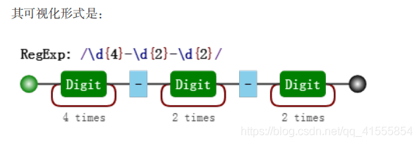
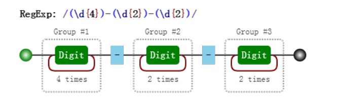

---
sidebar:
  title: 从零开始学正则（三），正则表达式括号的作用
  step: 1
  isTimeLine: true
title: 从零开始学正则（三），正则表达式括号的作用
tags:
  - JavaScript
categories:
  - JavaScript
---

# 从零开始学正则（三），正则表达式括号的作用

## 1.正则表达式括号的作用

不管哪门语言中都有括号。正则表达式也是一门语言，而括号的存在使这门语言更为强大。对括号的使用是否得心应手，是衡量对正则的掌握水平的一个侧面标准。括号的作用，其实三言两语就能说明白，括号提供了分组，便于我们引用它。 引用某个分组，会有两种情形：在 JavaScript 里引用它，在正则表达式里引用它。
内容包括：

- 分组和分支结构
- 分组引用
- 反向引用
- 相关案例

## 1.1. 分组和分支结构

这二者是括号最直觉的作用，也是最原始的功能，强调括号内的正则是一个整体，即提供子表达式。

#### 1.1.1. 分组

我们知道 /a+/ 匹配连续出现的 "a"，而要匹配连续出现的 "ab" 时，需要使用 /(ab)+/。
其中括号是提供分组功能，使量词 + 作用于 "ab" 这个整体，测试如下

```javascript
var regex = /(ab)+/g;
var string = "ababa abbb ababab";
console.log(string.match(regex));
// => ["abab", "ab", "ababab"]
```

#### 1.1.2. 分支结构

而在多选分支结构 (p1|p2) 中，此处括号的作用也是不言而喻的，提供了分支表达式的所有可能。

```javascript
var regex = /^I love (guxin|guxinxin)$/;
console.log(regex.test("I love guxin"));
console.log(regex.test("I love guxinxin"));
// => true
// => true
```

## 1.2. 分组引用

这是括号一个重要的作用，有了它，我们就可以进行数据提取，以及更强大的替换操作。
而要使用它带来的好处，必须配合使用实现环境的 API。 以日期为例。假设格式是 yyyy-mm-dd 的，我们可以先写一个简单的正则：

```javascript
var regex = /\d{4}-\d{2}-\d{2}/;
```



然后再修改成括号版的：

```javascript
var regex = /(\d{4})-(\d{2})-(\d{2})/;
```



对比这两个可视化图片，我们发现，与前者相比，后者多了分组编号，如 Group #1。 其实正则引擎也是这么做的，在匹配过程中，给每一个分组都开辟一个空间，用来存储每一个分组匹配到的
数据。 既然分组可以捕获数据，那么我们就可以使用它们。

#### 1.2.1. 提取数据

```javascript
var regex = /(\d{4})-(\d{2})-(\d{2})/;
var string = "2017-06-12";
console.log(string.match(regex));
// => ["2017-06-12", "2017", "06", "12", index: 0, input: "2017-06-12"]
```

match 返回的一个数组，第一个元素是整体匹配结果，然后是各个分组（括号里）匹配的
内容，然后是匹配下标，最后是输入的文本。另外，正则表达式是否有修饰符 g，match
返回的数组格式是不一样的。

另外也可以使用正则实例对象的 exec 方法：

```javascript
var regex = /(\d{4})-(\d{2})-(\d{2})/;
var string = "2017-06-12";
console.log(regex.exec(string));
// => ["2017-06-12", "2017", "06", "12", index: 0, input: "2017-06-12"]
```

同时，也可以使用构造函数的全局属性 $1 至 $9 来获取：

```javascript
var regex = /(\d{4})-(\d{2})-(\d{2})/;
var string = "2017-06-12";
regex.test(string); // 正则操作即可，例如
//regex.exec(string);
//string.match(regex);
console.log(RegExp.$1); // "2017"
console.log(RegExp.$2); // "06"
console.log(RegExp.$3); // "12"
```

#### 1.2.2. 替换

比如，想把 yyyy-mm-dd 格式，替换成 mm/dd/yyyy 怎么做？

```javascript
var regex = /(\d{4})-(\d{2})-(\d{2})/;
var string = "2017-06-12";
var result = string.replace(regex, "$2/$3/$1");
console.log(result);
// => "06/12/2017"
```

其中 replace 中的，第二个参数里用 $1、$2、$3 指代相应的分组。等价于如下的形式：

```javascript
var regex = /(\d{4})-(\d{2})-(\d{2})/;
var string = "2017-06-12";
var result = string.replace(regex, function () {
  return RegExp.$2 + "/" + RegExp.$3 + "/" + RegExp.$1;
});
console.log(result);
// => "06/12/2017"
```

也等价于：

```javascript
var regex = /(\d{4})-(\d{2})-(\d{2})/;
var string = "2017-06-12";
var result = string.replace(regex, function (match, year, month, day) {
  return month + "/" + day + "/" + year;
});
console.log(result);
// => "06/12/2017
```

## 1.3. 反向引用

除了使用相应 API 来引用分组，也可以在正则本身里引用分组。但只能引用之前出现的分组，即反向引用。
还是以日期为例。
比如要写一个正则支持匹配如下三种格式：

```javascript
2016-06-12
2016/06/12
2016.06.12
```

最先可能想到的正则是:

```javascript
var regex = /\d{4}(-|\/|\.)\d{2}(-|\/|\.)\d{2}/;
var string1 = "2017-06-12";
var string2 = "2017/06/12";
var string3 = "2017.06.12";
var string4 = "2016-06/12";
console.log(regex.test(string1)); // true
console.log(regex.test(string2)); // true
console.log(regex.test(string3)); // true
console.log(regex.test(string4)); // true
```

其中 / 和 . 需要转义。虽然匹配了要求的情况，但也匹配 "2016-06/12" 这样的数据。 假设我们想要求分割符前后一致怎么办？此时需要使用反向引用：

```javascript
var regex = /\d{4}(-|\/|\.)\d{2}\1\d{2}/;
var string1 = "2017-06-12";
var string2 = "2017/06/12";
var string3 = "2017.06.12";
var string4 = "2016-06/12";
console.log(regex.test(string1)); // true
console.log(regex.test(string2)); // true
console.log(regex.test(string3)); // true
console.log(regex.test(string4)); // false
```

注意里面的 \1，表示的引用之前的那个分组 (-|\/|\.)。
不管它匹配到什么（比如 -），\1 都匹配那个同 样的具体某个字符。 我们知道了 \1 的含义后，那么 \2 和 \3 的概念也就理解了，即分别指代第二个和第三个分组。

## 1.4. 相关案例

1.字符串 trim 方法模拟

trim 方法是去掉字符串的开头和结尾的空白符。有两种思路去做。 第一种，匹配到开头和结尾的空白符，然后替换成空字符。如：

```javascript
function trim(str) {
  return str.replace(/^\s+|\s+$/g, "");
}
console.log(trim(" foobar "));
// => "foobar"
```

第二种，匹配整个字符串，然后用引用来提取出相应的数据：

```javascript
function trim(str) {
  return str.replace(/^\s*(.*?)\s*$/g, "$1");
}
console.log(trim(" foobar "));
// => "foobar"
```

这里使用了惰性匹配 \*?，不然也会匹配最后一个空格之前的所有空格的。
当然，前者效率高

<br/>
<hr />

⭐️⭐️⭐️ 好啦！！！本文章到这里就结束啦。⭐️⭐️⭐️

✿✿ ヽ(°▽°)ノ ✿

撒花 🌸🌸🌸🌸🌸🌸
