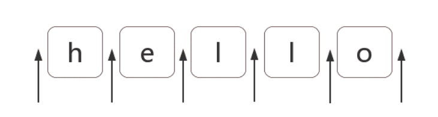

---
sidebar:
  title: 从零开始学正则（二），正则表达式位置匹配攻略
  step: 1
  isTimeLine: true
title: 从零开始学正则（二），正则表达式位置匹配攻略
tags:
  - JavaScript
categories:
  - JavaScript
---

# 从零开始学正则（二），正则表达式位置匹配攻略

## 1 .正则表达式位置匹配攻略

正则表达式是匹配模式，要么匹配字符，要么匹配位置。请记住这句话。然而大部分人学习正则时，对于匹配位置的重视程度没有那么高。本章讲讲正则匹配位置的相关知识点。
内容包括：

- 什么是位置？
- 如何匹配位置？
- 位置的特性
- 几个应用实例分析

## 1.1. 什么是位置呢？

位置（锚）是相邻字符之间的位置。比如，下图中箭头所指的地方：


## 1.2. 如何匹配位置呢？

在 ES5 中，共有 6 个锚： ^、$、\b、\B、(?=p)、(?!p)

##### 1.2.1. ^ 和 $

^（脱字符）匹配开头，在多行匹配中匹配行开头。
$（美元符号）匹配结尾，在多行匹配中匹配行结尾。
比如我们把字符串的开头和结尾用 "#" 替换（位置可以替换成字符的！）：

```javascript
var result = "guxin".replace(/^|$/g, "#");
console.log(result);
// => "#guxin#
```

**多行匹配模式（即有修饰符 m**）时，二者是行的概念，这一点需要我们注意：

```javascript
var result = "guxin\nguxinxin\nguxinya".replace(/^|$/gm, "#");
console.log(result);
/*
#guxin#
#guxinxin#
#guxinya#
*/
```

##### 1.2.2. \b 和 \B

\b 是单词边界，具体就是 \w 与 \W 之间的位置，也包括 \w 与 ^ 之间的位置，和 \w 与 $ 之间的位置。

```javascript
var result = "[I] am guxin xi_xixi".replace(/\b/g, "#");
console.log(result);
// => "[#I#] #am# #guxin# #xi_xixi#"
```

\B 就是 \b 的反面的意思，非单词边界。例如在字符串中所有位置中，扣掉 \b，剩下的都是 \B 的。
具体说来就是 \w 与 \w、 \W 与 \W、^ 与 \W，\W 与 $ 之间的位置。

```javascript
var result = "[I] am guxin xi_xixi".replace(/\B/g, "#");
console.log(result);
// => "#[I]# a#m g#u#x#i#n x#i#_#x#i#x#i"
```

##### 1.2.3. (?=p) 和 (?!p)

(?=p)，其中 p 是一个子模式，即 p 前面的位置，或者说，该位置后面的字符要匹配 p。
比如 (?=l)，表示 "l" 字符前面的位置，例如

```javascript
var result = "helloguxin".replace(/(?=guxin)/g, "#");
console.log(result);
// => "hello#guxin
```

而 (?!p) 就是 (?=p) 的反面意思，比如：

```javascript
//不在guxin前面加,其他之间加
var result = "helloguxin".replace(/(?!guxin)/g, "#");
console.log(result);
// => "#h#e#l#l#og#u#x#i#n#"
```

## 1.3. 位置的特性

对于位置的理解，我们可以理解成空字符 ""。
比如 "hello" 字符串等价于如下的形式：

```javascript
"hello" == "" + "h" + "" + "e" + "" + "l" + "" + "l" + "" + "o" + "";
```

也等价于：

```javascript
"hello" == "" + "" + "hello";
```

因此，把 /^hello $ / 写成 /^^hello$$$/，是没有任何问题的：

```javascript
var result = /^^hello$$$/.test("hello");
console.log(result);
// => true
```

```javascript
var result = /(?=he)^^he(?=\w)llo$\b\b$/.test("hello");
console.log(result);
// => true
```

也就是说字符之间的位置，可以写成多个。

## 1.4. 相关案例

##### 1.4.1. 不匹配任何东西的正则

让你写个正则不匹配任何东西

```javascript
easy，/.^/
```

因为此正则要求只有一个字符，但该字符后面是开头，而这样的字符串是不存在的

##### 1.4.2 数字的千位分隔符表示法

比如把 "12345678"，变成 "12,345,678"。
可见是需要把相应的位置替换成 ","。
思路是什么呢?

首先弄出最后一个逗号
使用 (?=\d{3}$) 就可以做到：

```javascript
var result = "12345678".replace(/(?=\d{3}$)/g, ",");
console.log(result);
// => "12345,678
```

其中，(?=\d{3}$) 匹配 \d{3} $ 前面的位置。而 \d{3}$ 匹配的是目标字符串最后那 3 位数字。

然后弄出所有的逗号
因为逗号出现的位置，要求后面 3 个数字一组，也就是 \d{3} 至少出现一次。
此时可以使用量词 +：

```javascript
var result = "12345678".replace(/(?=(\d{3})+$)/g, ",");
console.log(result);
// => "12,345,678"
```

##### 1.4.3. 匹配其余案例

写完正则后，要多验证几个案例，此时我们会发现问题：

```javascript
var result = "123456789".replace(/(?=(\d{3})+$)/g, ",");
console.log(result);
// => ",123,456,789"
```

因为上面的正则，仅仅表示把从结尾向前数，一但是 3 的倍数，就把其前面的位置替换成逗号。因此才会出
现这个问题。
怎么解决呢？我们要求匹配的到这个位置不能是开头。 我们知道匹配开头可以使用 ^，但要求这个位置不是开头怎么办？
easy，(?!^)，你想到了吗？测试如下：

```javascript
var regex = /(?!^)(?=(\d{3})+$)/g;
var result = "12345678".replace(regex, ",");
console.log(result);
// => "12,345,678"
result = "123456789".replace(regex, ",");
console.log(result);
// => "123,456,789"
```

##### 1.4.4 支持其他形式

如果要把 "12345678 123456789" 替换成 "12,345,678 123,456,789"。
此时我们需要修改正则，把里面的开头 ^ 和结尾 $，修改成 \b：

```javascript
//不匹配单词边界的
var string = "12345678 123456789",
  regex = /(?!\b)(?=(\d{3})+\b)/g;
var result = string.replace(regex, ",");
console.log(result);
// => "12,345,678 123,456,789
```

其中 (?!\b) 怎么理解呢？
要求当前是一个位置，但不是 \b 前面的位置，其实 (?!\b) 说的就是 \B。 因此最终正则变成了：/\B(?=(\d{3})+\b)/g。

##### 1.4.5 验证密码问题

密码长度 6-12 位，由数字、小写字符和大写字母组成，但必须至少包括 2 种字符。
此题，如果写成多个正则来判断，比较容易。但要写成一个正则就比较困难。 那么，我们就来挑战一下。看看我们对位置的理解是否深刻。

如果不考虑“但必须至少包括 2 种字符”这一条件。我们可以容易写出：

```javascript
var regex = /^[0-9A-Za-z]{6,12}$/;
```

判断是否包含有某一种字符
假设，要求的必须包含数字，怎么办？此时我们可以使用 (?=.\*[0-9]) 来做。 因此正则变成：

```javascript
var regex = /(?=.*[0-9])^[0-9A-Za-z]{6,12}$/;
```

同时包含具体两种字符
比如同时包含数字和小写字母，可以用 (?=._[0-9])(?=._[a-z]) 来做。 因此正则变成：

```javascript
var regex = /(?=.*[0-9])(?=.*[a-z])^[0-9A-Za-z]{6,12}$/;
```

**解惑**

```javascript
上面的正则看起来比较复杂，只要理解了第二步，其余就全部理解了。
/(?=.*[0-9])^[0-9A-Za-z]{6,12}$/
对于这个正则，我们只需要弄明白 (?=.*[0-9])^ 即可。

分开来看就是 (?=.*[0-9]) 和 ^。 表示开头前面还有个位置（当然也是开头，即同一个位置，想想之前的空字符类比）。
(?=.*[0-9]) 表示该位置后面的字符匹配 .*[0-9]，即，有任何多个任意字符，后面再跟个数字。
翻译成大白话，就是接下来的字符，必须包含个数字。
```

<br/>
<hr />

⭐️⭐️⭐️ 好啦！！！本文章到这里就结束啦。⭐️⭐️⭐️

✿✿ ヽ(°▽°)ノ ✿

撒花 🌸🌸🌸🌸🌸🌸
