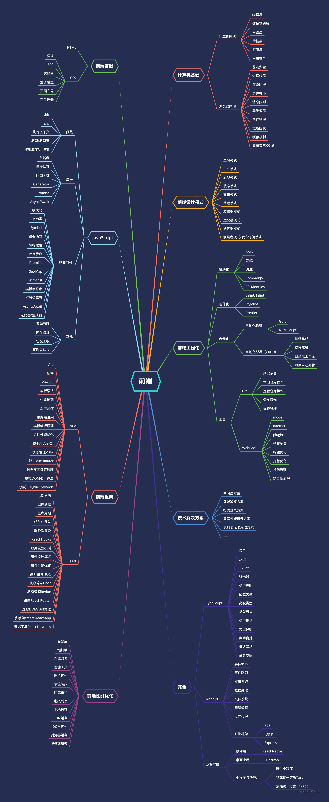

---
sidebar:
  title: 前端相关文章收集
  step: 1
  isTimeLine: true
title: 前端相关文章收集
tags:
  - 资源
categories:
  - 资源
---

# 前端相关文章收集

## 前端宝藏

[前端宝藏](https://mp.weixin.qq.com/mp/appmsgalbum?action=getalbum&__biz=MzU2MTIyNDUwMA==&scene=1&album_id=2190605009795547141&count=3#wechat_redirect)

## 前端知识点图

## js 相关

[最简实现 Promise，支持异步链式调用（20 行）](https://juejin.cn/post/6844904094079926286)

## vue 相关

[60 个 Vue 常见问题汇总及解决方案](https://mp.weixin.qq.com/s/Utngq5QgiHN_ViGYFJeKfQ)

## react 相关

## css 相关

## 面试相关

[前端知识库](https://www.html5iq.com/600fe22e9ab55c133a956711.html)

[面试资源分享](https://www.yuque.com/yayu/nice-people/wtxq0o#ugiMo27NIeQudp1ppbDRv0v7s2Y3wSsz)

[金九银十，你准备好面试了吗? (附 30w 字前端试炼总结)](https://juejin.cn/post/6996841019094335519)

## 工程化相关

[git 终端操作](https://juejin.cn/post/7131713973572861966)

## 性能优化相关

## node 相关

# 服务器

[jenkins 部署 github 项目 ](https://www.cnblogs.com/dingshaohua/p/16458325.html)

 

⭐️⭐️⭐️ 好啦！！！本文章到这里就结束啦。⭐️⭐️⭐️

✿✿ ヽ(°▽°)ノ ✿

撒花 🌸🌸🌸🌸🌸🌸
