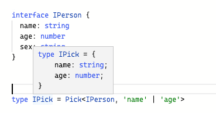
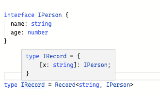
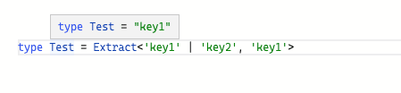

---
sidebar:
  title: TypeScript 内置工具类型
  step: 1
  isTimeLine: true
title: TypeScript 内置工具类型
tags:
  - TypeScript
categories:
  - TypeScript
---

# TypeScript 内置工具类型

## 前言

TS 为了方便开发者使用，在内部提供了非常多的工具类型，如 Partial、Required、ReadOnly 等等，本篇文章主要用于记录了一些常用的内置工具类型的使用及源码实现，以便参考。

## **Partial**

`Partial<T>`将`T`的所有属性映射为可选的，例如：

```ts
interface IPerson {
  name: string;
  age: number;
}

type IPartial = Partial<IPerson>;

let p1: IPartial = {};
```

### **Partial 原理**

Partial`的实现用到了`in`和`keyof

```ts
/**
 * Make all properties in T optional
 */
type Partial<T> = {
  [P in keyof T]?: T[P];
};
```

- `[P in keyof T]`遍历`T`上的所有属性
- `?:`设置属性为可选的
- `T[P]`设置类型为原来的类型

## **Readonly**

`Readonly<T>`将`T`的所有属性映射为只读的，例如：

```ts
interface IPerson {
  name: string;
  age: number;
}

type IReadOnly = Readonly<IPerson>;

let p1: IReadOnly = {
  name: "lin",
  age: 18,
};
```

### **Readonly 原理**

和 `Partial` 几乎完全一样，

```ts
/**
 * Make all properties in T readonly
 */
type Readonly<T> = {
  readonly [P in keyof T]: T[P];
};
```

- `[P in keyof T]`遍历`T`上的所有属性
- `readonly`设置属性为只读的
- `T[P]`设置类型为原来的类型

## **Pick**

`Pick`用于抽取对象子集，挑选一组属性并组成一个新的类型，例如：

```ts
interface IPerson {
  name: string;
  age: number;
  sex: string;
}

type IPick = Pick<IPerson, "name" | "age">;

let p1: IPick = {
  name: "vvv",
  age: 18,
};
```

这样就把 name 和 age 从 IPerson 中抽取出来。



### **Pick 原理**

```ts
/**
 * From T, pick a set of properties whose keys are in the union K
 */
type Pick<T, K extends keyof T> = {
  [P in K]: T[P];
};
```

Pick 映射类型有两个参数:

- 第一个参数 T，表示要抽取的目标对象
- 第二个参数 K，具有一个约束：K 一定要来自 T 所有属性字面量的联合类型

## **Record**

上面三种映射类型官方称为同态,意思是只作用于 obj 属性而不会引入新的属性。

`Record` 是会创建新属性的非同态映射类型。

```ts
interface IPerson {
  name: string;
  age: number;
}

type IRecord = Record<string, IPerson>;

let personMap: IRecord = {
  person1: {
    name: "vvv",
    age: 18,
  },
  person2: {
    name: "vvv",
    age: 20,
  },
};
```



### **Record 原理**

```ts
/**
 * Construct a type with a set of properties K of type T
 */
type Record<K extends keyof any, T> = {
  [P in K]: T;
};
```

Record 映射类型有两个参数:

- 第一个参数可以传入继承于 any 的任何值
- 第二个参数，作为新创建对象的值，被传入。

## **扩展：条件类型**

```ts
T extends U ? X : Y
//若类型 T 可被赋值给类型 U,那么结果类型就是 X 类型,否则就是 Y 类型
```

Exclude 和 Extract 的实现就用到了条件类型。

## **Exclude**

Exclude 意思是不包含，`Exclude<T, U>` 会返回 `联合类型 T` 中不包含 `联合类型 U` 的部分。

```ts
type Test = Exclude<"a" | "b" | "c", "a">;
```


### **Exclude 原理**

```ts
/**
 * Exclude from T those types that are assignable to U
 */
type Exclude<T, U> = T extends U ? never : T;
```

- `never`表示一个不存在的类型
- `never`与其他类型的联合后，为其他类型

## **Extract**

`Extract<T, U>`提取联合类型 T 和联合类型 U 的所有交集。

```ts
type Test = Extract<"key1" | "key2", "key1">;
```



### **Extract 原理**

```ts
/**
 * Extract from T those types that are assignable to U
 */
type Extract<T, U> = T extends U ? T : never;
```