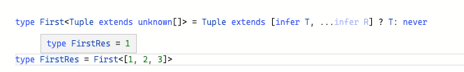
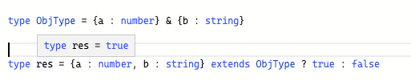
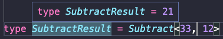

# TypeScript 类型体操

## **类型体操是什么**

TypeScript 给 JavaScript 增加了一套静态类型系统，通过 TS Compiler 编译为 JS，编译的过程做类型检查

TS的静态类型有些死板,因此新增了动态类型,也就是动态编程(`这也叫做类型体操`)

`对传入的类型参数（泛型）做各种逻辑运算，产生新的类型，这就是类型编程`  类型编程也就是类型体操

## **TypeScript 类型系统中的类型运算**

### **条件：extends ? :**

TypeScript 里的条件判断是 `extends ? :`，叫做条件类型（Conditional Type）比如：

```ts
type res = 1 extends 2 ? true : false;
```


### **推导：infer**

如何提取类型的一部分呢？答案是 infer。

比如提取元组类型的第一个元素：

```ts
type First<Tuple extends unknown[]> = Tuple extends [infer T, ...infer R] ? T: never

type FirstRes = First<[1, 2, 3]>
```



### **联合：｜**

联合类型（Union）类似 js 里的或运算符 |，但是作用于类型，代表类型可以是几个类型之一。

```ts
type Union = 1 | 2 | 3;
```

### **交叉：&**

交叉类型（Intersection）类似 js 中的与运算符 &，但是作用于类型，代表对类型做合并。

```ts
type ObjType = {a: number } & {c: boolean};
```



注意，同一类型可以合并，不同的类型没法合并，会被舍弃：


### **映射类型**

对象、class 在 TypeScript 对应的类型是索引类型（Index Type），那么如何对索引类型作修改呢？

答案是`映射类型`。

```ts
type MapType<T> = {
  [Key in keyof T]?: T[Key]
}
```

keyof T 是查询索引类型中所有的索引，叫做`索引查询`。

T[Key] 是取索引类型某个索引的值，叫做`索引访问`。

in 是用于遍历联合类型的运算符。

比如我们把一个索引类型的值变成 3 个元素的数组：

```ts
type MapType<T> = {
    [Key in keyof T]: [T[Key], T[Key], T[Key]]
}

type res = MapType<{a: 1, b: 2}>;
```


## **类型体操顺口溜**

**模式匹配做提取，重新构造做变换。**

**递归复用做循环，数组长度做计数。**

**联合分散可简化，特殊特性要记清。**

**基础扎实套路熟，类型体操可通关。**

## **模式匹配做提取**

就像字符串可以通过正则提取子串一样，TypeScript 的类型也可以通过匹配一个模式类型来提取部分类型到 infer 声明的局部变量中返回。

比如提取函数类型的返回值类型：

```ts
type GetReturnType<Func extends Function> = 
    Func extends (...args: any[]) => infer ReturnType 
        ? ReturnType 
        : never;
```


### **例子**

```ts

// 套路一: 模式匹配做提取
// 提取 value 的类型
type GetValue<P> =  P extends Promise<infer value> ? value : never
type GetValueRes = GetValue<Promise<'vvv'>>

// 删除数组第一个
type ShiftArr<T extends unknown[]> = T extends [] ? [] : T extends [infer Fistr, ...infer Rest] ? Rest : never
type ShiftArrRes = ShiftArr<[1, 2, 3]>

// 判断字符串是否以某个前缀开头
type StartsWith<Str extends string, perfix extends string> = Str extends `${perfix}${string}` ? true : false
type StartsWithType = StartsWith<'vvvcode', 'vvv'>

// 字符串替换
type ReplaceStr<Str extends string, From extends string, To extends string> = 
Str extends `${infer perfix}${From}${infer suffix}` ? `${perfix}${To}${suffix}` : Str

// ?替换嘻嘻嘻嘻
type ReplaceStrRes = ReplaceStr<'vvv is boy hha ?', '?', '嘻嘻嘻嘻'>

// 去掉字符串的空白符(因为空白符很多, 需要递归)
type Trim<Str extends string> = Str extends `${infer Rest}${' '}` ? Trim<Rest>: Str
type TrimRes = Trim<'vvvv                 '>

// 提取函数参数类型
type GetParametersType<Func extends Function> = Func extends (...args: infer Args) => unknown ? Args : never
type GetParametersTypeRes = GetParametersType<(a: number ,b: string) => string>

// 提取函数返回类型
type GetFnReturnType<Func extends Function> = Func extends (...args: any[]) => infer ReturnType ? ReturnType : never
type GetFnReturnTypeRes = GetFnReturnType<(a: number ,b: string) => string>

// 提取this类型
class Vvv {
    name: string;

    constructor() {
        this.name = "dong";
    }

    hello(this: Vvv) {
        return 'hello, I\'m ' + this.name;
    }
}
const vvv = new Vvv();
vvv.hello();

// vvv.hello.call({xxx:1});
type GetThisType<T> = T extends (this: infer ThisType, ...args: any[]) => any ? ThisType : unknown
type GetThisTypeRes = GetThisType<typeof vvv.hello>

// 构造器
interface Person {
    name: string;
}

interface PersonConstructor {
    new(name: string): Person;
}
// 提取构造器(实例对象)
type GetConstructorInstance<Constructor extends new (...args: any) => any> = 
Constructor extends new (...args: any) => infer Instance ? Instance : any
type GetConstructorInstanceRes = GetConstructorInstance<PersonConstructor>

// 提取构造器参数类型
type GetConstructorParamsters<Constructor extends new (...args: any) => any> = 
Constructor extends new (...args: infer Paramsters) => any ? Paramsters : any
type GetConstructorParamstersRes = GetConstructorParamsters<PersonConstructor>

// 提取ref值类型
type GetRefProps<Props> = 'ref' extends keyof Props ? 
        Props extends { ref?: infer Value | undefined} ? Value : never 
        : never
type GetRefPropsRes = GetRefProps<{ref: 1}>
type GetRefPropsRes2 = GetRefProps<{a: 1}>
```

[模式匹配做提取](https://www.typescriptlang.org/play?#code/FAehAJHVNR72MADkC5yEIrQ8PqE5lQsomC0FQC8aDXlUCfcANwEMAbAVwFNxAQt0G8fQaPVgAXATwAc6BxGtgDVKtADwAFAHzgAvOHDjwNAB5saAOwAmAZwUAnAPYBbAJbaaok+oBmNPaRE1pAfgfU6idTRJ323PgLC7gBKNLpy-EKOEoam5qIA5CTJCZKSwITggARKgCZpgA6mgCN+gDTesIBUcn484ADKABYm1mwAgnp6ogAqSqoaOuBU6gDW6gYA7uoA2gC60nIdKmpaupPgrkuIs10L4GNWtvYAYmZsegA04AB0Fzt24KHabBPLN2Fs4J7evpyVtfVNLbey1TqDWarTGAEZTgAmU4AZimGTA4EAJEqAWtNAOragDJvQBMcoB6M0AZCqAU7lAAvmpUAskqAAH9AAD6gBZNCp0KpsMh6NjaADqJjYNVEDPsc26ujueisAHNTjw9NYTMpOvMeoKRdNqkcZfzwAADAAkAG9xZLlABfbXy9TC-Vqx5HWivcDWSjmOlKpks9mctr+AEMp1sjlcpLJADGBk0NASpz9JFSCIgmKxgH+zQBGxg7QlwKGR-TQedzlXzNsbReA9rEVbmjiLTm0DMW5aWTYrgDyq7pNVqrvZdVLDVrC8ZO63wNoqNY9WbHs32wbtRXOwOhx3zYgeVHlgnANxqa5XSZoKbTGaO-zkydT6cz4fAZnAACMDBxwDUamRlqHwAlnE+EuuV5HMoBu5UAkcYx+hAC8vQBfNwxAAKQADtUALjkQIxQAI-UALE1TkAAHTAEDIwAkBMAJX0AEoHTaIUjCzXkNmrIVaw9bMSKbbU+1uNhOwSZ8R1cfCTEIujJAXI48II-dwFYwjwxIeQRNEsSRK-RF8EAX8U8kAIeU8hYB1InEJkyCMAQ7G0N0eFEPY+n9RsCwMtgTAMdRFX09RDJzHowIuM4mWFbRED7ZpnOw2RpD6QYRnUR53N0N4fD0ZSBFUvR1M0vRtP8PiVLUjS1BinSLDAshPCoIwL2uY4L0QPNPJkaQ83STIZLyQAV+MAPbUlM+AI2D2dRQjYKg9HUVK9IMoyrP9UzzMs7rbN0eyLiclzwDIdQOEmIrpFogQ2o691XBapbUutLwQrCxrmsW9rUvigQmrWg7-FEdLMuy3L8v7GthTmu6yOFMqpLwTkzCU-1U20XRBGScAtWAUT1Cigr7oAbgyUTA3UQUqD6gw9DAzygfE+QPu0M5QY0gEACJNHM4U8ah0T9WhkSahoCgKAMMDMcQf6SFR4H0b0fb-ISKmaYMU4AEkAB0EiMZ9wAAanATHsai0mRPJ8nYbuUgAbkLxhnAJmUah5ISDObnaa1pcdb16nabOf1KAoMCtWUW34DBfVsKh+rwEiNo6li3S2kVdZZRGhmzxsa53bMVLTgc8bECmmaJke6PHhDz2PF6AYhlGHbE8OsIATdj3OvqgxrGV3X9YMV6IEAEPNAAIEwALNWAKxkttdMFC08zAdZ+QcZocHnqh8n6-URudxbmLzIAYXM+HEfsNGRLVsCu57kVsMQcRW-UPvyrwaua7AwA87UAaPlAE-tQBDGNwl3IgnuHLWnvnr6m9NRCvqe2CRoy1fAUbHL0Zyo+muPpp1mfjfV+xE-bgA-l-SOk1-5eUDrscAd87gPzoK4JBjJrLJ2jjtYBegEagPQSgo6bBcH4KRoQzBEh16kOnuXcA+Ad4KTqu6S+k8QFIwiupO4Wkn5sLwdPd+NB1ZQJ-hNaOACOBAL4WQsBqpIER1Ea5IO9hOFGG4TFCRjxVHqKCjAjgODpHT20clbQxCaGgOMTwteo91DmKRnQ-A7NrCAB4FZhlRIihGsOIQwXBtAxAML4xUCQnGMWGuAfoNAOCF30AE3QrgO5iW8bEoyWpwBOOcEohBQQrQAB8U7BklF4TQ+pHjZOTlta4CTRLBQ+CwgQnikm+OIQ0nxfitROMQA7dIF96k0C8a024kIc69P6bE0QWoMrgC6UAA)

## **重新构造做变换**

TypeScript 类型系统可以通过 type 声明类型变量，通过 infer 声明局部变量，类型参数在类型编程中也相当于局部变量，但是它们都不能做修改，想要对类型做变换只能构造一个新的类型，在构造的过程中做过滤和转换。

在字符串、数组、函数、索引等类型都有很多应用，特别是索引类型。

比如把索引变为大写：

```ts
type UppercaseKey<Obj extends Record<string, any>> = { 
    [Key in keyof Obj as Uppercase<Key & string>]: Obj[Key]
}
```


```ts

// 重新构造叫变换

// 数组类型的重新构造
// Push

type Push<Arr extends unknown[], Ele> = [...Arr, Ele]
type PushRes = Push<[1, 2, 3], '123'>

// Zip(元组合并)
type Zip<One extends [unknown, unknown], Other extends [unknown, unknown]> =
    One extends [infer OneFirst, infer OneSecond] ? 
    Other extends [infer OtherFirst, infer OtherSecond] ? [[OneFirst, OtherSecond], [OneSecond, OtherFirst]] : []
     : []

type tuple1 = [1, 2];
type tuple2 = ['vvv', 'code'];
type ZipRes = Zip<tuple1, tuple2>

// 如果是任意个呢？
type Zip2<One extends unknown[], Other extends unknown[]> =
    One extends [infer OneFirst, ...infer OneRest] ? 
    Other extends [infer OtherFirst, ...infer OtherRest] ? [[OneFirst, OtherFirst], ...Zip2<OneRest, OtherRest>] : []
     : []

type tuple3 = [1, 2, 3, 4, 5];
type tuple4 = ['code1', 'code2', 'code3', 'code4', 'code5'];
type ZipRes2 = Zip2<tuple3, tuple4>


// 字符串类型的重新构造
// CapitalizeStr -- 把一个字符串字面量类型的 'vvv' 转为首字母大写的 'Vvv'。
type CapitalizeStr<Str extends string> = Str extends `${infer First}${infer Rest}` ? `${Uppercase<First>}${Rest}`: Str
type CapitalizeStrRes = CapitalizeStr<'vvv'>

// CamelCase -- 实现vvv_vvv_vvv 到 vvvVvvVvv 的变换
type CamelCase<Str extends string> = Str extends `${infer Left}_${infer Right}${infer Rest}`? 
`${Left}${Uppercase<Right>}${CamelCase<Rest>}` : Str
type CamelCaseRes = CamelCase<'vvv_vvv_vvv'>

// DropSubStr 删除指定字符串   vvv___ 删除_ => vvv

type DropSubStr<Str extends string, SubStr extends string> = Str extends `${infer Perfix}${SubStr}${infer Suffix}` ?
DropSubStr<`${Perfix}${Suffix}`, SubStr > : Str

type DropSubStrRes = DropSubStr<'vvv___', '_'>


// 函数类型的重新构造：
// AppendArgument 添加多一个参数
type AppendArgument<Fun extends Function, Arg> = Fun extends (...args: infer Args)  => infer ReturnType ? 
(...args: [...Args, Arg]) => ReturnType : never

type AppendArgumentRes = AppendArgument<(a: number, b: string) => string, number>

// 索引类型的重新构造
type Mapping<Obj extends object> = {
    [Key in keyof Obj]: Obj[Key]
}
type MappingRes = Mapping<{a: 1, b: 2, c: 3}>

// UppercaseKey
type UppercaseKey<Obj extends object> = {
    // 因为索引可能为 string、number、symbol 类型, 这里只能接受 string 类型，所以要 & string，也就是取索引中 string 的部分。
    [Key in keyof Obj as Uppercase<Key & string>]:  Obj[Key]
}
type UppercaseKeyRes = UppercaseKey<{a: 1, b: 2, c: 3}>

// 约束objet --- Record
type RecordRes = Record<'test', 3>
type UppercaseKey2<Obj extends Record<string, any>> = {
    [Key in keyof Obj as Uppercase<Key & string>]:  Obj[Key]
}
type Uppercase2KeyRes = UppercaseKey<{a: 1, b: 2, c: 3}>

// ToReadonly 添加 readonly 的修饰符 
type ToReadonly<T> = {
    readonly [Key in keyof T]: T[Key]
}
type ToReadonlyRes = ToReadonly<{name: 'vvv', age: 18}>

// ToPartial 添加可选修饰符
type ToPartial<T> = {
     [Key in keyof T]?: T[Key]
}
type ToPartialRes = ToPartial<{name: 'vvv', age: 18}>

// ToMutable 移除readonly修复师
type ToMutable<T> = {
    -readonly [Key in keyof T]: T[Key]
}

type ToMutableRes = ToMutable<{readonly name: 'vvv', readonly age: 18}>

// ToRequired 去掉?可选修饰符
type ToRequired<T> = {
    [Key in keyof T]-?: T[Key]
}
type ToRequiredRes = ToRequired<{name?: 'vvv', age?: 18}>

// FilterByValueType  在构造新索引类型的时候根据值的类型做下过滤：

type FilterByValueType<Obj extends Record<string, any>, ValueType> = {
    [Key in keyof Obj  as Obj[Key] extends ValueType ? Key : never] : Obj[Key]
}

interface Person {
    name: string
    age: number
    hobby: string[]
}
type FilterByValueTypeRes = FilterByValueType<Person, number>
```

[重新构造叫变换](https://www.typescriptlang.org/play?#code/FAehAJFnEwG00EPNAIEw18qA3lQRsbFBQDqaBG-Q3j6DR6oCFuMCm4ACgK4DOAFhgC4CeADgKaW10A8AggCcB4dgA9G7AHYATGuCqSA1pID2Ad0kBtALoAacAFEANuwB84ALzhNAOjuCB+4+23AWHLvQBK7OVer0PJoAjPoATPoAzHrgAOTBYZGxphhg4ABaAJasABSAwoo4gBAqgG56AJRubJxZrDwA8pKcYhIycpoKyuqS+u2qGjG1jHTswk1SstY9nd1KvZLa5hbA4Mvg9Y3iY62ZkgBmw6sNAGKZAjSM+tt7wmsAyuwAxioy2uAA-OBLKwNDIxst1pd9t9hsdTudwIDroNhndHs83tZNGtQWd9MCBLCntIYkiGpiZGjoQIUYxtC8AFzWVwrZaUnRMSrgRhUVgmYKWayhcBhbQAbgqHmZrPYYQ5mliADcpbF9LFHtJ2LE+QKqtkfH4MtkeEK2fodSKUuRAEGagBzzQD0ZoBvuUA8IaAKjlAEYqgHx-lWa1hhOoNER-caTDQ6Qk-T3Nb0zTo6BafZZrQObAG7IFHE6o8B2GyQg7sdWkhER1ZE6P-TRp9Ek-QpotEzMvd6aXHsEu5n4kmIp6putaZ-3DTOmClUnPgOmuZ36yJirkRcCRfQAFn0AFZle5OPrp2K5SoFcEZXF5SLt+uFUlZbvp-vd3Olfyly71aKrK3tSyTFOmU-2NPDeRAOragDJvQBMcoQJBwPA5AAMIAIasJkjDgUYmQAF7sDcjDCAAtKh4CAFFGgAAcjav5-l+gBG6YA84mAXEUoSrE4CADbxgBccoAaZlfoAs9aAOSagCZikQcQAGrSoAQAzOhBUEwXBiHIQIPBifm4xnAI2wAOYLOAkmjP8AAGAAkADeaYkgAvlpaaZrpqkIhpmkAKqsBwAj3OBNDsDwJKmPpmlGaplJiQJkHQbBCFISh6ocoJPkif54mStKhppBBAC27BGBB9ngOh4CAHnagANzhRAD62UUeAgAMSuAFE8RKJXgEQaBeXFCV2Q5ylenIMnyYp9VBnIZlpgAMuwOyMLpWUGXGwheJkcl0H1g1XOAbnvMAZndb1LmWdZtn2TwI1jYwzlabF8WJQ53bGQOSkoVVe21YFVi7TVa0RRKOVSg9lFRRAAAiAgqKwNxUAARpJgAESoAJmmAODGgBZ2vhKzZVlWXgEDMMWOYFEMh472fd9f0oRJKFSY1KHyfo6OtTGTWSApHJE2pk37BQww7JkoguYTKEuWm307HTDMma8wCo19v1iTwZk0wIHOM1Q7P08ZBP89j5geadzq80zAiXeASsy+FUNZfu2ufmkgC-ilggGkPAgBY-+QfBWWMghyVQcWSIw4CAN+2gAFSoAWJq4YAQ8pYM6lscDINt21IjCOQoOPgIcCj3IwmRPPoNuKZHkjhzkKbgQIck0JSaY2zQpTLAjEJDdN7DMgIkgACqMrNqd2Onmd0imufxxn2j54XPhl5XjKUg0ErDMjnB+9bGdBw7qvDwHo-2yHOTgb3ds-cM+g-ZSJNye35jr-okiL8ML3gIARL6AKj6xvAc6ACykFQaTdQ-QAVuHKgPw8W0cppOaaAA0uwzBF+Aihf4qB2KsB+2hKS1Aft-X+rhdKX2vvJVWV8rLyR4Jpee4AuSr25Poe4lJIi6QPstYYq12A-2YM6YhNlarkLvo-FS4xn731fopD+NI0iAAO1WiJ9AD3yoAX4DaLgHXoAQAZd4xSXgIYRNBmDiJUEYcAhB9CAE34wAM4mACvlPhgBS40AOvKQi8akwUQQQAMP+AAEjQAp3KAEDI8AAAyPRslSZGMAPpygBGHTNIANeUT6AFo5Ox8lyqAAuEwAYEr8RpNAv+2wAFAJAZAx+dlwBUNITwchNifGkx7JSUB99QmwMoVbah9lyGq3iTQ3+aCMFYMpBOPBk5CGpAgIAMr9AD65kw0uyUUo+EeAIaQzp2kqE6arHpnSeCxAkGcbckQUjXiKfk3+bYH7hwGdIHg29wDgUkMwUwrDP5JPCYA5gwCMkrLkFMhySTbHrzSZGKB5DsmTNyaQsIBTfAcmObQ9BlJyk4PAFUghB8K4qB8OBaQTwjB-1duAAQ7BAXAr-kQQAd-KAAdMn8Hxrx-IBUCyQIKeAV02TSCFUKMV-1Cf-XZ+yK7gPABXLJwA4Eov+ZC9FILVaovpdCtBkhwJxUpHdbc4E5LsHeQADhqeQP5FB04x1gs7F2PDACQCQin8zpRXisyLBLFOKQnbOTiSkBZLXiUkpdc6liqVBioEBKowTKTXKtVZpdlnLyLSn0Ly-lmChW-JUBfKgMEfomHAIAb89AZ4oZcwWFgBYTUABB6xrPXepMGq9+OZUJBuhdYTVES9k6vJQamBRqo1evAj6jMTyrB-Ojfm2Nmkk0EvAHal13L9CVpBSsvlgrhVpGZQARyoCcdg0hwCAG7lQAkcavFlfK41PhO3dsWdi+NGrf7EsiRS7QqE9UUqpTSxkHau0QukJa8dW6e1so5ewFddam3HpbQfY4RgJACAAELMC4rBKg7Aq4eHAIACnUEDQBPoBQAb6aAEwFQAnBaADtjQAPApEEIIALQVADQcoAcfjAAndubZ0V6b33sfUYZ9r6HLRPmQ8XpizlmrPWfodDmHKjquWESnZC6cOHIyVk8OpGX3V3AEk3u7B+4CF7NEtdGBtg3p2OBe4nBhY0CeOANhKwa1r30XJHMzqF7iIHjSOgz8frMBk-YuS9J10eBQ8MNDT7mMcFVvpu9D6jNYZ4KJuO1a94CFMEAA)

## **递归复用做循环**

在 TypeScript 类型编程中，遇到数量不确定问题时，就要条件反射的想到递归，每次只处理一个类型，剩下的放到下次递归，直到满足结束条件，就处理完了所有的类型。

比如把长度不确定的字符串转为联合类型：

```ts
type StringToUnion<Str extends string> = 
    Str extends `${infer First}${infer Rest}`
        ? First | StringToUnion<Rest>
        : never;
```


````ts

// 递归复用做循环

// Promise 的递归复用
// DeepPromiseValueType  实现一个提取不确定层数的 Promise 中的 value 类型的高级类型。

type DeepPromiseValueType<P extends Promise<unknown>> = P extends  Promise<infer ValueType> ?
        ValueType extends Promise<unknown> ? 
        DeepPromiseValueType<ValueType> : ValueType : never

type test = Promise<Promise<Promise<string>>>
type DeepPromiseValueTypeRes = DeepPromiseValueType<test>

// 简化
type DeepPromiseValueType2<T> = T extends Promise<infer ValueType> ? DeepPromiseValueType2<T> : T
type test2 = Promise<number> 
type DeepPromiseValueType2Res = DeepPromiseValueType<test2>


// 数组类型的递归
// ReverseArr 把type arr = [1,2,3,4,5]; 变成 type arr = [5,4,3,2,1];

type ReverseArr<Arr extends unknown[]> = Arr extends [infer First, ...infer Rest] ? [...ReverseArr<Rest>, First] : Arr
type ReverseArrRes = ReverseArr<[1,2,3,4,5]>

// Includes 比如查找 [1, 2, 3, 4, 5] 中是否存在 4，是就返回 true，否则返回 false。
type IsEqual<A, B> = (A extends B ? true : false) & (B extends A ? true : false);
type Includes<Arr extends unknown[], FindItem> = Arr extends [infer First, ...infer Rest] ?
 IsEqual<First, FindItem> extends true ? true :  Includes<Rest, FindItem>
 : false

 type IncludesRe = Includes<[1, 2, 3, 4], 4> 

 // RemoveItem 可以查找自然就可以删除，只需要改下返回结果，构造一个新的数组返回。
type RemoveItem<
    Arr extends unknown[], 
    Item, 
    Result extends unknown[] = []
> = Arr extends [infer First, ...infer Rest]
        ? IsEqual<First, Item> extends true
             // 如果存在,就不将first放入result
            ? RemoveItem<Rest, Item, Result>
            // 如果不存在, 就放入
            : RemoveItem<Rest, Item, [...Result, First]>
        : Result;

type RemoveItemRes = RemoveItem<[1,2,3,4,2,2], 2>

// 字符串类型递归
// ReplaceAll
type ReplaceAll<
    Str extends string, 
    From extends string, 
    To extends string
> = Str extends `${infer Left}${From}${infer Right}` ? `${Left}${To}${ReplaceAll<Right, From, To>}` : Str;

type ReplaceAllRes = ReplaceAll<'vvv_vvv_vvv', 'vvv', '123'>


// StringToUnion
type StringToUnion<Str extends string> = Str extends `${infer First}${infer Rest}` ? First | StringToUnion<Rest> : never
type StringToUnionRes = StringToUnion<'hello'>


// ReverseStr
type ReverseStr<Str extends string> = Str extends `${infer First}${infer Rest}` ? `${ReverseStr<Rest>}${First}` : Str
type ReverseStrRes = ReverseStr<'hello'>


// 对象类型的递归 -- 数量（层数）不确定，类型体操中应该自然的想到递归。

type DeepReadonly<Obj extends Record<string, any>> =
    Obj extends any
        ? {
            readonly [Key in keyof Obj]:
                Obj[Key] extends object
                    ? Obj[Key] extends Function
                        ? Obj[Key] 
                        : DeepReadonly<Obj[Key]>
                    : Obj[Key]
        }
        : never;

type obj = {
    a: {
        b: {
            c: {
                f: () => 'dong',
                d: {
                    e: {
                        vvv: string
                    }
                }
            }
        }
    }
}

type DeepReadonlyResult = DeepReadonly<obj>;
````

[**递归复用做循环**](https://www.typescriptlang.org/play?#code/FAehAJCQEwlfUWE1ApXQWgqCr9Q9c7FBACgJwPYC2AlgM4Cm4gIW4wKbgAiZZADroaWQGoCGANgK5kAKgE9mFcIDztQA3OgADlAVHKAF40BryoFg5QHYegLO1AQjqAHU0rg2xcuEC0cgYBufQeEDePoGj1SoA2swOV+DwEAMGAC5iKjFkYcPALCvgA8WOBkAB5eZAB2ACYkhvjGZGH88QDW8XgA7vEAfEXgALyGUbEJyeCp7ORhRPEAZmQ44MGCouKlAPzAdUNDXaHiVXFJKYGNWbkFxeB94IPDQ-6saUHWYxmjPWSlAFydOwfgJ-FkFu3evuBxJF7l9ekRW40zGU84zQDmJSKwB84w2X32vgASmQUhUwR8uGdwo8vEC6IAA70AaMrA+7whqIkIHABMYSEpQqQgmNWmCKarXap0Jvn6DCYm3xEPEJLJF3AQhx4xRRJeXzC8X4BAARu1SgK-GzwUiudDYayAgjORkhWi6LpACN+Dmo0Do0JuOHIAEEcB1AFFGIIo3GtLwA2gBGAA0RPdAGZ3QAWd0AVgAugBucCADeVAAhGD3ujo6FWdgf9Ps97tdYbu41N7Ut1rCVo6MUmtTmeUKzuD5PAhapU3AzuabQ6ADEiOavO7wAA6XtNhkqrzBpYN3vdnPmsiFsKDopdtsd4cnQty8ATvM4FUvddT-NutO+gMhtFgcAASXiAGMBIkYeBACvWgCDNQCn5oA-IwbHvAXvAvvAAfAIZmIA9GaAGQqgAa2oAFOp-oAMP9AYAjDqACvxgB7ag8OCCNBIGAJhKyHgC0fDkJ49rniQACiACO-B8AWXYAELVgAFBada1DRI5eGhFAnHhvDkAAlOAABk4D0axxbUjWbEcby3F8aGq4Xte-C3iQBZOmJ9Zlgslbzs0iRnnEBDVrW6m1I29Ktu2TxdmO-YdIOw4DMR5GUbwYQLlZ4Btkk+lkIZzEpOxNjLIFnF1ApN4wjOMKdp5uk+YZgxcfhZAYLG4zhUpMLQi8GXKWE+5fl2v5+sGXZ+rKgyntCBB4Dc8XgIA98qAKdyb6AFeBgBsjnBzWAARKgAmadBgBXyoAAOmAIGRgCcpoA0HLIYAy36ADnm0GACHmgAECQogANppQ+rIYR9zVbVZDxWEqx1MZ1QaTk5bxNpKzDPFXZHWuML8LwzwmSkmkVsOibBsARlqadpm2bFHbWX25kPU831rEMyxnqRFFUe5MXxaUr2oYI91Q0Mp6PrNkHunBqiAGA6LSWV4gB8poApoo4I9z0Y5jyy7XVBlRR5t3g09qJ01D2OzaoePgHBlNc2sJyM-tzODl2bPOmOKoczpi5ApjvJy89cmrmL8VbhUmvM-uXqHmmRKlV+J4QIA6tqAGTegBMcg4MAmiwvDcJeU68LwGuO87ruufdADK7H+eAPz-HdwwtmkgfB-Efyh0MQh4JH7H-D9Lz+0W-0pAABgAJAA3oDAAyZAtF4AC+efh4Q5f52DkJEH8AAWZeZyOOe50XJfV-H1fQswTsuxabszvXTfzmkXbx0Upctycafq0Rvf9972sPX3XuD65ADkFg7wA+jvFj7zvm9dtvx+n66RLepvOqnmn-zxwAqvERB4PEq739HT8v2-YRp4nvxo7Vn-qjNugNEbV0BoOaeI5EbgAAD7gE-n8b+r94gs1RLyK4ZoP5Jy-ngZ+aCV7INQb-TeDcyBuzwDfDADszTkDTh7ehZA05-wDqjKOAJU7sIzuAMBYMIF5ygdFGByw247lYbOauECZ5IPYkw3MLD2IrwkexMI5DKG8GobfCAgBP7UAIYxhoYDgAALQmPALoQA84mAAh-vQgBIf40JoaCDhADK8oAWZNTCABS9QAp9EdUoIAZ4NAAMSjATwq4NjQm4IkN+vARBhAAPKSgAFaB2hJePAOBEhhE4V2bg8QRAlHKPdBJyTUa5JEMLZYudhbDGppE6JIgGwAGkyANOaOAbILS8AtHAMU4MRxqmY2Kc6ZpIhhyozwEksgl4vADOVnUZYQyRljN4S2LI0y0GzLmcMBZSThktOHJsrZdQTjhLIHU+IMT4m7KWUrI5ysTiLP2cLUuwtLjXHaPPe4EzkkVCqcMbgJw-mY0lICzZl5QV3OGC0E49F+JlFKJvKJ0cT6HKGIkCFkKoZkAxZi5WB8TicNRVDF5uLwAkqOeS4l90XkvLCWyCJSKYmq2eHCelZzGWxO+UUUMQA)

## **数组长度做计数**

TypeScript 类型系统没有加减乘除运算符，但是可以构造不同的数组再取 length 来得到相应的结果。这样就把数值运算转为了数组类型的构造和提取。

比如实现减法：

```ts
type BuildArray<
    Length extends number, 
    Ele = unknown, 
    Arr extends unknown[] = []
> = Arr['length'] extends Length 
        ? Arr 
        : BuildArray<Length, Ele, [...Arr, Ele]>;

type Subtract<Num1 extends number, Num2 extends number> = 
    BuildArray<Num1> extends [...arr1: BuildArray<Num2>, ...arr2: infer Rest]
        ? Rest['length']
        : never;
```




## **联合分散可简化**

TypeScript 对联合类型做了特殊处理，当遇到字符串类型或者作为类型参数出现在条件类型左边的时候，会分散成单个的类型传入做计算，最后把计算结果合并为联合类型。

```ts
type UppercaseA<Item extends string> = 
    Item extends 'a' ?  Uppercase<Item> : Item;
```


这样虽然简化了类型编程，但也带来了一些认知负担。

比如联合类型的判断是这样的：

```ts
type IsUnion<A, B = A> =
    A extends A
        ? [B] extends [A]
            ? false
            : true
        : never
```

联合类型做为类型参数直接出现在条件类型左边的时候就会触发 distributive 特性，而不是直接出现在左边的时候不会。

所以， A 是单个类型、B 是整个联合类型。通过比较 A 和 B 来判断联合类型。

## **特殊特性要记清**

会了提取、构造、递归、数组长度计数、联合类型分散这 5 个套路以后，各种类型体操都能写，但是有一些特殊类型的判断需要根据它的特性来，所以要重点记一下这些特性。

比如 any 和任何类型的交叉都为 any，可以用来判断 any 类型：`

```ts
type IsAny<T> = 'vvv' extends ('code' & T) ? true : false
```


比如索引一般是 string，而可索引签名不是，可以根据这个来过滤掉可索引签名：

```ts
type RemoveIndexSignature<Obj extends Record<string, any>> = {
  [
      Key in keyof Obj 
          as Key extends `${infer Str}`? Str : never
  ]: Obj[Key]
}
```


## **基础扎实套路熟，类型体操可通关**

基础指的是 TypeScript 类型系统中的各种类型，以及可以对它们做的各种类型运算逻辑，这是类型编程的原材料。

但是只是会了基础不懂一些套路也很难做好类型编程，所以要熟悉上面 6 种套路。

基础扎实、套路也熟了之后，各种类型编程问题都可以搞定，也就是“通关”。


## **参考链接**

[[TypeScript 类型体操通关秘籍](https://juejin.cn/book/7047524421182947366)]