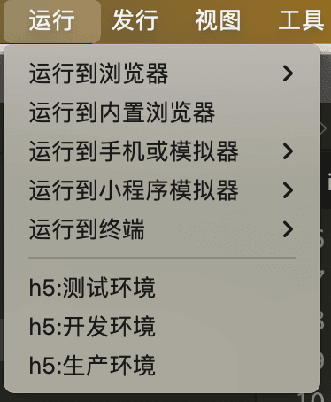

# uniapp环境变量设置

## 在 HBuilderX 中设置环境变量
通过在package.json文件中增加uni-app扩展节点，可实现自定义条件编译平台。
扩展新的平台后，有3点影响：
- 可以在代码里编写自定义的条件编译，为这个新平台编写专用代码
- 运行时可以执行面向新平台的编译运行
- 发行时可以执行面向新平台的编译发行
注意只能扩展web和小程序平台，不能扩展app打包。并且扩展小程序平台时只能基于指定的基准平台扩展子平台，不能扩展基准平台。基准平台详见下文。
### 用法
package.json扩展配置用法：
```json
{
    /**
     * package.json其它原有配置 
     * 拷贝代码后请去掉注释！
     */
    "uni-app": {// 扩展配置
        "scripts": {
            "custom-platform": { //自定义编译平台配置，可通过cli方式调用
                "title":"自定义扩展名称", // 在HBuilderX中会显示在 运行/发行 菜单中
                "browser":"",  //运行到的目标浏览器，仅当UNI_PLATFORM为h5时有效
                "env": {//环境变量
                    "UNI_PLATFORM": "",  //基准平台
                    "MY_TEST": "", // ... 其他自定义环境变量
                 },
                "define": { //自定义条件编译
                    "CUSTOM-CONST": true //自定义条件编译常量，建议为大写
                }
            }
        }    
    }
}

```

Tips：

- UNI_PLATFORM仅支持填写uni-app默认支持的基准平台，目前仅限如下枚举值：h5、mp-weixin、mp-alipay、mp-baidu、mp-toutiao、mp-qq
- browser 仅在UNI_PLATFORM为h5时有效,目前仅限如下枚举值：chrome、firefox、ie、edge、safari、hbuilderx
- package.json文件中不允许出现注释，否则扩展配置无效
- vue-cli需更新到最新版，HBuilderX需升级到 2.1.6+ 版本

实际项目操作：
```json
{
	"uni-app": {
		"scripts": {
			"h5-dev": {
				"title": "h5:开发环境",
				"env": {
					"UNI_PLATFORM": "h5",
					"browser": "chrome",
					"NODE_ENV": "development",
					"ENV": "development",
					"VUE_APP_ENV": "development",
					"VUE_APP_BASE_API": "/dev-api"
				}
			},
			"h5-beta": {
				"title": "h5:测试环境",
				"env": {
					"UNI_PLATFORM": "h5",
					"browser": "chrome",
					"NODE_ENV": "production",
					"ENV": "production",
					"VUE_APP_ENV": "development",
					"VUE_APP_BASE_API": "/beta-api"
				}
			},
			"h5-prod": {
				"title": "h5:生产环境",
				"env": {
					"UNI_PLATFORM": "h5",
					"browser": "chrome",
					"NODE_ENV": "production",
					"ENV": "production",
					"VUE_APP_ENV": "production",
					"VUE_APP_BASE_API": "/prod-api"
				}
			}
		}
	}
}
```

设置后 HBuilderX 展示

## 在 vue cli 创建的项目中设置环境变量
通过建立.env 文件来设置环境变量, 例如:
新建一个.env.development 文件，内容如下：
```shell
# 本地环境构建环境变量
NODE_ENV = 'development'

VUE_APP_ENV = 'development'

VUE_APP_BASE_API = '/dev-api'
```
然后再 package.json 中 设置脚本
```json
{
	"scripts": {
		"dev": "npm run dev:h5",
		"dev:h5": "vue-cli-service uni-serve --watch",
	}
}
```
还有其他环境的也可以通过这样设置, 例如(测试、生产环境)
新建一个.env.beta 文件，内容如下：
```shell
# 生产环境构建环境变量
NODE_ENV = 'production'

VUE_APP_ENV = 'development'

VUE_APP_BASE_API = '/beta-api'
```

新建一个.env.production 文件，内容如下：
```shell
# 生产环境构建环境变量
NODE_ENV = 'production'

VUE_APP_ENV = 'production'

VUE_APP_BASE_API = '/prod-api'
```
可以在 package.json 中, 通过 `mode` 来启动(beta、production)模式

```json
{
	"scripts": {
		"dev": "npm run dev:h5",
		"beta": "npm run beta:h5",
		"build": "npm run build:h5",

		"dev:h5": "vue-cli-service uni-serve --watch",
		"beta:h5": "vue-cli-service uni-build --mode beta",
		"build:h5": "vue-cli-service uni-build --mode production",
	}
}
```

## 总结
通过这次 uniapp 转 h5 收货还是蛮大的
- 学会了 在 HBuilderX 中设置环境变量，主要是通过 package.json 的 uni-app 扩展节点来设置环境变量
- 学会了 vue cli 构建项目，然后通过.env 文件来设置环境变量，然后通过 package.json 中的 scripts 来启动不同环境的项目

[前往 uniapp package.json](https://uniapp.dcloud.net.cn/collocation/package.html#%E7%94%A8%E6%B3%95)


