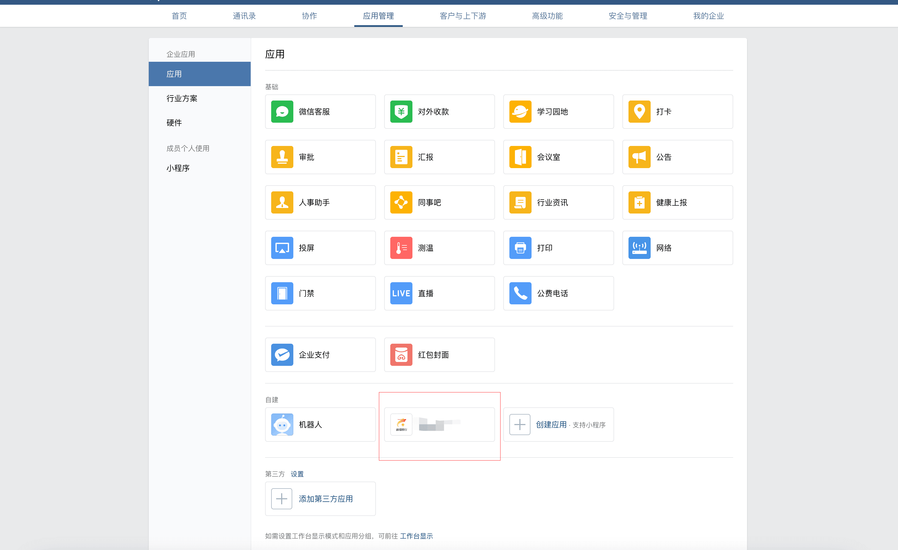

# 微信小程序使用企业微信登录
在微信小程序中实现用户点击登录跳转到企业微信授权登录页面的功能，需要以下几个步骤：
- 构造网页授权链接
- 在小程序中发起跳转
- 用户授权并回调处理

我们从这三方面来实现这个功能。

## 构造网页授权链接

如果企业需要在打开的网页里面携带用户的身份信息，第一步需要构造如下的链接来获取code参数：
```text
https://open.weixin.qq.com/connect/oauth2/authorize?appid=CORPID&redirect_uri=REDIRECT_URI&response_type=code&scope=snsapi_base&state=STATE&agentid=AGENTID#wechat_redirect
```
参数说明可以在[官方链接](https://developer.work.weixin.qq.com/document/path/91022)中查看

这里主要说一下 2 个参数
- appid
- redirect_uri

**appid** 需要在企业微信->我的企业中获取: https://work.weixin.qq.com/wework_admin/frame#profile


**redirect_uri** 则需要在企业微信->应用中中获取，点进去自建的应用，进入网页授权页面，点击添加网页授权域名，添加域名，然后点击保存。

自建的应用的地址是：https://work.weixin.qq.com/wework_admin/frame#apps




这里配置可信域名需完成域名归属认证需要在你的服务器上添加一个 `txt` 文件， 这个文件放在与 `index.html` 文件同一个目录

另外还要配置服务器ip ，因为企业微信说了：企业可信IP为本企业服务器的IP地址，仅所配IP可通过接口获取企业数据。


## 在小程序中发起跳转
在小程序中发起跳转中需要一个 webview 页面 ，所以我们专门创建一个只处理这个登录的 webview 页面，具体的代码如下：

```vue
<template>
  <web-view :src="enterpriseWeChatAuthUrl"></web-view>
</template>

<script>
export default {
  data() {
    return {
      enterpriseWeChatAuthUrl: `https://open.weixin.qq.com/connect/oauth2/authorize?appid=企业ID&redirect_uri=redirect_uri&response_type=code&scope=snsapi_privateinfo&state=STATE&agentid=1000003#wechat_redirect`
    }
  },
  onload() {
  }
}
</script>
```
**注意**
scope 设置了这个 snsapi_privateinfo， 需要扫码企业微信->我的企业->微信插件 中邀请关注的二维码

## 用户授权并回调处理
用户授权后会返回一个 url，例如： https://xxx?code=6NUxlmKDikOqQDPqTQ5vlH-XlMJA-ey3mFGd1MHYorM&amp;state=STATE 

这里会带回一个 code，根据 code + 后端的接口我们可以拿到用户的信息

这里的话我主要想讲的是： `h5 如何跳转到小程序中`， 因为这个 url 跳转的还是小程序的 web-view 页面， 因此我们可以在 h5 页面中使用 `wx.miniProgram` 对象方法进行跳转

**相关步骤**

- 首页需要在微信公众平台下配置业务域名（也就是你的h5地址）
  [去配置](https://mp.weixin.qq.com)， 具体的路径是开发管理->业务域名

- 配置好之后，我们就可以是用 `wx-sdk` 的方法了
  先要在 index.html中引入 wx-sdk

  ```js
  <script src="//res2.wx.qq.com/open/js/jweixin-1.6.0.js"></script>
  ```
  然后 `wx.miniProgram.redirectTo` 进行跳转

  ```vue
  <template>
    <div></div>
  </template>

  <script>
  import wx from 'wx'
  export default {
    data() {
      return {
      }
    },
    created() {
     const { code } = this.$route.query
      wx.miniProgram.redirectTo({
        url: `/pages/login/login?code=${code}`
      })
    }
  }
  </script>

  ```


<br/>
<hr />

⭐️⭐️⭐️好啦！！！本文章到这里就结束啦。⭐️⭐️⭐️

✿✿ヽ(°▽°)ノ✿

撒花 🌸🌸🌸🌸🌸🌸
