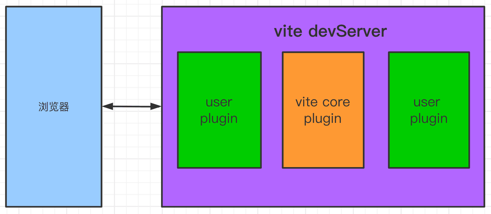
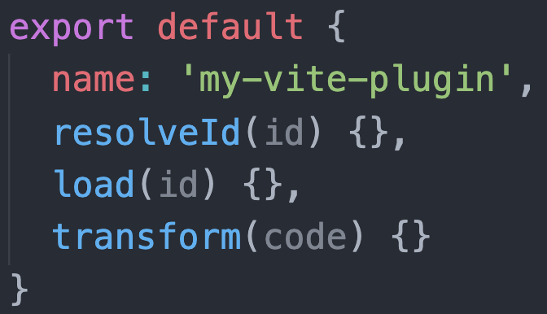
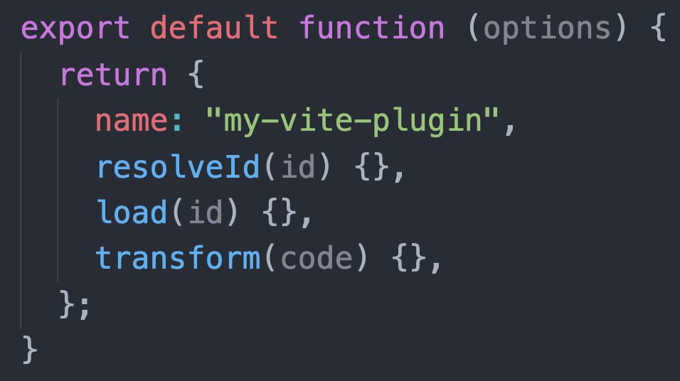
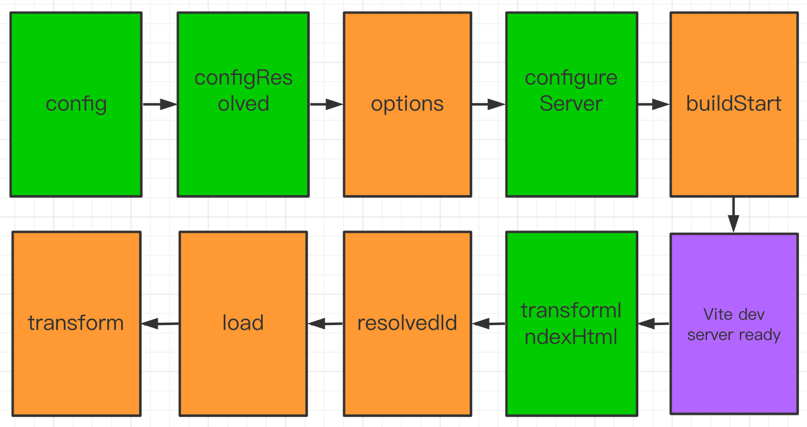
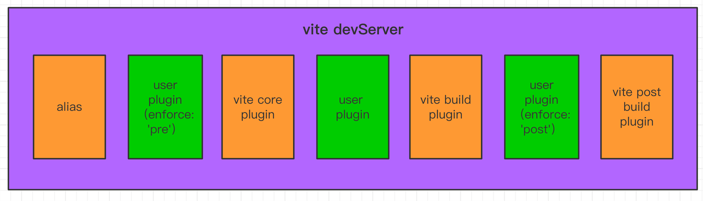
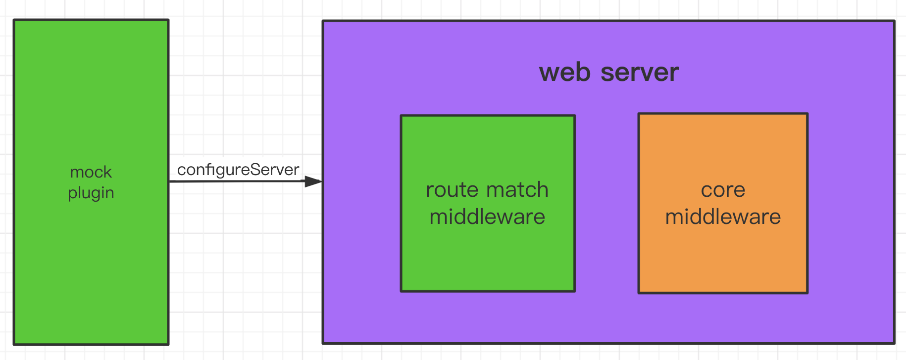

---
sidebar:
  title: vite 插件开发指南
  step: 1
  isTimeLine: true
title: vite 插件开发指南
tags:
  - Vite
categories:
  - Vite
---

# vite 插件开发指南
>原文视频： [bilibili](https://www.bilibili.com/video/BV1jb4y1R7UV/)
><br/>作者： [前端杨村长](https://space.bilibili.com/480140591)
><br/>发布时间：2021-02-17

## Vite 插件是什么

使用 Vite 插件可以扩展 Vite 能力，比如解析用户自定义的文件输入，在打包代码前转译代码，或者查找第三方模块。



### Vite 插件的形式

`Vite`插件扩展自`Rollup`插件接口，只是额外多了一些`Vite`特有选项。

`Vite`插件是一个**拥有名称**、**创建钩子**(build hook)或**生成钩子**(output generate hook)**的对象**。



如果需要配置插件，它的形式应该是一个接收插件选项，**返回插件对象的函数**。



### 范例：加载一个不存在的虚拟模块

创建`vite-plugin-my-example.js`

```js
export default function myExample() {
  return {
    name: "my-example", // 名称用于警告和错误展示
    resolveId(source) {
      if (source === "virtual-module") {
        return source; // 返回source表明命中，vite不再询问其他插件处理该id请求
      }
      return null; // 返回null表明是其他id要继续处理
    },
    load(id) {
      if (id === "virtual-module") {
        return 'export default "This is virtual!"'; // 返回"virtual-module"模块源码
      }
      return null; // 其他id继续处理
    },
  };
}
```

## 插件钩子

### 通用钩子

开发时，`Vite dev server`创建一个插件容器按照`Rollup`调用创建钩子的规则请求各个钩子函数。

下面钩子会在服务器启动时调用一次:

- [`options`](https://rollupjs.org/guide/en/#options) 替换或操纵`rollup`选项
- [`buildStart`](https://rollupjs.org/guide/en/#buildstart) 开始创建

下面钩子每次有模块请求时都会被调用:

- [`resolveId`](https://rollupjs.org/guide/en/#resolveid) 创建自定义确认函数，常用语定位第三方依赖
- [`load`](https://rollupjs.org/guide/en/#load) 创建自定义加载函数，可用于返回自定义的内容
- [`transform`](https://rollupjs.org/guide/en/#transform) 可用于转换已加载的模块内容

下面钩子会在服务器关闭时调用一次:

- [`buildEnd`](https://rollupjs.org/guide/en/#buildend)
- [`closeBundle`](https://rollupjs.org/guide/en/#closebundle)

### Vite 特有钩子

- config: 修改 Vite 配置
- configResolved：Vite 配置确认
- configureServer：用于配置 dev server
- transformIndexHtml：用于转换宿主页
- handleHotUpdate：自定义 HMR 更新时调用

### 范例：钩子调用顺序测试

```js
export default function myExample() {
  // 返回的是插件对象
  return {
    name: "hooks-order",
    // 初始化hooks，只走一次
    options(opts) {
      console.log("options", opts);
    },
    buildStart() {
      console.log("buildStart");
    },
    // vite特有钩子
    config(config) {
      console.log("config", config);
      return {};
    },
    configResolved(resolvedCofnig) {
      console.log("configResolved");
    },
    configureServer(server) {
      console.log("configureServer");
      // server.app.use((req, res, next) => {
      //   // custom handle request...
      // })
    },
    transformIndexHtml(html) {
      console.log("transformIndexHtml");
      return html;
      // return html.replace(
      //   /<title>(.*?)<\/title>/,
      //   `<title>Title replaced!</title>`
      // )
    },
    // 通用钩子
    resolveId(source) {
      if (source === "virtual-module") {
        console.log("resolvedId", source);
        return source;
      }
      return null;
    },
    load(id) {
      if (id === "virtual-module") {
        console.log("load");
        return 'export default "This is virtual!"';
      }
      return null;
    },
    transform(code, id) {
      if (id === "virtual-module") {
        console.log("transform");
      }
      return code;
    },
  };
}
```

### 钩子调用顺序



## 插件顺序

- 别名处理 Alias
- 用户插件设置`enforce: 'pre'`
- Vite 核心插件
- 用户插件未设置`enforce`
- Vite 构建插件
- 用户插件设置`enforce: 'post'`
- Vite 构建后置插件(minify, manifest, reporting)



## 插件编写实操

#### 实现一个 mock 服务器 vite-plugin-mock

实现思路是给开发服务器实例(connect)配一个中间件，该中间件可以存储用户配置接口映射信息，并提前处理输入请求，如果请求的 url 和路由表匹配则接管，按用户配置的 handler 返回结果。



创建`plugins/vite-plugin-mock.js`

```js
import path from "path";

let mockRouteMap = {};

function matchRoute(req) {
  let url = req.url;
  let method = req.method.toLowerCase();
  let routeList = mockRouteMap[method];

  return routeList && routeList.find((item) => item.path === url);
}

function createRoute(mockConfList) {
  mockConfList.forEach((mockConf) => {
    let method = mockConf.type || "get";
    let path = mockConf.url;
    let handler = mockConf.response;
    let route = { path, method: method.toLowerCase(), handler };
    if (!mockRouteMap[method]) {
      mockRouteMap[method] = [];
    }
    console.log("create mock api: ", route.method, route.path);
    mockRouteMap[method].push(route);
  });
}

function send(body) {
  let chunk = JSON.stringify(body);
  // Content-Length
  if (chunk) {
    chunk = Buffer.from(chunk, "utf-8");
    this.setHeader("Content-Length", chunk.length);
  }
  // content-type
  this.setHeader("Content-Type", "application/json");
  // status
  this.statusCode = 200;
  // respond
  this.end(chunk, "utf8");
}
export default function (options = {}) {
  options.entry = options.entry || "./mock/index.js";

  if (!path.isAbsolute(options.entry)) {
    options.entry = path.resolve(process.cwd(), options.entry);
  }

  return {
    configureServer: function ({ app }) {
      const mockObj = require(options.entry);
      createRoute(mockObj);

      const middleware = (req, res, next) => {
        let route = matchRoute(req);

        if (route) {
          console.log("mock request", route.method, route.path);
          res.send = send;
          route.handler(req, res);
        } else {
          next();
        }
      };
      app.use(middleware);
    },
  };
}
```

<br/>
<hr />

⭐️⭐️⭐️好啦！！！本文章到这里就结束啦。⭐️⭐️⭐️

✿✿ヽ(°▽°)ノ✿

撒花 🌸🌸🌸🌸🌸🌸
