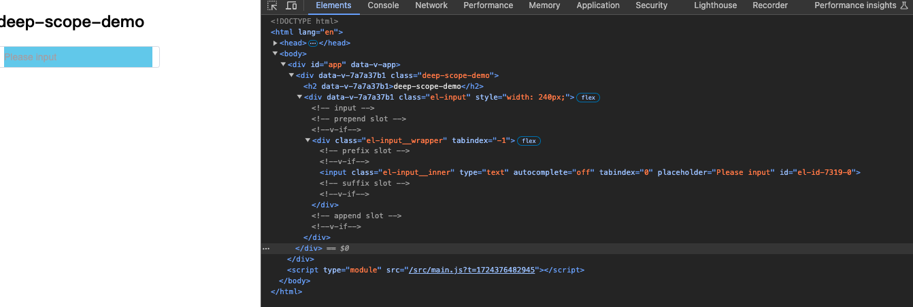

---
sidebar:
  title: vue 样式穿透（deep）与 scope 作用域隔离的原理
  step: 1
  isTimeLine: true
title: vue 样式穿透（deep）与 scope 作用域隔离的原理
tags:
  - Vue2
  - Vue3
categories:
  - Vue2
  - Vue3
---

# vue 样式穿透（deep）与 scope 作用域隔离的原理

## 样式穿透（deep）

先来看一个例子：

```vue
<template>
  <div class="deep-scope-demo">
    <h2>deep-scope-demo</h2>
    <el-input v-model="input" style="width: 240px" placeholder="Please input" />
  </div>
</template>

<style scoped lang="scss">
.deep-scope-demo {
  input {
    background-color: skyblue;
  }
}
</style>
```

在浏览器呈现的效果如下图所示：


可以知道，设置的 input 的背景色并没有生效

:::tip
**不生效原因**

没使用`:deep()`之前，css 样式编译后的结果是

```css
.deep-scope-demo input[data-v-7a7a37b1] {
  background-color: skyblue;
}
```

但是 scoped 的特性只会在子组件的最外层元素添加上父组件的 data-v-xxx 属性， 所以 input 是没有 data-v-xxx 属性的，因此编译后的 css 样式无法找到该元素。
:::

接下来，我们尝试使用 `:deep()` 穿透，css 修改如下

```vue
<style scoped lang="scss">
.deep-scope-demo {
  // input {
  //   background-color: skyblue;
  // }
  :deep(input) {
    background-color: skyblue;
  }
}
</style>
```

此时，在浏览器呈现的效果如下图所示：


可以发现，设置的 input 的背景色生效了。

那么，为什么 `:deep()` 穿透可以生效呢？


:::tip
**生效原因**

使用`:deep()`之后，css 样式编译后的结果是

```css
.deep-scope-demo[data-v-7a7a37b1] input {
  background-color: skyblue;
}
```

可以看到，使用`:deep()`之后，编译后的 css 样式中，添加了上层元素添加了 data-v-xxx 属性，因此可以找到该元素。
:::

## scope 作用域隔离的原理

我们拿上面的例子，来看看 scope 作用域隔离的原理。


可以看到，为元素都添加了 `data-v-xxx` 属性。

所以是`通过给元素添加一个属性选择器，从而让样式只作用于含有该属性的元素来实现样式隔离`

:::tip
**作用域隔离的原理**

- 通过给组件里面的元素添加一个唯一的 `data-v-xxx` 属性来保证他的唯一性
- 会在每句编译后的 css 选择器末尾添加一个当前组件的属性选择器（如[data-v-69538f99]）来私有化样式
- 如果组件内部还有其他组件，只会给`其他组件的最外层元素添加当前组件的 data-v-xxx 属性`，这也就是为什么我们修改一些第三方 ui 库的样式时需要使用深度选择器 `:deep()` 实现样式穿透的原因，因为第三方的子组件内部的元素不会添加当前组件的 `data-v-xxx` 属性，而转译后的 css 又会在末尾添加含有该 `data-v-xxx` 属性的属性选择器，这样就会导致设置的样式无法准确命中。
  :::

## 总结

- `scoped` 的特性只会在子组件的最外层元素添加上父组件的 `data-v-xxx` 属性
- 使用`:deep()`之后，编译后的 css 样式中，添加了上层元素添加了 `data-v-xxx` 属性，因此可以找到该元素
- 通过给元素添加一个属性选择器 `data-v-xxx`，从而让样式只作用于含有该属性的元素来实现样式隔离。