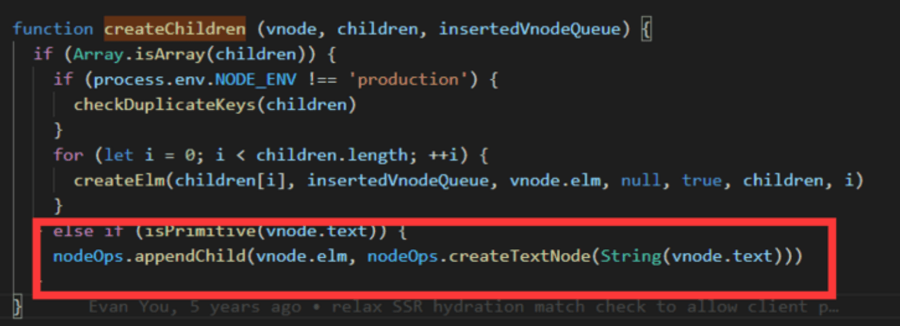

---
sidebar:
  title: vue中是如何防御XSS（注入攻击）的
  step: 1
  isTimeLine: true
title: vue中是如何防御XSS（注入攻击）的
tags:
  - Vue2
categories:
  - Vue2
---

# Vue 中是如何防御 XSS（注入攻击）的

## 什么是 XSS

维基百科解释: **跨站脚本**（英语：Cross-site scripting，通常简称为：XSS）是一种网站应用程序的安全漏洞攻击，是[代码注入](https://zh.wikipedia.org/wiki/代碼注入)的一种。它允许恶意用户将代码注入到网页上，其他用户在观看网页时就会受到影响。这类攻击通常包含了[HTML](https://zh.wikipedia.org/wiki/HTML)以及用户端[脚本语言](https://zh.wikipedia.org/wiki/腳本語言)。

[详细查看](https://zh.wikipedia.org/wiki/%E8%B7%A8%E7%B6%B2%E7%AB%99%E6%8C%87%E4%BB%A4%E7%A2%BC)

## 如何代码注入攻击

现在模拟一段攻击文本

```js
let xssText = '<script> console.log( 'cookie数据为',  document.cookie ) </script>'
```

然后将这段文本放入 html 中

```html
<div>
  <script>
    console.log("cookie数据为", document.cookie);
  </script>
</div>
```

放入之后, 这段脚本就会自动执行, 从而获取到 cookie 之类敏感信息。

那么如何去防御这类攻击呢？

- 将文本内容转化为纯字符串
- 设置禁止通过脚本获取到 cookie

## Vue 中是如何防御 XSS（注入攻击）的

vue 主要是通过用`createTextNode`将文本、动态文本（表达式）转化为纯字符串

我们来看一段模板代码

```vue
<template>
  <div>{{ xssText }}</div>
</template>
<script>
export default {
  data() {
    return {
      xssText: '<script> console.log( 'cookie数据为',  document.cookie ) <\/script>'
    }
  }
}
</script>
```

这种操作有害吗？完全无害。为什么呢？

上面一段模板代码生成的 render 函数类似于

```js
createElement("div", {}, xxsText); // 创建vnode
```

vue 在 patchVnode（ 虚拟 dom 生成 真实 dom ）有如下代码 处理子节点



红框部分意思是 如果 vnode 子节点为 基本类型 如字符串，那么该文本会通过 createTextNode 方法 生成文本节点，然后插入父节点

所以 很明显 xssText 被 createTextNode 处理成了纯字符串了，变成无害的了

## 扩展：v-html 的危害

我们知道 v-html 是通过 innerHTML 将内容直接插入到元素中

如果需要用户自己输入的避免去使用 v-html 去插入，因为这有可能受到 xss 的攻击

当然， 如果非要这样子做的话， 可以对输入的内容进行转义