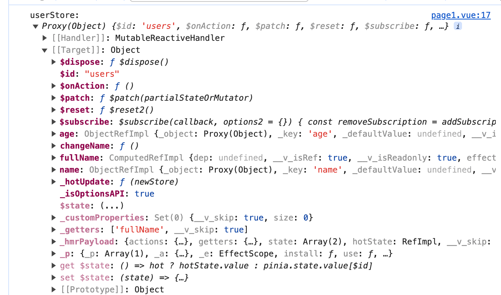

---
sidebar:
  title: Pinia在Vue3里的基本使用
  step: 1
  isTimeLine: true
title: Pinia在Vue3里的基本使用
tags:
  - Vue3
categories:
  - Vue3
---

# Pinia 在 Vue3 里的基本使用

Pinia 概念详解与使用：[一文搞懂 pinia 状态管理（保姆级教程）](https://link.juejin.cn/?target=https%3A%2F%2Fzhuanlan.zhihu.com%2Fp%2F533233367)

## Pinia 与 Vuex 的区别

- 支持选项式 api 和组合式 api 写法
- pinia 没有 mutations，只有：state、getters、actions
- pinia 分模块不需要 modules（之前 vuex 分模块需要 modules）
- TypeScript 支持很好
- 自动化代码拆分
- pinia 体积更小（性能更好）

## 使用流程

### 安装

:::=tabs
::npm

```shell
npm install pinia
```

::yarn

```shell
yarn add pinia
```

::pnpm

```shell
pnpm add pinia
```

:::

### 创建 Pinia 并全局注册

**创建 Pinia**

```ts
// src/store/index.ts
import { createPinia } from "pinia";

const pinia = createPinia();

export default pinia;
```

**全局注册**

```ts
// main-ts
import { createApp } from "vue";
import App from "./App.vue";
import pinia from "./store";

const app = createApp(App);
app.use(pinia); //注册全局pinia

app.mount("#app");
```

### 创建 store

使用 pinia 提供的 defineStore() 方法来创建一个 store，该 store 用来存放我们需要全局使用的数据。
src/store/user.ts

```ts
import { defineStore } from "pinia";
// 第一个参数是应用程序中 store 的唯一 id
export const useUserStore = defineStore("users", {
  // state 是 store 的状态，可以理解为 store 的数据
  state: () => {
    return {
      name: "随缘",
      age: 18,
    };
  },
  // getters 是可以被外部调用的计算属性，可以理解为 store 的计算属性
  getters: {
    fullName(state) {
      return state.name + "66666";
    },
  },
  // actions 是可以被外部调用的方法，可以理解为 store 的方法
  actions: {
    changeName(name: string) {
      this.name = name;
    },
  },
});
```

创建 store 很简单，调用 pinia 中的 defineStore 函数即可，该函数接收两个参数：

- name：一个字符串，必传项，该 store 的唯一 id。
- options：一个对象，store 的配置项，比如配置 store 内的数据，修改数据的方法等等。

我们可以定义任意数量的 store，因为我们其实一个 store 就是一个函数，这也是 pinia 的好处之一，让我们的代码扁平化了，这和 Vue3 的实现思想是一样的。

### 使用 store

page1.vue 代码如下

```vue
<script setup lang="ts">
import { useUserStore } from "../store/user";
const userStore = useUserStore();
console.log("userStore:", userStore);
</script>
```



## state

### 定义 state 数据

```ts
import { defineStore } from "pinia";
// 第一个参数是应用程序中 store 的唯一 id
export const useUserStore = defineStore("users", {
  // state 是 store 的状态，可以理解为 store 的数据
  state: () => {
    return {
      name: "随缘",
      age: 18,
    };
  },
});
```

### 组件(页面)使用 pinia 的 state 数据

**基本使用**

```vue
<template>
  <div>
    <div>pinia 数据</div>
    姓名: {{ userStore.name }} 年龄: {{ userStore.age }}
  </div>
</template>

<script setup lang="ts">
import { useUserStore } from "../store/user";
const userStore = useUserStore();
console.log("userStore:", userStore);
</script>

<style lang="scss" scoped></style>
```

如果使用解构出来的的数据, 则会失去响应式, 需要使用 storeToRef()来进行转换，才能动态获取数据

```vue
<template>
  <div>
    <div>pinia 数据</div>
    姓名: {{ name }}
    <br />
    姓名2: {{ name2 }}
    <br />
    年龄: {{ userStore.age }}
    <br />

    <button @click="userStore.changeName('随缘 666666666')">修改姓名</button>
  </div>
</template>

<script setup lang="ts">
import { storeToRefs } from "pinia";
import { useUserStore } from "../store/user";
const userStore = useUserStore();
// 解构
const { name } = userStore;

// 使用storeToRef
const { name: name2 } = storeToRefs(userStore);
</script>
```

上面代码中, 当点击`修改姓名`时,变化的只有`name2`, 直接对 userStore 会让其失去响应式

### 组件修改 pinia 的 state 数据

本身 pinia 可以直接修改 state 数据，无需像 vuex 一样通过 mutations 才可以修改, 修改的方式有一下以下几种

- 直接修改
- 定义 action 中的 方法修改
- 批量修改

```vue
<template>
  <div>
    <div>pinia 数据</div>
    姓名: {{ name }}
    <br />
    姓名2: {{ name2 }}
    <br />
    年龄: {{ userStore.age }}
    <br />
    <button @click="btn">直接修改姓名</button>
    <button @click="userStore.changeName('随缘 666666666')">
      通过 action 定义的方法修改姓名
    </button>
    <button @click="btn2">批量修改 state</button>
  </div>
</template>

<script setup lang="ts">
import { storeToRefs } from "pinia";
import { useUserStore } from "../store/user";
const userStore = useUserStore();
// 解构
const { name } = userStore;

// 使用storeToRef
const { name: name2 } = storeToRefs(userStore);

const btn = () => {
  userStore.changeName("随缘 777");
};
const btn2 = () => {
  userStore.$patch((state) => {
    state.name = "随缘 888";
    state.age = 20;
  });
};
</script>
```

**直接修改**

直接修改可以通过上述 使用 storeToRef 解构出来的 state 进行修改

```ts
const btn = () => {
  name2.value = "随缘 7777777";
};
```

**定义 action 中的 方法修改**
定义 action 中的 方法修改 可以现在 pinia 的 actions 中定义方法, 该方法可以对 state 数据进行修改

```ts
import { defineStore } from "pinia";
// 第一个参数是应用程序中 store 的唯一 id
export const useUserStore = defineStore("users", {
  // state 是 store 的状态，可以理解为 store 的数据
  state: () => {
    return {
      name: "随缘",
      age: 18,
    };
  },
  // actions 是可以被外部调用的方法，可以理解为 store 的方法
  actions: {
    changeName(name: string) {
      this.name = name;
    },
  },
});
```

**批量修改**

批量修改可以使用$patch 进行批量更新

```ts
const btn2 = () => {
  userStore.$patch((state) => {
    state.name = "随缘 888";
    state.age = 20;
  });
};
```

## getters

getters 和 vuex 的 getters 几乎类似，也是有缓存的机制(类似于 vue 计算属性)

**定义**

```ts
import { defineStore } from "pinia";
// 第一个参数是应用程序中 store 的唯一 id
export const useUserStore = defineStore("users", {
  // state 是 store 的状态，可以理解为 store 的数据
  state: () => {
    return {
      name: "随缘",
      age: 18,
    };
  },
  // getters 是可以被外部调用的计算属性，可以理解为 store 的计算属性
  getters: {
    fullName(state) {
      return state.name + "66666";
    },
  },
});
```

**使用**

```vue
<template>
  <div>
    <div>pinia 数据</div>
    全名: {{ userStore.fullName }}
  </div>
</template>

<script setup lang="ts">
import { storeToRefs } from "pinia";
import { useUserStore } from "../store/user";
const userStore = useUserStore();
</script>
```

## actions

actions 是定义 store 里的方法

**定义**

```ts
import { defineStore } from "pinia";
// 第一个参数是应用程序中 store 的唯一 id
export const useUserStore = defineStore("users", {
  // state 是 store 的状态，可以理解为 store 的数据
  state: () => {
    return {
      name: "随缘",
      age: 18,
    };
  },
  // actions 是可以被外部调用的方法，可以理解为 store 的方法
  actions: {
    changeAge(age: number) {
      this.age = age;
    },
  },
});
```

**使用**

```vue
<template>
  <div>
    <div>pinia 数据</div>
    年龄: {{ userStore.age }}
    <button @click="userStore.changeAge(20)">修改年龄</button>
  </div>
</template>

<script setup lang="ts">
import { storeToRefs } from "pinia";
import { useUserStore } from "../store/user";
const userStore = useUserStore();
</script>
```

以上就是 Pinia 在 Vue3 里的基本使用了, 下面介绍一下不怎么常用的功能

## $reset 重置 state

`$reset` 可以重置 state 数据, 注意: 这是让所有 state 数据变为最开始的状态

**使用**

```vue
<script setup lang="ts">
import { storeToRefs } from "pinia";
import { useUserStore } from "../store/user";
const userStore = useUserStore();
// 重置状态
userStore.$reset();
</script>
```

## $subscribe 订阅 state

`$subscribe` 可以订阅 state, 也就是可以监听 state 数据的变化,从而做一些操作

```vue
<script setup lang="ts">
import { storeToRefs } from "pinia";
import { useUserStore } from "../store/user";
const userStore = useUserStore();
// 订阅状态
userStore.$subscribe((mutation, state) => {
  // todo ...
  console.log("mutation:", mutation);
  console.log("state:", state);
});
</script>
```

<br/>
<hr />

⭐️⭐️⭐️ 好啦！！！本文章到这里就结束啦。⭐️⭐️⭐️

✿✿ ヽ(°▽°)ノ ✿

撒花 🌸🌸🌸🌸🌸🌸
