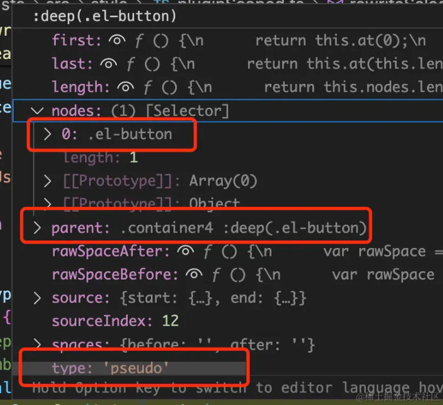

---
sidebar:
  title: 为什么 vue:deep、/deep/、>>> 样式能穿透到子组件
  step: 1
  isTimeLine: true
title: 为什么 vue:deep、/deep/、>>> 样式能穿透到子组件
tags:
  - Vue2
  - Vue3
categories:
  - Vue2
  - Vue3
---

# 为什么 vue:deep、/deep/、>>> 样式能穿透到子组件

> 原文：[掘金](https://juejin.cn/post/7397285315822632997) ><br/> 作者：[前端下饭菜](https://juejin.cn/user/906414209122200/posts)

## 为什么 vue:deep、/deep/、>>> 样式能穿透到子组件

在 scoped 标记的 style 中，只要涉及三方组件，那 deep 符号会经常被使用，用来修改外部组件的样式。

## 小试牛刀

### 不使用 deep

要想修改三方组件样式，只能添加到 scoped 之外，弊端是污染了全局样式，后续可能出现样式冲突。

```css
<style lang="less" > .container {
  .el-button {
    background: #777;
  }
}
```

### 使用 /deep/

```css
.container1 {
  /deep/ .el-button {
    background: #000;
  }
}
```

### 使用 >>>

```css
.container2 >>> .el-button {
  background: #222;
}
```

:::tip 提示
当在 vue3 使用 /deep/ 或者 >>>、::v-deep，console 面板会打印警告信息：
`the >>> and /deep/ combinators have been deprecated. Use :deep() instead`
:::

由于 /deep/ 或者 >>> 在 less 或者 scss 中存在兼容问题，所以不推荐使用了。

### 使用 :deep

```css
.container3 {
  :deep(.el-button) {
    background: #444;
  }
}
```

那么问题来了，如果我按以下的方式嵌套 deep，能生效吗？

```css
.container4 {
  :deep(.el-button) {
    :deep(.el-icon) {
      color: #f00;
    }
  }
}
```

## 源码解析

### /deep/ 或 >>> 会被编译为什么

编译后的代码为：

```css
.no-deep .container1[data-v-f5dea59b] .el-button {
  background: #000;
}
```

源代码片段：

```js
if (n.type === "combinator" && (n.value === ">>>" || n.value === "/deep/")) {
  n.value = " ";
  n.spaces.before = n.spaces.after = "";
  warn(
    `the >>> and /deep/ combinators have been deprecated. ` +
      `Use :deep() instead.`
  );
  return false;
}
```

当 vue 编译样式时，先将样式解析为 AST 对象，例如 deep/ .el-button 会被解析为 Selector 对象，/deep/ .el-button 解析后生成的 Selector 包含的字段：

```js
{ type: 'combinator'， value: '/deep/' }
```

然后将 n.value 由/deep/替换为空 。所以转换出来的结果，.el-button 直接变为.container 下的子样式。

### :deep 会被编译为什么？

编译后的代码：

```css
.no-deep .container3[data-v-f5dea59b] .el-button {
  background: #444;
}
```

源代码片段：

```js
// .foo :v-deep(.bar) -> .foo[xxxxxxx] .bar
let last: selectorParser.Selector["nodes"][0] = n;
n.nodes[0].each((ss) => {
  selector.insertAfter(last, ss);
  last = ss;
});
// insert a space combinator before if it doesn't already have one
const prev = selector.at(selector.index(n) - 1);
if (!prev || !isSpaceCombinator(prev)) {
  selector.insertAfter(
    n,
    selectorParser.combinator({
      value: " ",
    })
  );
}
selector.removeChild(n);
```

还是以 .container4 :deep(.el-button) 为例，当解析到 :deep 符号式，selector 快照为



parent 为`.container4 :deep(.el-button)`，当前 selector 的 type 正好为伪类标识 `pseudo`，nodes 节点包含一个`.el-button`。

经过递归遍历，生成的 selector 结构为`.container4 :deep(.el-button).el-button`，

最后一行代码`selector.removeChild(n)`会将`:deep(.el-button)`移出，所以输出的最终样式为`.container4 .el-button`。

如果样式为`:deep(.el-button) { :deep(.el-icon) { color: #f00 } }`，当遍历 .el-icon 时找不到 ancestor，所以直接将`:deep(.el-icon)`作为其 icon 时找不到 ancestor ,其结果为:

```css
.no-deep .container4[data-v-f5dea59b] .el-button :deep(.el-icon) {
  color: #f00;
}
```

因此，deep 是不支持嵌套的。

## 总结

- /deep/ 和 >>> 编译后，会直接将样式变为.container 下的子样式。
- :deep 编译后，会直接将样式变为.container 下的子样式。
- :deep 编译，不支持嵌套。