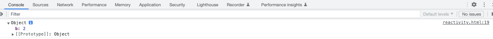

# reactive实现

## 前言

在vue3中，将引用数据类型(数组或者对象)变为响应式数据用的是reactive。

reactive的形式共有四种：

- reactive
- shallowReactive（只有第一层具备响应式）
- readonly（仅读）
- shallowReadonly（仅读和只有第一层具备响应式）

一般我们就用reactive， 但是既然学习vue3， 当然其他3个我们也要学习一下，下面通过本文章来展示这几个reactive如何使用和实现。

## 基本使用

想要去实现这几个reactive， 我们必须知道他们几个怎么用，我们先去github克隆一下vue3源码。

```shell
git clone https://github.com/vuejs/core
```

克隆下来之后，先打包我们需要的文件， 在终端中执行命令。

```shell
pnpm i

pnpm run build 
```

执行完命令后， 我们可以看见在packages/vue/下多了一个dist文件夹， 这里面就是我们打包后的文件。

### 使用

- 创建examples文件夹
- 创建reactivity文件
- 然后在reactivity文件写下下面代码

```html
<!DOCTYPE html>
<html lang="en">
<head>
  <meta charset="UTF-8">
  <meta http-equiv="X-UA-Compatible" content="IE=edge">
  <meta name="viewport" content="width=device-width, initial-scale=1.0">
  <title>Document</title>
</head>
<body>
  <script src="../packages/reactivity//dist/reactivity.global.js"></script>
  <script>
    const { reactive, shallowReactive, readonly, shallowReadonly }  = VueReactivity
    const state = shallowReadonly({
      a: 1,
      obj: {
        b: 2
      }
    })
    console.log(state.obj)
    state.a =  3
    console.log(state.a)
    const test = shallowReadonly(false)
  </script>
</body>
</html>
```

上面的代码， 我们可以通过访问变量和修改变量来测试它们的作用，例如： shallowReactive

```javascript
const { reactive, shallowReactive, readonly, shallowReadonly }  = VueReactivity
    const state = shallowReadonly({
      a: 1,
      obj: {
        b: 2
      }
    })
    console.log(state.obj)
```

在浏览器看到的结果已经不是proxy的了，只是一个普通对象



## 实现

大概知道了几个reactive的基本使用后，我们就可以进入实现的一个过程，首先我们先分析如何实现和具体的一些细节。

**从一开始我们知道几个reactive的不同之处**

- reactive
- shallowReactive（只有第一层具备响应式）
- readonly（仅读）
- shallowReadonly（仅读和只有第一层具备响应式）

**只有第一层具备响应式，也就是说如果嵌套对象，只处理第一层，不用去管下面的， 直接返回结果**

**仅读指的是我们在拦截set方法是， 不去操作set方法**

**reactive是用过proxy实现的**

了解了几个reactive的不同之处后， 我们来一步一步的去实现这几个**reactive。**

首先，通过上面我们可以了解到，几个reactive其实是大同小异，那么我们就可以用柯里化的思想一个思想来处理这几个reactive，也就是用过定义一个共同函数，通过参数的不一样， 来处理不用的逻辑。

```typescript
/**
 * createReactiveObject
 * @param target 目标对象
 * @param isReadonly 是否仅读
 * @param baseHandlers (proxy handlers 核心)
 */
function createReactiveObject(target, isReadonly, baseHandlers) {}
```

上面createReactiveObject函数， 通过isReadonly来决定是否仅读， 通过baseHandlers来决定get和set应该如何进行拦截， 那么下面我们对这几种reactive就可以这样子定义。

```typescript
// 基本reactive
export function reactive(target) {
  return createReactiveObject(target, false, mutableHandlers)
}
// 浅reactive
export function shallowReactive(target) {
   return createReactiveObject(target, false, shallowReactiveHandlers)
}
// 只读reactive
export function readonly(target) {
   return createReactiveObject(target, true, readonlyHandlers)
}
// 浅只读reactive
export function shallowReadonly(target) {
   return createReactiveObject(target, true, shallowReadonlyHandlers)
}
```

### createReactiveObject的相关逻辑

定义好了reactive， 我们就可以处理createReactiveObject的逻辑：

- 首先我们知道reactive的实现是使用proxy来实现的
- proxy的参数是一个对象
- 如果我们已经使用proxy过对象，那么下次就不再用proxy处理了

```typescript
export const reactiveMap = new WeakMap()
export const readonlyMap = new WeakMap()

// 函数柯里化思想
/**
 * createReactiveObject
 * @param target 目标对象
 * @param isReadonly 是否只读
 * @param baseHandlers proxy handlers (核心)
 */
function createReactiveObject(target, isReadonly, baseHandlers) {
  // 1.proxy 只接受对象为为参数
  if(!isObject(target)) {
    console.warn(`value cannot be made reactive: ${String(target)}`)
    return target
  }

  // 2.进行存储, 多次用proxy处理, 返回第一次处理情况
  const proxyMap = isReadonly ? readonlyMap : reactiveMap
  const existingProxy = proxyMap.get(target)
  // 如果存储中有
  if(existingProxy) {
    return existingProxy
  }

  const proxy = new Proxy(target, baseHandlers)
  // 存储
  proxyMap.set(target, proxy)
  return proxy
}
```

createReactiveObject的相关逻辑已经处理完毕了， 后面我们可以去处理baseHandlers的相关逻辑了。

### baseHandlers的相关逻辑

baseHandlers主要是拦截get和set，get是读取的时候触发get函数里面的逻辑，set是重新取值的时候触发get函数里面的逻辑。

这里我们需要了解的是，如果是仅读的reactive，不会进行依赖收集和触发，而非仅读的reactive会进行依赖收集和触发。

baseHandlers的实现我们依旧使用柯里化的思想。

```typescript
import { isObject, extend } from '../../shared/src/index';
import { reactive, readonly } from './reactive';
// 实现new Proxy(targets, handler)

// 是不是仅读 ,仅读的属性set会报异常
// 是不是深度的
/**
 * 拦截获取
 * @param isReadonly 是否仅读
 * @param shallow 是否浅的
 */
function createGetter(isReadonly = false, shallow = false) {
  return function get(target, key, receiver) {
    const res = Reflect.get(target, key, receiver)
    // 非仅读
    if (!isReadonly) {
      // 收集依赖
    }
    if (shallow) {
      return res
    }
    if (isObject(res)) {
      // 递归(vue2的处理事一上来就递归, 而vue3只有当嵌套对象才去递归)
      return isReadonly ? readonly(res) : reactive(res)
    }
    return res
  }
}

function createSetter(shallow = false) {
  return function set(target, key, value, receiver) {
    // let oldValue = target[key]
    const res = Reflect.set(target, key, value, receiver) // 设置新的
    // 浅的, 直接返回就行
    if (shallow) {
      return res
    }
    // 如果还是对象, 递归
    if (isObject(res)) {
      return reactive(res)
    }
    return res
  }

}


const get = createGetter()
const shallowGet = createGetter(false, true)
const readonlyGet = createGetter(true)
const shallowReadonlyGet = createGetter(true, true)


const set = createSetter()
const shallowSet = createSetter(true)

// 4种handler, 对应4个reactive
export const mutableHandlers = {
  get,
  set
}
export const shallowReactiveHandlers = {
  get: shallowGet,
  set: shallowSet
}

// 仅读的不会收集依赖
export const readonlyHandlers = {
  get: readonlyGet,
  set(target, key) {
    console.warn(`Set operation on key "${String(key)}" failed: target is readonly.`, target)
    return true
  }
}
// extend === Object.assign
export const shallowReadonlyHandlers = extend(
  {},
  readonlyHandlers,
  {
    get: shallowReadonlyGet
  }
)
```

上面的代码中， 我们创建了4中不一样的get和set来处理不一样的情况，如果是仅读，我们对其set设置了警告（warn），但不是仅读的，我们需要注意其是深的还是浅的， 深的我们就递归去处理，浅的我们就直接返回

## 总结

**reactive的实现就到这里了， 其实实现一个reactive还是很简单的， 只要我们注意几个点就好：**

- **reactive是处理复制数据的**
- **使用proxy实现， 参数必须是对象**
- **注意深的还是浅的， 深的我们就递归处理， 浅的直接返回**
- **还有仅读的， 我们对它的set不怎么做处理， 只输出警告⚠️**
- **使用柯里化的思想来实现代码会更清晰且易追踪**

## mini-vue3实现相关

[reactive实现](https://codevity.top/article/web/vue/vue3/source-code/1-reactive.html)

[ref实现](https://codevity.top/article/web/vue/vue3/source-code/3-ref.html)

[effect实现](https://codevity.top/article/web/vue/vue3/source-code/2-effect.html)

[computed实现](https://codevity.top/article/web/vue/vue3/source-code/5-computed.html)