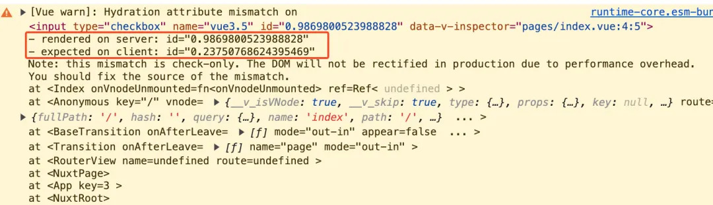

---
sidebar:
  title: Vue3.5 主要新特性详解
  step: 1
  isTimeLine: true
title: Vue3.5 主要新特性详解
tags:
  - Vue3 版本更新变化
categories:
  - Vue3 版本更新变化
---

# Vue3.5 主要新特性详解

## 前言

9 月 3 日，Vue 3.5 正式发布，版本代号为 “天元突破红莲螺岩”，其主要更新概括：

- 响应性系统优化

- 响应式 Props 解构

- 服务端渲染（SSR）改进

  - 新增`useId` 函数
  - Lazy Hydration
  - data-allow-mismatch

- 自定义元素改进

- 其他值得注意的特性：

  - 新增`useTemplateRef`函数
  - 延迟 Teleport （defer）
  - 新增`onWatcherCleanup`函数

- 其他
  - 新增`onEffectCleanup`函数
  - 新增`base watch`函数
  - 新增`pause`和`resume`方法
  - watch 的 deep 选项支持传入数字

## 响应性系统优化

这次响应式的重构是属于 Vue 内部优化，对于普通开发者来说是无感的。重构后内存占用减少了 `56%`，优化手段主要是通过`版本计数`和`双向链表数据结构`，灵感来源于 Preact signals。

## 响应式 props 支持解构

在 3.5 中响应式 props 支持解构终于正式稳定了，在没有这个功能之前我们想要在 js 中访问 prop 必须要这样写：`props.name`，否则 `name` 将会丢失响应式。

有了响应式 props 解构后，在 js 中我们就可以直接解构出 `name` 来使用，比如下面这样的代码：

```vue
<script setup lang="ts">
const { name } = defineProps({
  name: String,
});

console.log(name);
</script>
```

当`defineProps`搭配解构一起使用后，在编译时就可以将`name`处理成`props.name`。编译后简化的代码如下：

```js
setup(__props) {
  console.log(__props.name);
  const __returned__ = {};
  return __returned__;
}
```

从上面的代码可以看到 `console.log(name)`经过编译后变成了 `console.log(__props.name)`，这样处理后 name 当然就不会丢失响应式了。

## 服务端渲染（SSR）改进

服务端渲染 SSR 主要有这几个部分：新增 useId 函数、Lazy Hydration 懒加载水合、data-allow-mismatch

### useId 函数

有时我们需要生成一个随机数塞到 DOM 元素上，比如下面这个场景：

```vue
<template>
  <label :htmlFor="id">Do you like Vue3.5?</label>
  <input type="checkbox" name="vue3.5" :id="id" />
</template>

<script setup lang="ts">
const id = Math.random();
</script>
```

在这个场景中我们需要生成一个随机数 id，在普通的客户端渲染中这个代码是没问题的。

但是如果这个代码是在 SSR 服务端渲染中那么就会报警告了，如下图：



上面报错的意思是服务端和客户端生成的 `id` 不一样，因为服务端和客户端都执行了一次 `Math.random()` 生成 `id`。由于 `Math.random()` 每次执行的结果都不同，自然服务端和客户端生成的 `id` 也不同。

`useId` 函数的作用就是为了解决这个问题。

当然 `useId` 也可以用于客户端渲染的一些场景，比如在列表中我们需要一个唯一键，但是服务端又没有给我们，这时我们就可以使用 `useId` 给列表中的每一项生成一个唯一键。

## Lazy Hydration 懒加载水合

异步组件现在可以通过 defineAsyncComponent() API 的 hydrate 选项来控制何时进行水合。

## data-allow-mismatch

SSR 中有的时候确实在服务端和客户端生成的 html 不一致，比如在 DOM 上面渲染当前时间，代码如下：

```vue
<template>
  <div>当前时间是：{{ new Date() }}</div>
</template>
```

这种情况是避免不了会出现前面 useId 例子中的那种警告，此时我们可以使用 data-allow-mismatch 属性来干掉警告，代码如下：

```vue
<template>
  <div data-allow-mismatch>当前时间是：{{ new Date() }}</div>
</template>
```

## 自定义元素改进

修复了与 `defineCustomElement()` API 相关的许多长期存在的问题，并增加了新功能，如通过 `configureApp` 选项支持应用配置，以及访问自定义元素的宿主元素和影子根。

## useTemplateRef 函数

vue3 中想要访问 DOM 和子组件可以使用 ref 进行模版引用，但是这个 ref 有一些让人迷惑的地方。

比如定义的 ref 变量到底是一个响应式数据还是 DOM 元素？

还有 template 中 ref 属性的值明明是一个字符串，比如`ref="inputEl"`，怎么就和 script 中同名的`inputEl`变量绑到一块了呢？

3.5 中的`useTemplateRef`函数就可以完美的解决了这些问题。

这是 3.5 之前使用 ref 访问 input 输入框的例子：

```vue
<input type="text" ref="inputEl" />

const inputEl = ref<HTMLInputElement>();
```

使用`useTemplateRef`函数后就好多了，代码如下：

```vue
<input type="text" ref="inputRef" />

const inputEl = useTemplateRef<HTMLInputElement>("inputRef");
```

使用`useTemplateRef`函数后会返回一个 ref 变量，`useTemplateRef`函数传的参数是字符串`"inputRef"`。

在 template 中`ref`属性的值也是字符串`"inputRef"`，所以`useTemplateRef`函数的返回值就指向了 DOM 元素 input 输入框。

[Vue3.5 的 useTemplateRef 让 ref 操作 DOM 更加丝滑](https://mp.weixin.qq.com/s/IceXvCd3PMcWIVnPahPTVg)

## 延迟 Teleport

`Teleport`组件的作用是将 children 中的内容传送到指定的位置去，比如下面的代码：

```vue
<div id="target"></div>
<Teleport to="#target">被传送的内容</Teleport>
```

文案`被传送的内容`最终会渲染在`id="target"`的 div 元素中。

在之前有个限制，就是不能将`<div id="target">`放在`Teleport`组件的后面。

这个也很容易理解 DOM 是从上向下开始渲染的，如果先渲染到`Teleport`组件。然后就会去找 id 的值为`target`的元素，如果找不到当然就不能成功的将`Teleport`组件的子节点传送到`target`的位置。

在 3.5 中为了解决这个问题，在`Teleport`组件上新增了一个`defer`延迟属性。

加了`defer`延迟属性后就能将`target`写在`Teleport`组件的后面，代码如下：

```vue
<Teleport defer to="#target">被传送的内容</Teleport>
<div id="target"></div>
```

`defer`延迟属性的实现也很简单，就是等这一轮渲染周期结束后再去渲染`Teleport`组件。所以就算是`target`写在`Teleport`组件的后面，等到渲染`Teleport`组件的时候`target`也已经渲染到页面上了。

## onWatcherCleanup 函数

在组件卸载之前或者下一次`watch`回调执行之前会自动调用`onWatcherCleanup`函数，同样有了这个函数后你就不需要在组件的`beforeUnmount`钩子函数去统一清理一些 timer 了。比如下面这个场景：

```js
import { watch, ref, onWatcherCleanup } from "vue";

watch(flag, () => {
  const timer = setInterval(() => {
    // 做一些事情
    console.log("do something");
  }, 200);
  onWatcherCleanup(() => {
    console.log("清理定时器");
    clearInterval(timer);
  });
});
```

和`onEffectCleanup`函数不同的是我们可以从 vue 中 import 导入`onWatcherCleanup`函数。

## onEffectCleanup 函数

在组件卸载之前或者下一次`watchEffect`回调执行之前会自动调用`onEffectCleanup`函数，有了这个函数后你就不需要在组件的`beforeUnmount`钩子函数去统一清理一些 timer 了。

```js
import { watchEffect, ref } from "vue";
import { onEffectCleanup } from "@vue/reactivity";

const flag = ref(true);
watchEffect(() => {
  if (flag.value) {
    const timer = setInterval(() => {
      // 做一些事情
      console.log("do something");
    }, 200);
    onEffectCleanup(() => {
      clearInterval(timer);
    });
  }
});
```

上面这个例子在`watchEffect`中会去注册一个循环调用的定时器，如果不使用`onEffectCleanup`，那么我们就需要在`beforeUnmount`钩子函数中去清理定时器。

但是有了`onEffectCleanup`后，将`clearInterval`放在他的回调中就可以了。当组件卸载时会自动执行`onEffectCleanup`传入的回调函数，也就是会执行`clearInterval`清除定时器。

还有一点值得注意的是`onEffectCleanup`函数目前没有在`vue`包中暴露出来，如果你想使用可以像我这样从`@vue/reactivity`包中导入`onEffectCleanup`函数。

## base watch 函数

我们之前使用的`watch`函数是和 Vue 组件以及生命周期一起实现的，他们是深度绑定的，所以`watch`函数代码的位置在 vue 源码中的`runtime-core`模块中。

但是有的场景中我们只想使用 vue 的响应式功能，也就是 vue 源码中的`reactivity`模块，比如小程序`vuemini`。为此我们不得不将`runtime-core`模块也导入到项目中，或者像`vuemini`一样去手写一个 watch 函数。

在 3.5 版本中重构了一个`base watch`函数，这个函数的实现和 vue 组件没有一毛钱关系，所以他是在`reactivity`模块中。详情可以查看文章：[Vue3.5 新增的 baseWatch 让 watch 函数和 Vue 组件彻底分手](https://mp.weixin.qq.com/s?__biz=MzkzMzYzNzMzMQ==&mid=2247485662&idx=1&sn=731cf8872f576b5766e9adbd44e999a2&scene=21#wechat_redirect)

还有一点就是这个`base watch`函数对于普通开发者来说没有什么影响，但是对于一些下游项目，比如`vuemini`来说是和受益的。

## **pause 和 resume 方法**

有的场景中我们可能想在“一段时间中暂停一下”，不去执行`watch`或者`watchEffect`中的回调。等业务条件满足后再去恢复执行`watch`或者`watchEffect`中的回调。在这种场景中`pause`和`resume`方法就能派上用场啦。

下面这个是`watchEffect`的例子，代码如下：

```vue
<template>
  <button @click="count++">count++</button>
  <button @click="runner2.pause()">暂停</button>
  <button @click="runner2.resume()">恢复</button>
</template>

<script setup lang="ts">
import { watchEffect } from "vue";

const count = ref(0);
const runner2 = watchEffect(() => {
  if (count.value > 0) {
    console.log(count.value);
  }
});
</script>
```

在上面的 demo 中，点击`count++`按钮后理论上每次都会执行一次`watchEffect`的回调。

但是当我们点击了暂停按钮后就会执行`pause`方法进行暂停，在暂停期间`watchEffect`的回调就不会执行了。

当我们再次点击了恢复按钮后就会执行`resume`方法进行恢复，此时`watchEffect`的回调就会重新执行。

不光`watchEffect`可以执行`pause`和`resume`方法，`watch`一样也可以执行`pause`和`resume`方法。代码如下：

```js
const runner = watch(count, () => {
  if (count.value > 0) {
    console.log(count.value);
  }
});

runner.pause(); // 暂停方法
runner.resume(); // 恢复方法
```

## watch 的 deep 选项支持传入数字

在以前`deep`选项的值要么是`false`，要么是`true`，表明是否深度监听一个对象。在 3.5 中`deep`选项支持传入数字了，表明监控对象的深度。

比如下面的这个 demo：

```js
const obj1 = ref({
  a: {
    b: 1,
    c: {
      d: 2,
      e: {
        f: 3,
      },
    },
  },
});

watch(
  obj1,
  () => {
    console.log("监听到obj1变化");
  },
  {
    deep: 3,
  }
);

function changeDeep3Obj() {
  obj1.value.a.c.d = 20;
}

function changeDeep4Obj() {
  obj1.value.a.c.e.f = 30;
}
```

在上面的例子`watch`的`deep`选项值是 3，表明监听到对象的第 3 层。

`changeDeep3Obj`函数中就是修改对象的第 3 层的`d`属性，所以能够触发`watch`的回调。

而`changeDeep4Obj`函数是修改对象的第 4 层的`f`属性，所以不能触发`watch`的回调。

## 参考

https://blog.vuejs.org/posts/vue-3-5

https://mp.weixin.qq.com/s/HOZ3pa_7Xks1olet7zWb3Q

https://mp.weixin.qq.com/s/X-N0q2BK9ONN8iz-oWW4-A

## 最后

Vue Macros: 由 Vue 团队成员维护的一个 超前版 Vue

[Vue Macros](https://vue-macros.dev/zh-CN/)

<br/>
<hr />

⭐️⭐️⭐️ 好啦！！！本文章到这里就结束啦。⭐️⭐️⭐️

✿✿ ヽ(°▽°)ノ ✿

撒花 🌸🌸🌸🌸🌸🌸
