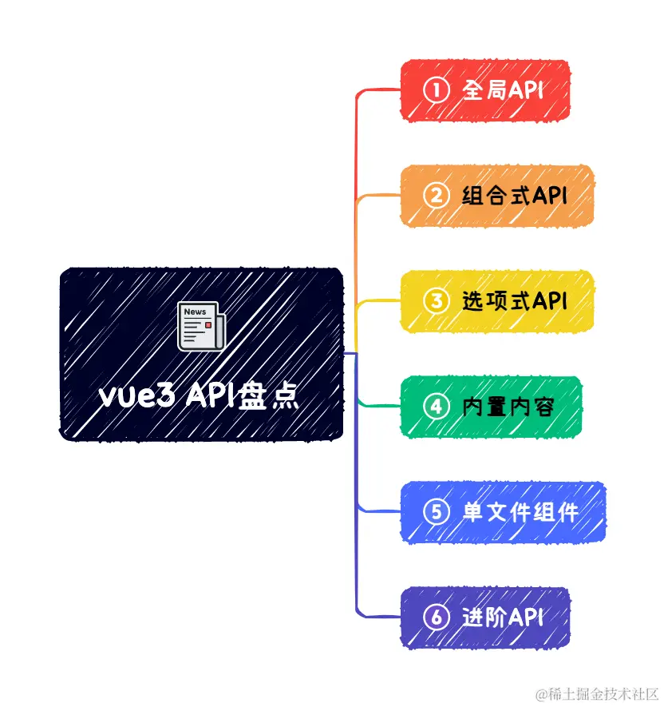

---
sidebar:
  title: 地板式扫盲了 Vue3 所有API盲点
  step: 1
  isTimeLine: true
title: 地板式扫盲了 Vue3 所有API盲点
tags:
  - Vue3
categories:
  - Vue3
---

# 地板式扫盲了 Vue3 所有API盲点

## 关于文档

首先附上官方文档的具体材料：[cn.vuejs.org/api/](https://link.juejin.cn/?target=https%3A%2F%2Fcn.vuejs.org%2Fapi%2F)

## VUE3 API整体盘点

在`vue3`的全新`API`中，有部分在`vue2`的基础上沿用了。还有另外一部分，是`vue3`所新增加的。我们先来看`vue3 API`文档主要包含哪些内容？

`vue3 API`主要包含以下六个部分：

- 全局API —— 全局会用到的API
- 组合式API —— vue3所拥有的组合式API
- 选项式API —— vue2所拥有的选项式API
- 内置内容 —— 指令、组件、特殊元素和特殊属性
- 单文件组件 —— 语法定义、
- 进阶API —— 渲染函数、服务端渲染、TS工具类型和自定义渲染

下面将依据上面提到的六大点内容，来进行相应的剖析和讲解。

## 全局API
## 组合式API
## 选项式API
## 内置内容
## 单文件组件
## 进阶API

 

⭐️⭐️⭐️ 好啦！！！本文章到这里就结束啦。⭐️⭐️⭐️

✿✿ ヽ(°▽°)ノ ✿

撒花 🌸🌸🌸🌸🌸🌸
