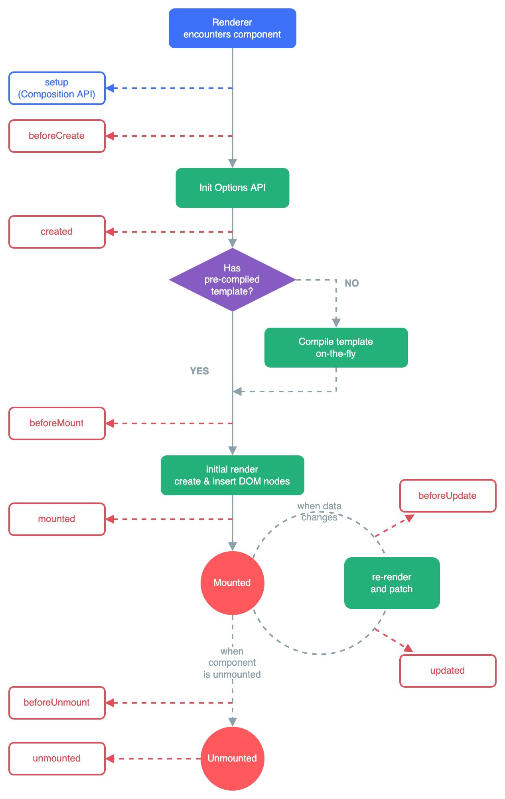

---
sidebar:
  title: vue3 基础知识
  step: 1
  isTimeLine: true
title: vue3 基础知识
tags:
  - Vue3
categories:
  - Vue3
---

# vue3 基础知识

## **创建一个 Vue 应用**

### 应用实例

每个 Vue 应用都是通过 [`createApp`](https://cn.vuejs.org/api/application.html#createapp) 函数创建一个新的 **应用实例**：

```js
import { createApp } from "vue";

const app = createApp({
  /* 根组件选项 */
});
```

### 根组件

我们传入 `createApp` 的对象实际上是一个组件，每个应用都需要一个`根组件`，其他组件将作为其子组件。

如果你使用的是单文件组件，我们可以直接从另一个文件中导入根组件。

```js
import { createApp } from "vue";
// 从一个单文件组件中导入根组件
import App from "./App.vue";

const app = createApp(App);
```

### 挂载应用

应用实例必须在调用了 `.mount()` 方法后才会渲染出来。该方法接收一个容器参数，可以是一个实际的 DOM 元素或是一个 CSS 选择器字符串：

```html
<div id="app"></div>
```

```js
app.mount("#app");
```

应用根组件的内容将会被渲染在容器元素里面。容器元素自己将**不会**被视为应用的一部分。

## **模版语法**

### 动态参数

在指令参数上也可以使用一个 JavaScript 表达式，需要包含在一对方括号内：

```js
<a v-bind:[attributeName]="url"> ... </a>

<!-- 简写 -->
<a :[attributeName]="url"> ... </a>
```

这里的 `attributeName` 会作为一个 JavaScript 表达式被动态执行，计算得到的值会被用作最终的参数。举例来说，如果你的组件实例有一个数据属性 `attributeName`，其值为 `"href"`，那么这个绑定就等价于 `v-bind:href`。

相似地，你还可以将一个函数绑定到动态的事件名称上：

```js
<a v-on:[eventName]="doSomething"> ... </a>

<!-- 简写 -->
<a @[eventName]="doSomething">
```

在此示例中，当 `eventName` 的值是 `"focus"` 时，`v-on:[eventName]` 就等价于 `v-on:focus`。

#### 动态参数值的限制

动态参数中表达式的值应当是一个字符串，或者是 `null`。特殊值 `null` 意为显式移除该绑定。其他非字符串的值会触发警告。(`动态参数值只能是字符串或者是null`)

#### 动态参数语法的限制

动态参数表达式因为某些字符的缘故有一些语法限制，比如空格和引号，在 HTML attribute 名称中都是不合法的。例如下面的示例

```js
<!-- 这会触发一个编译器警告 -->
<a :['foo' + bar]="value"> ... </a>
```

## **`reactive`**

### 声明响应式状态

我们可以使用 [`reactive()`](https://cn.vuejs.org/api/reactivity-core.html#reactive) 函数创建一个响应式对象或数组：

```js
<script setup>
import { reactive } from 'vue'

const state = reactive({ count: 0 })

function increment() {
  state.count++
}
</script>

<template>
  <button @click="increment">
    {{ state.count }}
  </button>
</template>
```

```html
<script setup> 中的顶层的导入和变量声明可在同一组件的模板中直接使用。
你可以理解为模板中的表达式和 <script setup> 中的代码处在同一个作用域中。
```

### DOM 更新时机

当你更改响应式状态后，DOM 会自动更新。然而，你得注意 DOM 的更新并不是同步的。相反，Vue 将缓冲它们直到更新周期的 下个时机 以确保无论你进行了多少次状态更改，每个组件都只需要更新一次。

若要等待一个状态改变后的 DOM 更新完成，你可以使用 [nextTick()](https://cn.vuejs.org/api/general.html#nexttick) 这个全局 API：

```js
import { nextTick } from "vue";

function increment() {
  state.count++;
  nextTick(() => {
    // 访问更新后的 DOM
  });
}
```

### 深层响应性

在 Vue 中，状态都是默认深层响应式的。这意味着即使在更改深层次的对象或数组，你的改动也能被检测到。

```js
import { reactive } from "vue";

const obj = reactive({
  nested: { count: 0 },
  arr: ["foo", "bar"],
});

function mutateDeeply() {
  // 以下都会按照期望工作
  obj.nested.count++;
  obj.arr.push("baz");
}
```

你也可以直接创建一个[浅层响应式对象](https://cn.vuejs.org/api/reactivity-advanced.html#shallowreactive)。它们仅在顶层具有响应性，一般仅在某些特殊场景中需要。

### 响应式代理 vs. 原始对象

值得注意的是，`reactive()` 返回的是一个原始对象的 [Proxy](https://developer.mozilla.org/en-US/docs/Web/JavaScript/Reference/Global_Objects/Proxy)，它和原始对象是不相等的：

```js
const raw = {};
const proxy = reactive(raw);

// 代理对象和原始对象不是全等的
console.log(proxy === raw); // false
```

只有代理对象是响应式的，更改原始对象不会触发更新。因此，使用 Vue 的响应式系统的最佳实践是 **仅使用你声明对象的代理版本**。

为保证访问代理的一致性，对同一个原始对象调用 `reactive()` 会总是返回同样的代理对象，而对一个已存在的代理对象调用 `reactive()` 会返回其本身：

```js
// 在同一个对象上调用 reactive() 会返回相同的代理
console.log(reactive(raw) === proxy); // true

// 在一个代理上调用 reactive() 会返回它自己
console.log(reactive(proxy) === proxy); // true
```

这个规则对嵌套对象也适用。依靠深层响应性，响应式对象内的嵌套对象依然是代理：

```js
const proxy = reactive({});

const raw = {};
proxy.nested = raw;

console.log(proxy.nested === raw); // false
```

### `reactive()` 的局限性

`reactive()` API 有两条限制：

- 仅对对象类型有效（对象、数组和 `Map`、`Set` 这样的[集合类型](https://developer.mozilla.org/zh-CN/docs/Web/JavaScript/Reference/Global_Objects#使用键的集合对象)），而对 `string`、`number` 和 `boolean` 这样的 [原始类型](https://developer.mozilla.org/zh-CN/docs/Glossary/Primitive) 无效。

- 因为 Vue 的响应式系统是通过属性访问进行追踪的，因此我们必须始终保持对该响应式对象的相同引用。这意味着我们不可以随意地替换一个响应式对象，因为这将导致对初始引用的响应性连接丢失：

  ```js
  let state = reactive({ count: 0 });

  // 上面的引用 ({ count: 0 }) 将不再被追踪（响应性连接已丢失！）
  state = reactive({ count: 1 });
  ```

同时这也意味着当我们将响应式对象的属性赋值或解构至本地变量时，或是将该属性传入一个函数时，我们会失去响应性：

```js
const state = reactive({ count: 0 });

// n 是一个局部变量，同 state.count
// 失去响应性连接
let n = state.count;
// 不影响原始的 state
n++;

// count 也和 state.count 失去了响应性连接
let { count } = state;
// 不会影响原始的 state
count++;

// 该函数接收一个普通数字，并且
// 将无法跟踪 state.count 的变化
callSomeFunction(state.count);
```

## `ref`

`reactive()` 的种种限制归根结底是因为 JavaScript 没有可以作用于所有值类型的 引用 机制。为此，Vue 提供了一个 [`ref()`](https://cn.vuejs.org/api/reactivity-core.html#ref) 方法来允许我们创建可以使用任何值类型的响应式 **ref**：

```js
import { ref } from "vue";

const count = ref(0);
```

`ref()` 将传入参数的值包装为一个带 `.value` 属性的 ref 对象：

```js
const count = ref(0);

console.log(count); // { value: 0 }
console.log(count.value); // 0

count.value++;
console.log(count.value); // 1
```

和响应式对象的属性类似，ref 的 `.value` 属性也是响应式的。同时，当值为对象类型时，会用 `reactive()` 自动转换它的 `.value`。

一个包含对象类型值的 ref 可以响应式地替换整个对象：

```js
const objectRef = ref({ count: 0 });

// 这是响应式的替换
objectRef.value = { count: 1 };
```

ref 被传递给函数或是从一般对象上被解构时，不会丢失响应性：

```js
const obj = {
  foo: ref(1),
  bar: ref(2),
};

// 该函数接收一个 ref
// 需要通过 .value 取值
// 但它会保持响应性
obj.foo.value; // 1
obj.bar.value; // 2

// 仍然是响应式的
const { foo, bar } = obj;
```

简言之，`ref()` 让我们能创造一种对任意值的 引用，并能够在不丢失响应性的前提下传递这些引用。这个功能很重要，因为它经常用于将逻辑提取到 [组合函数](https://cn.vuejs.org/guide/reusability/composables.html) 中。

### ref 在模板中的解包

当 ref 在模板中作为顶层属性被访问时，它们会被自动解包，所以不需要使用 `.value`。下面是之前的计数器例子，用 `ref()` 代替：

```vue
<script setup>
import { ref } from "vue";

const count = ref(0);

function increment() {
  count.value++;
}
</script>

<template>
  <button @click="increment">
    {{ count }}
    <!-- 无需 .value -->
  </button>
</template>
```

请注意，仅当 ref 是模板渲染上下文的顶层属性时才适用自动解包。 例如， foo 是顶层属性，但 object.foo 不是。

所以我们给出以下 object：

```js
const object = { foo: ref(1) }


下面的表达式将不会像预期的那样工作：
{{ object.foo + 1 }}
渲染的结果会是一个 [object Object]，因为 object.foo 是一个 ref 对象。
我们可以通过将 foo 改成顶层属性来解决这个问题：
const { foo } = object
{{ foo + 1 }}

现在渲染结果将是 2。
需要注意的是，如果一个 ref 是文本插值（即一个 {{ }} 符号）计算的最终值，
它也将被解包。因此下面的渲染结果将为 1：
{{ object.foo }}

这只是文本插值的一个方便功能，相当于 {{ object.foo.value }}。
```

### ref 在响应式对象中的解包

当一个 `ref` 被嵌套在一个响应式对象中，作为属性被访问或更改时，它会自动解包，因此会表现得和一般的属性一样：

```js
const count = ref(0);
const state = reactive({
  count,
});

console.log(state.count); // 0

state.count = 1;
console.log(count.value); // 1
```

如果将一个新的 ref 赋值给一个关联了已有 ref 的属性，那么它会替换掉旧的 ref：

```js
const otherCount = ref(2);

state.count = otherCount;
console.log(state.count); // 2
// 原始 ref 现在已经和 state.count 失去联系
console.log(count.value); // 1
```

只有当嵌套在一个深层响应式对象内时，才会发生 ref 解包。当其作为[浅层响应式对象](https://cn.vuejs.org/api/reactivity-advanced.html#shallowreactive)的属性被访问时不会解包。

#### 数组和集合类型的 ref 解包

跟响应式对象不同，当 ref 作为响应式数组或像 `Map` 这种原生集合类型的元素被访问时，不会进行解包。

```js
const books = reactive([ref("Vue 3 Guide")]);
// 这里需要 .value
console.log(books[0].value);

const map = reactive(new Map([["count", ref(0)]]));
// 这里需要 .value
console.log(map.get("count").value);
```

### 总结

当一个 `ref` 被嵌套在一个响应式对象中

- 基本数据会解包
- 复杂数据不会解包

## **计算属性 computed**

模板中的表达式虽然方便，但也只能用来做简单的操作。如果在模板中写太多逻辑，会让模板变得臃肿，难以维护。比如说，我们有这样一个包含嵌套数组的对象：

```js
const author = reactive({
  name: "John Doe",
  books: [
    "Vue 2 - Advanced Guide",
    "Vue 3 - Basic Guide",
    "Vue 4 - The Mystery",
  ],
});
```

我们想根据 `author` 是否已有一些书籍来展示不同的信息：

```js
<p>Has published books:</p>
<span>{{ author.books.length > 0 ? 'Yes' : 'No' }}</span>
```

这里的模板看起来有些复杂。我们必须认真看好一会儿才能明白它的计算依赖于 `author.books`。更重要的是，如果在模板中需要不止一次这样的计算，我们可不想将这样的代码在模板里重复好多遍。

因此我们推荐使用**计算属性**来描述依赖响应式状态的复杂逻辑。这是重构后的示例：

```js
<script setup>
import { reactive, computed } from 'vue'

const author = reactive({
  name: 'John Doe',
  books: [
    'Vue 2 - Advanced Guide',
    'Vue 3 - Basic Guide',
    'Vue 4 - The Mystery'
  ]
})

// 一个计算属性 ref
const publishedBooksMessage = computed(() => {
  return author.books.length > 0 ? 'Yes' : 'No'
})
</script>

<template>
  <p>Has published books:</p>
  <span>{{ publishedBooksMessage }}</span>
</template>

```

我们在这里定义了一个计算属性 `publishedBooksMessage`。

`computed()` 方法期望接收一个 `getter 函数`，返回值为一个**计算属性 ref**。和其他一般的 ref 类似，你可以通过 `publishedBooksMessage.value` 访问计算结果。计算属性 ref 也会在模板中自动解包，因此在模板表达式中引用时无需添加 `.value`。

Vue 的计算属性会自动追踪响应式依赖。它会检测到 `publishedBooksMessage` 依赖于 `author.books`，所以当 `author.books` 改变时，任何依赖于 `publishedBooksMessage` 的绑定都会同时更新。

### 计算属性缓存 vs 方法

你可能注意到我们在表达式中像这样调用一个函数也会获得和计算属性相同的结果：

```html
<p>{{ calculateBooksMessage() }}</p>
```

```js
// 组件中
function calculateBooksMessage() {
  return author.books.length > 0 ? "Yes" : "No";
}
```

若我们将同样的函数定义为一个方法而不是计算属性，两种方式在结果上确实是完全相同的，然而，不同之处在于**计算属性值会基于其响应式依赖被缓存**。一个计算属性仅会在其响应式依赖更新时才重新计算。这意味着只要 `author.books` 不改变，无论多少次访问 `publishedBooksMessage` 都会立即返回先前的计算结果，而不用重复执行 getter 函数。

这也解释了为什么下面的计算属性永远不会更新，因为 `Date.now()` 并不是一个响应式依赖：

```js
const now = computed(() => Date.now());
```

相比之下，方法调用**总是**会在重渲染发生时再次执行函数。

### 可写计算属性

计算属性默认是只读的。当你尝试修改一个计算属性时，你会收到一个运行时警告。只在某些特殊场景中你可能才需要用到可写的属性，你可以通过同时提供 getter 和 setter 来创建：

```js
<script setup>
import { ref, computed } from 'vue'

const firstName = ref('John')
const lastName = ref('Doe')

const fullName = computed({
  // getter
  get() {
    return firstName.value + ' ' + lastName.value
  },
  // setter
  set(newValue) {
    // 注意：我们这里使用的是解构赋值语法
    [firstName.value, lastName.value] = newValue.split(' ')
  }
})
</script>

```

现在当你再运行 `fullName.value = 'John Doe'` 时，setter 会被调用而 `firstName` 和 `lastName` 会随之更新。

### 最佳实践

- Getter 不应有副作用

  计算属性的 getter 应只做计算而没有任何其他的副作用，这一点非常重要，请务必牢记。举例来说，**不要在 getter 中做异步请求或者更改 DOM**！一个计算属性的声明中描述的是如何根据其他值派生一个值。因此 getter 的职责应该仅为计算和返回该值。在之后的指引中我们会讨论如何使用[监听器](https://cn.vuejs.org/guide/essentials/watchers.html)根据其他响应式状态的变更来创建副作用。

- 避免直接修改计算属性值

  从计算属性返回的值是派生状态。可以把它看作是一个临时快照，每当源状态发生变化时，就会创建一个新的快照。更改快照是没有意义的，因此计算属性的返回值应该被视为只读的，并且永远不应该被更改——应该更新它所依赖的源状态以触发新的计算。

## **类和样式绑定**

数据绑定的一个常见需求场景是操纵元素的 CSS class 列表和内联样式。因为 `class` 和 `style` 都是 attribute，我们可以和其他 attribute 一样使用 `v-bind` 将它们和动态的字符串绑定。但是，在处理比较复杂的绑定时，通过拼接生成字符串是麻烦且易出错的。因此，Vue 专门为 `class` 和 `style` 的 `v-bind` 用法提供了特殊的功能增强。除了字符串外，表达式的值也可以是对象或数组。

### 绑定 HTML class

- 对象写法

  我们可以给 `:class` (`v-bind:class` 的缩写) 传递一个对象来动态切换 class：

  ```html
  <div :class="{ active: isActive }"></div>
  ```

- 数组写法

  我们可以给 `:class` 绑定一个数组来渲染多个 CSS class：

  ```js
  const activeClass = ref("active");
  const errorClass = ref("text-danger");
  ```

  ```html
  <div :class="[activeClass, errorClass]"></div>
  ```

### 在组件上使用

对于只有一个根元素的组件，当你使用了 `class` attribute 时，这些 class 会被添加到根元素上，并与该元素上已有的 class 合并。

举例来说，如果你声明了一个组件名叫 `MyComponent`，模板如下：

```html
<!-- 子组件模板 -->
<p class="foo bar">Hi!</p>
```

在使用时添加一些 class：

```html
<!-- 在使用组件时 -->
<MyComponent class="baz boo" />
```

渲染出的 HTML 为：

```html
<p class="foo bar baz boo">Hi</p>
```

### 绑定内联样式 style

`:style` 支持绑定 JavaScript 对象值，对应的是 [HTML 元素的 `style` 属性](https://developer.mozilla.org/en-US/docs/Web/API/HTMLElement/style)：

```js
const activeColor = ref("red");
const fontSize = ref(30);
```

```html
<div :style="{ color: activeColor, fontSize: fontSize + 'px' }"></div>
```

尽管推荐使用 camelCase，但 `:style` 也支持 kebab-cased 形式的 CSS 属性 key (对应其 CSS 中的实际名称)，例如：

```html
<div :style="{ 'font-size': fontSize + 'px' }"></div>
```

直接绑定一个样式对象通常是一个好主意，这样可以使模板更加简洁：

```js
const styleObject = reactive({
  color: "red",
  fontSize: "13px",
});
```

```html
<div :style="styleObject"></div>
```

同样的，如果样式对象需要更复杂的逻辑，也可以使用返回样式对象的计算属性。

**绑定数组**

我们还可以给 `:style` 绑定一个包含多个样式对象的数组。这些对象会被合并后渲染到同一元素上：

```html
<div :style="[baseStyles, overridingStyles]"></div>
```

**自动前缀**

当你在 `:style` 中使用了需要[浏览器特殊前缀](https://developer.mozilla.org/en-US/docs/Glossary/Vendor_Prefix)的 CSS 属性时，Vue 会自动为他们加上相应的前缀。Vue 是在运行时检查该属性是否支持在当前浏览器中使用。如果浏览器不支持某个属性，那么将测试加上各个浏览器特殊前缀，以找到哪一个是被支持的。

**样式多值**

你可以对一个样式属性提供多个 (不同前缀的) 值，举例来说：

```html
<div :style="{ display: ['-webkit-box', '-ms-flexbox', 'flex'] }"></div>
```

数组仅会渲染浏览器支持的最后一个值。在这个示例中，在支持不需要特别前缀的浏览器中都会渲染为 `display: flex`。

## **条件渲染 v-if**

### `v-if`

`v-if` 指令用于条件性地渲染一块内容。这块内容只会在指令的表达式返回真值时才被渲染。

```html
<h1 v-if="awesome">Vue is awesome!</h1>
```

### `v-else`

你也可以使用 `v-else` 为 `v-if` 添加一个 else 区块。

```html
<button @click="awesome = !awesome">Toggle</button>

<h1 v-if="awesome">Vue is awesome!</h1>
<h1 v-else>Oh no 😢</h1>
```

一个 `v-else` 元素必须跟在一个 `v-if` 或者 `v-else-if` 元素后面，否则它将不会被识别。

### `v-else-if`

顾名思义，`v-else-if` 提供的是相应于 `v-if` 的 else if 区块。它可以连续多次重复使用

```html
<div v-if="type === 'A'">A</div>
<div v-else-if="type === 'B'">B</div>
<div v-else-if="type === 'C'">C</div>
<div v-else>Not A/B/C</div>
```

和 `v-else` 类似，一个使用 `v-else-if` 的元素必须紧跟在一个 `v-if` 或一个 `v-else-if` 元素后面。

### `<template>` 上的 `v-if`

因为 `v-if` 是一个指令，他必须依附于某个元素。但如果我们想要切换不止一个元素呢？在这种情况下我们可以在一个 `<template>` 元素上使用 `v-if`，这只是一个不可见的包装器元素，最后渲染的结果并不会包含这个 `<template>` 元素。

```html
<template v-if="ok">
  <h1>Title</h1>
  <p>Paragraph 1</p>
  <p>Paragraph 2</p>
</template>
```

`v-else` 和 `v-else-if` 也可以在 `<template>` 上使用。

### `v-show`

另一个可以用来按条件显示一个元素的指令是 `v-show`。其用法基本一样：

```html
<h1 v-show="ok">Hello!</h1>
```

不同之处在于 `v-show` 会在 DOM 渲染中保留该元素；`v-show` 仅切换了该元素上名为 `display` 的 CSS 属性。

`v-show` 不支持在 `<template>` 元素上使用，也不能和 `v-else` 搭配使用。

### `v-if` vs `v-show`

- `v-if` 是真实的按条件渲染，因为它确保了在切换时，条件区块内的事件监听器和子组件都会被销毁与重建。
- `v-if` 也是**惰性**的：如果在初次渲染时条件值为 false，则不会做任何事。条件区块只有当条件首次变为 true 时才被渲染。
- 相比之下，`v-show` 简单许多，元素无论初始条件如何，始终会被渲染，只有 CSS `display` 属性会被切换。

总的来说，`v-if` 有更高的切换开销，而 `v-show` 有更高的初始渲染开销。因此，如果需要频繁切换，则使用 `v-show` 较好；如果在运行时绑定条件很少改变，则 `v-if` 会更合适。

### `v-if` 和 `v-for`

警告: 同时使用 `v-if` 和 `v-for` 是**不推荐的**，因为这样二者的优先级不明显。

当 `v-if` 和 `v-for` 同时存在于一个元素上的时候，`v-if` 会首先被执行。请查看[列表渲染指南](https://cn.vuejs.org/guide/essentials/list.html#v-for-with-v-if)获取更多细节。

## **列表渲染 v-for**

### `v-for`

我们可以使用 `v-for` 指令基于一个数组来渲染一个列表。`v-for` 指令的值需要使用 `item in items` 形式的特殊语法，其中 `items` 是源数据的数组，而 `item` 是迭代项的**别名**：

```js
const items = ref([{ message: "Foo" }, { message: "Bar" }]);
```

```html
<li v-for="item in items">{{ item.message }}</li>
```

在 `v-for` 块中可以完整地访问父作用域内的属性和变量。`v-for` 也支持使用可选的第二个参数表示当前项的位置索引。

```js
const parentMessage = ref("Parent");
const items = ref([{ message: "Foo" }, { message: "Bar" }]);
```

```html
<li v-for="(item, index) in items">
  {{ parentMessage }} - {{ index }} - {{ item.message }}
</li>
```

`v-for` 变量的作用域和下面的 JavaScript 代码很类似：

```js
const parentMessage = "Parent";
const items = [
  /* ... */
];

items.forEach((item, index) => {
  // 可以访问外层的 `parentMessage`
  // 而 `item` 和 `index` 只在这个作用域可用
  console.log(parentMessage, item.message, index);
});
```

注意 `v-for` 是如何对应 `forEach` 回调的函数签名的。实际上，你也可以在定义 `v-for` 的变量别名时使用解构，和解构函数参数类似：

```html
<li v-for="{ message } in items">{{ message }}</li>

<!-- 有 index 索引时 -->
<li v-for="({ message }, index) in items">{{ message }} {{ index }}</li>
```

你也可以使用 `of` 作为分隔符来替代 `in`，这更接近 JavaScript 的迭代器语法：

```html
<div v-for="item of items"></div>
```

### `v-for` 与对象

你也可以使用 `v-for` 来遍历一个对象的所有属性。遍历的顺序会基于对该对象调用 `Object.keys()` 的返回值来决定。

```js
const myObject = reactive({
  title: "How to do lists in Vue",
  author: "Jane Doe",
  publishedAt: "2016-04-10",
});
```

```html
<ul>
  <li v-for="value in myObject">{{ value }}</li>
</ul>
```

可以通过提供第二个参数表示属性名 (例如 key)：

```html
<li v-for="(value, key) in myObject">{{ key }}: {{ value }}</li>
```

第三个参数表示位置索引：

```html
<li v-for="(value, key, index) in myObject">
  {{ index }}. {{ key }}: {{ value }}
</li>
```

### 在 `v-for` 里使用范围值

`v-for` 可以直接接受一个整数值。在这种用例中，会将该模板基于 `1...n` 的取值范围重复多次。

```html
<span v-for="n in 10">{{ n }}</span>
```

注意此处 `n` 的初值是从 `1` 开始而非 `0`。

### `<template>` 上的 `v-for`

与模板上的 `v-if` 类似，你也可以在 `<template>` 标签上使用 `v-for` 来渲染一个包含多个元素的块。例如：

```html
<ul>
  <template v-for="item in items">
    <li>{{ item.msg }}</li>
    <li class="divider" role="presentation"></li>
  </template>
</ul>
```

### `v-for` 与 `v-if`

注意: 同时使用 `v-if` 和 `v-for` 是**不推荐的**，因为这样二者的优先级不明显

当它们同时存在于一个节点上时，`v-if` 比 `v-for` 的优先级更高。这意味着 `v-if` 的条件将无法访问到 `v-for` 作用域内定义的变量别名：

(`vue2中的v-for比v-if优先级高`)

```html
<!--
 这会抛出一个错误，因为属性 todo 此时
 没有在该实例上定义
-->
<li v-for="todo in todos" v-if="!todo.isComplete">{{ todo.name }}</li>
```

在外新包装一层 `<template>` 再在其上使用 `v-for` 可以解决这个问题 (这也更加明显易读)：

```html
<template v-for="todo in todos">
  <li v-if="!todo.isComplete">{{ todo.name }}</li>
</template>
```

### 通过 key 管理状态

Vue 默认按照就地更新的策略来更新通过 `v-for` 渲染的元素列表。当数据项的顺序改变时，Vue 不会随之移动 DOM 元素的顺序，而是就地更新每个元素，确保它们在原本指定的索引位置上渲染。

默认模式是高效的，但**只适用于列表渲染输出的结果不依赖子组件状态或者临时 DOM 状态 (例如表单输入值) 的情况**。

为了给 Vue 一个提示，以便它可以跟踪每个节点的标识，从而重用和重新排序现有的元素，你需要为每个元素对应的块提供一个唯一的 `key` attribute：

```html
<div v-for="item in items" :key="item.id">
  <!-- 内容 -->
</div>
```

当你使用 `<template v-for>` 时，`key` 应该被放置在这个 `<template>` 容器上：

```html
<template v-for="todo in todos" :key="todo.name">
  <li>{{ todo.name }}</li>
</template>
```

[推荐](https://cn.vuejs.org/style-guide/#keyed-v-for-essential)在任何可行的时候为 `v-for` 提供一个 `key` attribute，除非所迭代的 DOM 内容非常简单 (例如：不包含组件或有状态的 DOM 元素)，或者你想有意采用默认行为来提高性能。

`key` 绑定的值期望是一个基础类型的值，例如字符串或 number 类型。不要用对象作为 `v-for` 的 key。关于 `key` attribute 的更多用途细节，请参阅 [`key` API 文档](https://cn.vuejs.org/api/built-in-special-attributes.html#key)。

### 组件上使用 `v-for`

我们可以直接在组件上使用 `v-for`，和在一般的元素上使用没有区别 (别忘记提供一个 `key`)：

```html
<MyComponent v-for="item in items" :key="item.id" />
```

但是，这不会自动将任何数据传递给组件，因为组件有自己独立的作用域。为了将迭代后的数据传递到组件中，我们还需要传递 props：

```html
<MyComponent
  v-for="(item, index) in items"
  :item="item"
  :index="index"
  :key="item.id"
/>
```

不自动将 `item` 注入组件的原因是，这会使组件与 `v-for` 的工作方式紧密耦合。明确其数据的来源可以使组件在其他情况下重用。

### 数组变化侦测

**变更方法**

Vue 能够侦听响应式数组的变更方法，并在它们被调用时触发相关的更新。这些变更方法包括：

- `push()`
- `pop()`
- `shift()`
- `unshift()`
- `splice()`
- `sort()`
- `reverse()`

**替换一个数组**

变更方法，顾名思义，就是会对调用它们的原数组进行变更。相对地，也有一些不可变 (immutable) 方法，例如 `filter()`，`concat()` 和 `slice()`，这些都不会更改原数组，而总是**返回一个新数组**。当遇到的是非变更方法时，我们需要将旧的数组替换为新的：

```js
// `items` 是一个数组的 ref
items.value = items.value.filter((item) => item.message.match(/Foo/));
```

你可能认为这将导致 Vue 丢弃现有的 DOM 并重新渲染整个列表——幸运的是，情况并非如此。Vue 实现了一些巧妙的方法来最大化对 DOM 元素的重用，因此用另一个包含部分重叠对象的数组来做替换，仍会是一种非常高效的操作。

### 展示过滤或排序后的结果

有时，我们希望显示数组经过过滤或排序后的内容，而不实际变更或重置原始数据。在这种情况下，你可以创建返回已过滤或已排序数组的计算属性。

举例来说：

```js
const numbers = ref([1, 2, 3, 4, 5]);

const evenNumbers = computed(() => {
  return numbers.value.filter((n) => n % 2 === 0);
});
```

```html
<li v-for="n in evenNumbers">{{ n }}</li>
```

在计算属性不可行的情况下 (例如在多层嵌套的 `v-for` 循环中)，你可以使用以下方法：

```js
const sets = ref([
  [1, 2, 3, 4, 5],
  [6, 7, 8, 9, 10],
]);

function even(numbers) {
  return numbers.filter((number) => number % 2 === 0);
}
```

```html
<ul v-for="numbers in sets">
  <li v-for="n in even(numbers)">{{ n }}</li>
</ul>
```

在计算属性中使用 `reverse()` 和 `sort()` 的时候务必小心！这两个方法将变更原始数组，计算函数中不应该这么做。请在调用这些方法之前创建一个原数组的副本：

```js
return [...numbers].reverse();
```

## **事件处理**

### 监听事件

我们可以使用 `v-on` 指令 (简写为 `@`) 来监听 DOM 事件，并在事件触发时执行对应的 JavaScript。用法：`v-on:click="methodName"` 或 `@click="handler"`。

事件处理器的值可以是：

- 内联事件处理器：事件被触发时执行的内联 JavaScript 语句 (与 `onclick` 类似)。
- 方法事件处理器：一个指向组件上定义的方法的属性名或是路径。

### 内联事件处理器

内联事件处理器通常用于简单场景，例如：

```js
const count = ref(0);
```

```html
<button @click="count++">Add 1</button>
<p>Count is: {{ count }}</p>
```

### 方法事件处理器

随着事件处理器的逻辑变得愈发复杂，内联代码方式变得不够灵活。因此 `v-on` 也可以接受一个方法名或对某个方法的调用。

```js
const name = ref("Vue.js");

function greet(event) {
  alert(`Hello ${name.value}!`);
  // `event` 是 DOM 原生事件
  if (event) {
    alert(event.target.tagName);
  }
}
```

```html
<!-- `greet` 是上面定义过的方法名 -->
<button @click="greet">Greet</button>
```

方法事件处理器会自动接收原生 DOM 事件并触发执行。在上面的例子中，我们能够通过被触发事件的 `event.target.tagName` 访问到该 DOM 元素。

**方法与内联事件判断**

模板编译器会通过检查 `v-on` 的值是否是合法的 JavaScript 标识符或属性访问路径来断定是何种形式的事件处理器。

举例来说，`foo`、`foo.bar` 和 `foo['bar']` 会被视为方法事件处理器，而 `foo()` 和 `count++` 会被视为内联事件处理器。

### 在内联处理器中调用方法

除了直接绑定方法名，你还可以在内联事件处理器中调用方法。这允许我们向方法传入自定义参数以代替原生事件：

```js
function say(message) {
  alert(message);
}
```

```html
<button @click="say('hello')">Say hello</button>
<button @click="say('bye')">Say bye</button>
```

### 在内联事件处理器中访问事件参数

有时我们需要在内联事件处理器中访问原生 DOM 事件。你可以向该处理器方法传入一个特殊的 `$event` 变量，或者使用内联箭头函数：

```html
<!-- 使用特殊的 $event 变量 -->
<button @click="warn('Form cannot be submitted yet.', $event)">Submit</button>

<!-- 使用内联箭头函数 -->
<button @click="(event) => warn('Form cannot be submitted yet.', event)">
  Submit
</button>
```

```js
function warn(message, event) {
  // 这里可以访问原生事件
  if (event) {
    event.preventDefault();
  }
  alert(message);
}
```

### 事件修饰符

在处理事件时调用 `event.preventDefault()` 或 `event.stopPropagation()` 是很常见的。尽管我们可以直接在方法内调用，但如果方法能更专注于数据逻辑而不用去处理 DOM 事件的细节会更好。

为解决这一问题，Vue 为 `v-on` 提供了**事件修饰符**。修饰符是用 `.` 表示的指令后缀，包含以下这些：

- `.stop`
- `.prevent`
- `.self`
- `.capture`
- `.once`
- `.passive`

```html
<!-- 单击事件将停止传递 -->
<a @click.stop="doThis"></a>

<!-- 提交事件将不再重新加载页面 -->
<form @submit.prevent="onSubmit"></form>

<!-- 修饰语可以使用链式书写 -->
<a @click.stop.prevent="doThat"></a>

<!-- 也可以只有修饰符 -->
<form @submit.prevent></form>

<!-- 仅当 event.target 是元素本身时才会触发事件处理器 -->
<!-- 例如：事件处理器不来自子元素 -->
<div @click.self="doThat">...</div>
```

:::tip

提示: 使用修饰符时需要注意调用顺序，因为相关代码是以相同的顺序生成的。

因此使用 `@click.prevent.self` 会阻止**元素及其子元素的所有点击事件的默认行为**

而`@click.self.prevent` 则只会阻止对元素本身的点击事件的默认行为。

:::

`.capture`、`.once` 和 `.passive` 修饰符与[原生 `addEventListener` 事件](https://developer.mozilla.org/zh-CN/docs/Web/API/EventTarget/addEventListener#options)相对应：

```html
<!-- 添加事件监听器时，使用 `capture` 捕获模式 -->
<!-- 例如：指向内部元素的事件，在被内部元素处理前，先被外部处理 -->
<div @click.capture="doThis">...</div>

<!-- 点击事件最多被触发一次 -->
<a @click.once="doThis"></a>

<!-- 滚动事件的默认行为 (scrolling) 将立即发生而非等待 `onScroll` 完成 -->
<!-- 以防其中包含 `event.preventDefault()` -->
<div @scroll.passive="onScroll">...</div>
```

`.passive` 修饰符一般用于触摸事件的监听器，可以用来[改善移动端设备的滚屏性能](https://developer.mozilla.org/zh-CN/docs/Web/API/EventTarget/addEventListener#使用_passive_改善的滚屏性能)。

`passive`修饰符主要用在移动端的 scroll 事件，来提高浏览器响应速度，提升用户体验。因为 passive=true 等于提前告诉了浏览器，touchstart 和 touchmove 不会阻止默认事件，手刚开始触摸，浏览器就可以立刻给与响应；否则，手触摸屏幕了，但要等待 touchstart 和 touchmove 的结果，多了这一步，响应时间就长了，用户体验也就差了。

:::tip

提示: 请勿同时使用 `.passive` 和 `.prevent`，因为 `.passive` 已经向浏览器表明了你*不想*阻止事件的默认行为。如果你这么做了，则 `.prevent` 会被忽略，并且浏览器会抛出警告。

:::

### 按键修饰符

在监听键盘事件时，我们经常需要检查特定的按键。Vue 允许在 `v-on` 或 `@` 监听按键事件时添加按键修饰符。

```html
<!-- 仅在 `key` 为 `Enter` 时调用 `submit` -->
<input @keyup.enter="submit" />
```

你可以直接使用 [`KeyboardEvent.key`](https://developer.mozilla.org/zh-CN/docs/Web/API/KeyboardEvent/key/Key_Values) 暴露的按键名称作为修饰符，但需要转为 kebab-case 形式。

```html
<input @keyup.page-down="onPageDown" />
```

在上面的例子中，仅会在 `$event.key` 为 `'PageDown'` 时调用事件处理。

**按键别名**

- `.enter`
- `.tab`
- `.delete` (会捕获 Delete 和 Backspace 两个按键)
- `.esc`
- `.space`
- `.up`
- `.down`
- `.left`
- `.right`

**系统按键修饰符**

你可以使用以下系统按键修饰符来触发鼠标或键盘事件监听器，只有当按键被按下时才会触发。

- `.ctrl`
- `.alt`
- `.shift`
- `.meta`

:::tip

注意: 在 Mac 键盘上，meta 是 Command 键 (⌘)。在 Windows 键盘上，meta 键是 Windows 键 (⊞)。在 Sun 微机系统键盘上，meta 是钻石键 (◆)。在某些键盘上，特别是 MIT 和 Lisp 机器的键盘及其后代版本的键盘，如 Knight 键盘，space-cadet 键盘，meta 都被标记为 META。在 Symbolics 键盘上，meta 也被标识为 META 或 Meta。

:::

**`.exact` 修饰符**

`.exact` 修饰符允许控制触发一个事件所需的确定组合的系统按键修饰符。

```html
<!-- 当按下 Ctrl 时，即使同时按下 Alt 或 Shift 也会触发 -->
<button @click.ctrl="onClick">A</button>

<!-- 仅当按下 Ctrl 且未按任何其他键时才会触发 -->
<button @click.ctrl.exact="onCtrlClick">A</button>

<!-- 仅当没有按下任何系统按键时触发 -->
<button @click.exact="onClick">A</button>
```

### 鼠标按键修饰符

- `.left`
- `.right`
- `.middle`

这些修饰符将处理程序限定为由特定鼠标按键触发的事件。

## **表单输入绑定 v-model**

在前端处理表单时，我们常常需要将表单输入框的内容同步给 JavaScript 中相应的变量。手动连接值绑定和更改事件监听器可能会很麻烦：

```html
<input :value="text" @input="event => text = event.target.value" />
```

`v-model` 指令帮我们简化了这一步骤：

```html
<input v-model="text" />
```

另外，`v-model` 还可以用于各种不同类型的输入，`<textarea>`、`<select>` 元素。它会根据所使用的元素自动使用对应的 DOM 属性和事件组合：

- 文本类型的 `<input>` 和 `<textarea>` 元素会绑定 `value` property 并侦听 `input` 事件；
- `<input type="checkbox">` 和 `<input type="radio">` 会绑定 `checked` property 并侦听 `change` 事件；
- `<select>` 会绑定 `value` property 并侦听 `change` 事件：

:::tip

注意: `v-model` 会忽略任何表单元素上初始的 `value`、`checked` 或 `selected` attribute。它将始终将当前绑定的 JavaScript 状态视为数据的正确来源。你应该在 JavaScript 中使用响应式系统的 API 来声明该初始值。

:::

### 修饰符

`.lazy`

默认情况下，`v-model` 会在每次 `input` 事件后更新数据 ([IME 拼字阶段的状态](https://cn.vuejs.org/guide/essentials/forms.html#vmodel-ime-tip)例外)。你可以添加 `lazy` 修饰符来改为在每次 `change` 事件后更新数据：

```html
<!-- 在 "change" 事件后同步更新而不是 "input" -->
<input v-model.lazy="msg" />
```

`.number`

如果你想让用户输入自动转换为数字，你可以在 `v-model` 后添加 `.number` 修饰符来管理输入：

```html
<input v-model.number="age" />
```

如果该值无法被 `parseFloat()` 处理，那么将返回原始值。

`number` 修饰符会在输入框有 `type="number"` 时自动启用。

`.trim`

如果你想要默认自动去除用户输入内容中两端的空格，你可以在 `v-model` 后添加 `.trim` 修饰符：

```html
<input v-model.trim="msg" />
```

## **生命周期**

每个 Vue 组件实例在创建时都需要经历一系列的初始化步骤，比如设置好数据侦听，编译模板，挂载实例到 DOM，以及在数据改变时更新 DOM。在此过程中，它也会运行被称为生命周期钩子的函数，让开发者有机会在特定阶段运行自己的代码。

### 注册周期钩子

举例来说，`onMounted` 钩子可以用来在组件完成初始渲染并创建 DOM 节点后运行代码：

```vue
<script setup>
import { onMounted } from "vue";

onMounted(() => {
  console.log(`the component is now mounted.`);
});
</script>
```

还有其他一些钩子，会在实例生命周期的不同阶段被调用，最常用的是 [`onMounted`](https://cn.vuejs.org/api/composition-api-lifecycle.html#onmounted)、[`onUpdated`](https://cn.vuejs.org/api/composition-api-lifecycle.html#onupdated) 和 [`onUnmounted`](https://cn.vuejs.org/api/composition-api-lifecycle.html#onunmounted)。所有生命周期钩子的完整参考及其用法请参考 [API 索引](https://cn.vuejs.org/api/composition-api-lifecycle.html)。

当调用 `onMounted` 时，Vue 会自动将回调函数注册到当前正被初始化的组件实例上。这意味着这些钩子应当在组件初始化时被**同步**注册。

例如，请不要这样做：

```js
setTimeout(() => {
  onMounted(() => {
    // 异步注册时当前组件实例已丢失
    // 这将不会正常工作
  });
}, 100);
```

注意这并不意味着对 `onMounted` 的调用必须放在 `setup()` 或 `<script setup>` 内的词法上下文中。`onMounted()` 也可以在一个外部函数中调用，只要调用栈是同步的，且最终起源自 `setup()` 就可以。

### 生命周期图示

下面是实例生命周期的图表。你现在并不需要完全理解图中的所有内容，但以后它将是一个有用的参考。



有关所有生命周期钩子及其各自用例的详细信息，请参考[生命周期钩子 API 索引](https://cn.vuejs.org/api/composition-api-lifecycle.html)。

## **侦听器 watch**

### 基本示例

计算属性允许我们声明性地计算衍生值。然而在有些情况下，我们需要在状态变化时执行一些副作用：例如更改 DOM，或是根据`异步操作`的结果去修改另一处的状态。

在组合式 API 中，我们可以使用 [`watch` 函数](https://cn.vuejs.org/api/reactivity-core.html#watch)在每次响应式状态发生变化时触发回调函数：

```vue
<script setup>
import { ref, watch } from "vue";

const question = ref("");
const answer = ref("Questions usually contain a question mark. ;-)");

// 可以直接侦听一个 ref
watch(question, async (newQuestion, oldQuestion) => {
  if (newQuestion.indexOf("?") > -1) {
    answer.value = "Thinking...";
    try {
      const res = await fetch("https://yesno.wtf/api");
      answer.value = (await res.json()).answer;
    } catch (error) {
      answer.value = "Error! Could not reach the API. " + error;
    }
  }
});
</script>

<template>
  <p>
    Ask a yes/no question:
    <input v-model="question" />
  </p>
  <p>{{ answer }}</p>
</template>
```

**侦听数据源类型**

`watch` 的第一个参数可以是不同形式的数据源：它可以是一个` ref (包括计算属性)、一个响应式对象、一个 getter 函数、或多个数据源组成的数组`：

```js
const x = ref(0);
const y = ref(0);

// 单个 ref
watch(x, (newX) => {
  console.log(`x is ${newX}`);
});

// getter 函数
watch(
  () => x.value + y.value,
  (sum) => {
    console.log(`sum of x + y is: ${sum}`);
  }
);

// 多个来源组成的数组
watch([x, () => y.value], ([newX, newY]) => {
  console.log(`x is ${newX} and y is ${newY}`);
});
```

注意，你不能直接侦听响应式对象的属性值，例如:

```js
const obj = reactive({ count: 0 });

// 错误，因为 watch() 得到的参数是一个 number
watch(obj.count, (count) => {
  console.log(`count is: ${count}`);
});
```

这里需要用一个返回该属性的 getter 函数：

```js
// 提供一个 getter 函数
watch(
  () => obj.count,
  (count) => {
    console.log(`count is: ${count}`);
  }
);
```

### 深层侦听器

直接给 `watch()` 传入一个响应式对象，会隐式地创建一个深层侦听器——该回调函数在所有嵌套的变更时都会被触发：

```js
const obj = reactive({ count: 0 });

watch(obj, (newValue, oldValue) => {
  // 在嵌套的属性变更时触发
  // 注意：`newValue` 此处和 `oldValue` 是相等的
  // 因为它们是同一个对象！
});

obj.count++;
```

相比之下，一个返回响应式对象的 getter 函数，`只有在返回不同的对象时`，才会触发回调：

```js
watch(
  () => state.someObject,
  () => {
    // 仅当 state.someObject 被替换时触发
  }
);
```

你也可以给上面这个例子显式地加上 `deep` 选项，强制转成深层侦听器：

```js
watch(
  () => state.someObject,
  (newValue, oldValue) => {
    // 注意：`newValue` 此处和 `oldValue` 是相等的
    // *除非* state.someObject 被整个替换了
  },
  { deep: true }
);
```

:::warning 谨慎使用

深度侦听需要遍历被侦听对象中的所有嵌套的属性，当用于大型数据结构时，开销很大。因此请只在必要时才使用它，并且要留意性能。

:::

### `watchEffect()`

`watch()` 是懒执行的：仅当数据源变化时，才会执行回调。

但在某些场景中，我们希望在创建侦听器时，立即执行一遍回调。举例来说，我们想请求一些初始数据，然后在相关状态更改时重新请求数据。我们可以这样写

```js
const url = ref("https://...");
const data = ref(null);

async function fetchData() {
  const response = await fetch(url.value);
  data.value = await response.json();
}

// 立即获取
fetchData();
// ...再侦听 url 变化
watch(url, fetchData);
```

我们可以用 [`watchEffect` 函数](https://cn.vuejs.org/api/reactivity-core.html#watcheffect) 来简化上面的代码。`watchEffect()` 会立即执行一遍回调函数，如果这时函数产生了副作用，Vue 会自动追踪副作用的依赖关系，自动分析出响应源。上面的例子可以重写为：

```js
watchEffect(async () => {
  const response = await fetch(url.value);
  data.value = await response.json();
});
```

这个例子中，回调会立即执行。在执行期间，它会自动追踪 `url.value` 作为依赖（和计算属性的行为类似）。每当 `url.value` 变化时，回调会再次执行。

你可以参考一下[这个例子](https://cn.vuejs.org/examples/#fetching-data)：它用了 `watchEffect`，还展示了如何做响应式的数据请求。

:::tip

`watchEffect` 仅会在其**同步**执行期间，才追踪依赖。在使用异步回调时，只有在第一个 `await` 正常工作前访问到的属性才会被追踪。

:::

### `watch` vs. `watchEffect`

`watch` 和 `watchEffect` 都能响应式地执行有副作用的回调。它们之间的主要区别是追踪响应式依赖的方式：

- `watch` 只追踪`明确侦听的数据源`。它不会追踪任何在回调中访问到的东西。另外，仅在数据源确实改变时才会触发回调。`watch` 会避免在发生副作用时追踪依赖，因此，我们能更加精确地控制回调函数的触发时机。(`明确数据源,精准追踪`)
- `watchEffect`，则会在副作用发生期间追踪依赖。它会在同步执行过程中，`自动追踪所有能访问到的响应式属性`。这更方便，而且代码往往更简洁，但有时其响应性依赖关系会不那么明确。(`自动追踪所有, 依赖关系不明确`)

### 回调的触发时机

当你更改了响应式状态，它可能会同时触发 Vue 组件更新和侦听器回调。

默认情况下，用户创建的侦听器回调，都会在 Vue 组件更新**之前**被调用。这意味着你在侦听器回调中访问的 DOM 将是被 Vue 更新之前的状态。

如果想在侦听器回调中能访问被 Vue 更新**之后**的 DOM，你需要指明 `flush: 'post'` 选项：

```js
watch(source, callback, {
  flush: "post",
});

watchEffect(callback, {
  flush: "post",
});
```

后置刷新的 `watchEffect()` 有个更方便的别名 `watchPostEffect()`：

```js
import { watchPostEffect } from "vue";

watchPostEffect(() => {
  /* 在 Vue 更新后执行 */
});
```

### 停止侦听器

在 `setup()` 或 `<script setup>` 中用同步语句创建的侦听器，会自动绑定到宿主组件实例上，并且会在宿主组件卸载时自动停止。因此，在大多数情况下，你无需关心怎么停止一个侦听器。

一个关键点是，侦听器必须用**同步**语句创建：如果用异步回调创建一个侦听器，那么它不会绑定到当前组件上，你必须手动停止它，以防内存泄漏。如下方这个例子：

```js
<script setup>
  import {watchEffect} from 'vue' // 它会自动停止 watchEffect(() => {}) //
  ...这个则不会！ setTimeout(() => {watchEffect(() => {})}, 100)
</script>
```

要手动停止一个侦听器，请调用 `watch` 或 `watchEffect` 返回的函数：

```js
const unwatch = watchEffect(() => {});

// ...当该侦听器不再需要时
unwatch();
```

注意，需要异步创建侦听器的情况很少，请尽可能选择同步创建。如果需要等待一些异步数据，你可以使用条件式的侦听逻辑：

```js
// 需要异步请求得到的数据
const data = ref(null);

watchEffect(() => {
  if (data.value) {
    // 数据加载后执行某些操作...
  }
});
```

## **模板引用**

虽然 Vue 的声明性渲染模型为你抽象了大部分对 DOM 的直接操作，但在某些情况下，我们仍然需要直接访问底层 DOM 元素。要实现这一点，我们可以使用特殊的 `ref` attribute：

```html
<input ref="input" />
```

`ref` 是一个特殊的 attribute，和 `v-for` 章节中提到的 `key` 类似。它允许我们在一个特定的 DOM 元素或子组件实例被挂载后，获得对它的直接引用。这可能很有用，比如说在组件挂载时将焦点设置到一个 input 元素上，或在一个元素上初始化一个第三方库。

### 访问模板引用

为了通过组合式 API 获得该模板引用，我们需要声明一个同名的 ref：

```vue
<script setup>
import { ref, onMounted } from "vue";

// 声明一个 ref 来存放该元素的引用
// 必须和模板里的 ref 同名
const input = ref(null);

onMounted(() => {
  input.value.focus();
});
</script>

<template>
  <input ref="input" />
</template>
```

如果不使用 `<script setup>`，需确保从 `setup()` 返回 ref：

```js
export default {
  setup() {
    const input = ref(null);
    // ...
    return {
      input,
    };
  },
};
```

注意，你只可以**在组件挂载后**才能访问模板引用。如果你想在模板中的表达式上访问 `input`，在初次渲染时会是 `null`。这是因为在初次渲染前这个元素还不存在呢！

如果你需要侦听一个模板引用 ref 的变化，确保考虑到其值为 `null` 的情况：

```js
watchEffect(() => {
  if (input.value) {
    input.value.focus();
  } else {
    // 此时还未挂载，或此元素已经被卸载（例如通过 v-if 控制）
  }
});
```

### `v-for` 中的模板引用

当在 `v-for` 中使用模板引用时，对应的 ref 中包含的值是一个数组，它将在元素被挂载后包含对应整个列表的所有元素：

```vue
<script setup>
import { ref, onMounted } from "vue";

const list = ref([
  /* ... */
]);

const itemRefs = ref([]);

onMounted(() => console.log(itemRefs.value));
</script>

<template>
  <ul>
    <li v-for="item in list" ref="itemRefs">
      {{ item }}
    </li>
  </ul>
</template>
```

应该注意的是，ref 数组**并不**保证与源数组相同的顺序。

### 函数模板引用

除了使用字符串值作名字，`ref` attribute 还可以绑定为一个函数，会在每次组件更新时都被调用。该函数会收到元素引用作为其第一个参数：

```html
<input :ref="(el) => { /* 将 el 赋值给一个数据属性或 ref 变量 */ }" />
```

注意我们这里需要使用动态的 `:ref` 绑定才能够传入一个函数。当绑定的元素被卸载时，函数也会被调用一次，此时的 `el` 参数会是 `null`。你当然也可以绑定一个组件方法而不是内联函数。

### 组件上的 ref

模板引用也可以被用在一个子组件上。这种情况下引用中获得的值是组件实例：

```vue
<script setup>
import { ref, onMounted } from 'vue'
import Child from './Child.vue'

const child = ref(null)

onMounted(() => {
  // child.value 是 <Child /> 组件的实例
})
</script>

<template>
  <Child ref="child" />
</template>

如果一个子组件使用的是选项式 API 或没有使用 <script setup>，被引用的组件实例和该子组件的 this 完全一致
这意味着父组件对子组件的每一个属性和方法都有完全的访问权。这使得在父组件和子组件之间创建紧密耦合的实现细节变得很容易，
当然也因此，应该只在绝对需要时才使用组件引用。大多数情况下，你应该首先使用标准的 props 和 emit 接口来实现父子组件交互。
```

```html
有一个例外的情况，使用了 <script setup> 的组件是默认私有的：
一个父组件无法访问到一个使用了 <script setup> 的子组件中的任何东西，
除非子组件在其中通过 defineExpose 宏显式暴露：
```

```js
<script setup>
  import {ref} from 'vue' const a = 1 const b = ref(2) defineExpose({(a, b)})
</script>
```

当父组件通过模板引用获取到了该组件的实例时，得到的实例类型为 `{ a: number, b: number }` (ref 都会自动解包，和一般的实例一样)。

## **组件基础**

组件允许我们将 UI 划分为独立的、可重用的部分，并且可以对每个部分进行单独的思考。在实际应用中，组件常常被组织成层层嵌套的树状结构：


这和我们嵌套 HTML 元素的方式类似，Vue 实现了自己的组件模型，使我们可以在每个组件内封装自定义内容与逻辑。Vue 同样也能很好地配合原生 Web Component。如果你想知道 Vue 组件与原生 Web Components 之间的关系，可以[阅读此章节](https://cn.vuejs.org/guide/extras/web-components.html)。

### 定义一个组件

当使用构建步骤时，我们一般会将 Vue 组件定义在一个单独的 `.vue` 文件中，这被叫做[单文件组件](https://cn.vuejs.org/guide/scaling-up/sfc.html) (简称 SFC)：

```vue
<script setup>
import { ref } from "vue";

const count = ref(0);
</script>

<template>
  <button @click="count++">You clicked me {{ count }} times.</button>
</template>
```

### 使用组件

要使用一个子组件，我们需要在父组件中导入它。假设我们把计数器组件放在了一个叫做 `ButtonCounter.vue` 的文件中，这个组件将会以默认导出的形式被暴露给外部。

```vue
<script setup>
import ButtonCounter from './ButtonCounter.vue'
</script>

<template>
  <h1>Here is a child component!</h1>
  <ButtonCounter />
</template>

通过 <script setup>，导入的组件都在模板中直接可用。
```

当然，你也可以全局地注册一个组件，使得它在当前应用中的任何组件上都可以使用，而不需要额外再导入。关于组件的全局注册和局部注册两种方式的利弊，我们放在了[组件注册](https://cn.vuejs.org/guide/components/registration.html)这一章节中专门讨论。

组件可以被重用任意多次：

```html
<h1>Here is a child component!</h1>
<ButtonCounter />
<ButtonCounter />
<ButtonCounter />

你会注意到，每当点击这些按钮时，每一个组件都维护着自己的状态，是不同的 count。
这是因为每当你使用一个组件，就创建了一个新的实例。
在单文件组件中，推荐为子组件使用 PascalCase 的标签名， 以此来和原生的 HTML
元素作区分。 虽然原生 HTML 标签名是不区分大小写的，但 Vue
单文件组件是可以在编译中区分大小写的。 我们也可以使用 /> 来关闭一个标签。
```

如果你是直接在 DOM 中书写模板 (例如原生 `template` 元素的内容)，模板的编译需要遵从浏览器中 HTML 的解析行为。在这种情况下，你应该需要使用 `kebab-case` 形式并显式地关闭这些组件的标签。

```html
<!-- 如果是在 DOM 中书写该模板 -->
<button-counter></button-counter>
<button-counter></button-counter>
<button-counter></button-counter>
```

请看 [DOM 模板解析注意事项](https://cn.vuejs.org/guide/essentials/component-basics.html#dom-template-parsing-caveats)了解更多细节。

### 传递 props

Props 是一种特别的 attributes，你可以在组件上声明注册。要传递给博客文章组件一个标题，我们必须在组件的 props 列表上声明它。这里要用到 [`defineProps`](https://cn.vuejs.org/api/sfc-script-setup.html#defineprops-defineemits) 宏：

```vue
<!-- BlogPost.vue -->
<script setup>
defineProps(["title"]);
</script>

<template>
  <h4>{{ title }}</h4>
</template>
```

`defineProps` 是一个仅 `<script setup>` 中可用的编译宏命令，`并不需要显式地导入`。声明的 props 会自动暴露给模板。`defineProps` 会返回一个对象，其中包含了可以传递给组件的所有 props：

```js
const props = defineProps(["title"]);
console.log(props.title);
```

如果你没有使用 `<script setup>`，props 必须以 `props` 选项的方式声明，props 对象会作为 `setup()` 函数的第一个参数被传入：

```js
export default {
  props: ["title"],
  setup(props) {
    console.log(props.title);
  },
};
```

一个组件可以有任意多的 props，默认情况下，所有 prop 都接受任意类型的值。

当一个 prop 被注册后，可以像这样以自定义 attribute 的形式传递数据给它：

```html
<BlogPost title="My journey with Vue" />
<BlogPost title="Blogging with Vue" />
<BlogPost title="Why Vue is so fun" />
```

### 监听事件

子组件和父组件交互, 我们可以`监听子组件给父组件上抛的时间`

子组件可以通过调用内置的 [**`$emit`** 方法](https://cn.vuejs.org/api/component-instance.html#emit)，通过传入事件名称来抛出一个事件：

```html
<!-- BlogPost.vue, 省略了 <script> -->
<template>
  <div class="blog-post">
    <h4>{{ title }}</h4>
    <button @click="$emit('enlarge-text')">Enlarge text</button>
  </div>
</template>
```

因为有了 `@enlarge-text="postFontSize += 0.1"` 的监听，父组件会接收这一事件，从而更新 `postFontSize` 的值。

我们可以通过 [`defineEmits`](https://cn.vuejs.org/api/sfc-script-setup.html#defineprops-defineemits) 宏来声明需要抛出的事件：

```js
<!-- BlogPost.vue -->
<script setup>
defineProps(['title'])
defineEmits(['enlarge-text'])
</script>


这声明了一个组件可能触发的所有事件，还可以对事件的参数进行验证。
同时，这还可以让 Vue 避免将它们作为原生事件监听器隐式地应用于子组件的根元素。
```

```js
<script setup>
const emit = defineEmits(['enlarge-text'])

emit('enlarge-text')
</script>

和 defineProps 类似，defineEmits 仅可用于 <script setup> 之中，并且不需要导入
它返回一个等同于 $emit 方法的 emit 函数。它可以被用于在组件的 <script setup> 中抛出事件，因为此处无法直接访问 $emit：
```

```js
如果你没有在使用 <script setup>，你可以通过 emits 选项定义组件会抛出的事件。
你可以从 setup() 函数的第二个参数，即 setup 上下文对象上访问到 emit 函数：

export default {
  emits: ['enlarge-text'],
  setup(props, ctx) {
    ctx.emit('enlarge-text')
  }
}
```

以上就是目前你需要了解的关于组件自定义事件的所有知识了。如果你看完本章节后还想知道更多细节，请深入阅读[组件事件](https://cn.vuejs.org/guide/components/events.html)章节。

### 通过插槽来分配内容

一些情况下我们会希望能和 HTML 元素一样向组件中传递内容：

这可以通过 Vue 的自定义 `<slot>` 元素来实现：

```vue
<template>
  <div class="alert-box">
    <strong>This is an Error for Demo Purposes</strong>
    <slot />
  </div>
</template>

<style scoped>
.alert-box {
  /* ... */
}
</style>

如上所示，我们使用 <slot> 作为一个占位符，父组件传递进来的内容就会渲染在这里。
```

以上就是目前你需要了解的关于插槽的所有知识了。如果你看完本章节后还想知道更多细节，请深入阅读[组件插槽](https://cn.vuejs.org/guide/components/slots.html)章节。

### 动态组件

有些场景会需要在两个组件间来回切换，比如 Tab 界面：

```html
<!-- currentTab 改变时组件也改变 -->
<component :is="tabs[currentTab]"></component>
```

在上面的例子中，被传给 `:is` 的值可以是以下几种：

- 被注册的组件名
- 导入的组件对象

你也可以使用 `is` attribute 来创建一般的 HTML 元素。

```html
当使用
<component :is="...">
  来在多个组件间作切换时，被切换掉的组件会被卸载。 我们可以通过
  <KeepAlive> 组件强制被切换掉的组件仍然保持存活的状态。</KeepAlive></component
>
```

[keepAlive 组件](https://cn.vuejs.org/guide/built-ins/keep-alive.html)

## **参考文档**

[vue3 官方文档](https://cn.vuejs.org/guide/introduction.html)

<br/>
<hr />

⭐️⭐️⭐️ 好啦！！！本文章到这里就结束啦。⭐️⭐️⭐️

✿✿ ヽ(°▽°)ノ ✿

撒花 🌸🌸🌸🌸🌸🌸
