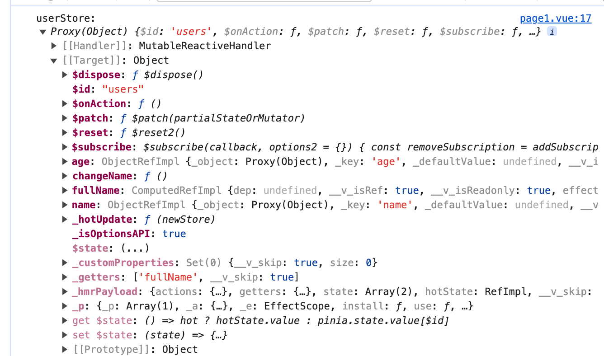

# Pinia在Vue3里的基本使用

Pinia概念详解与使用：[一文搞懂pinia状态管理（保姆级教程）](https://link.juejin.cn/?target=https%3A%2F%2Fzhuanlan.zhihu.com%2Fp%2F533233367)

## Pinia与Vuex的区别

- 支持选项式api和组合式api写法
- pinia没有mutations，只有：state、getters、actions
- pinia分模块不需要modules（之前vuex分模块需要modules）
- TypeScript支持很好
- 自动化代码拆分
- pinia体积更小（性能更好）

## 使用流程
### 安装

:::=tabs
::npm
```shell
npm install pinia
```
::yarn
```shell
yarn add pinia
```

::pnpm
```shell
pnpm add pinia
```

:::

### 创建Pinia并全局注册
**创建Pinia**

```ts
// src/store/index.ts
import { createPinia } from "pinia";

const pinia = createPinia()

export default pinia

```
**全局注册**

```ts
// main-ts
import { createApp } from 'vue'
import App from './App.vue'
import pinia from './store'

const app = createApp(App)
app.use(pinia) //注册全局pinia

app.mount('#app')

```
### 创建store
使用pinia提供的 defineStore() 方法来创建一个store，该store用来存放我们需要全局使用的数据。
src/store/user.ts
```ts
import { defineStore } from 'pinia'
// 第一个参数是应用程序中 store 的唯一 id
export const useUserStore = defineStore('users', {
  // state 是 store 的状态，可以理解为 store 的数据
  state: () => {
    return {
      name: '随缘',
      age: 18
    }
  },
  // getters 是可以被外部调用的计算属性，可以理解为 store 的计算属性
  getters: {
    fullName(state) {
      return state.name + '66666' 
    }
  },
  // actions 是可以被外部调用的方法，可以理解为 store 的方法
  actions: {
    changeName(name: string) {
      this.name = name
    }
  }
})
```

创建store很简单，调用pinia中的defineStore函数即可，该函数接收两个参数：

- name：一个字符串，必传项，该store的唯一id。
- options：一个对象，store的配置项，比如配置store内的数据，修改数据的方法等等。

我们可以定义任意数量的store，因为我们其实一个store就是一个函数，这也是pinia的好处之一，让我们的代码扁平化了，这和Vue3的实现思想是一样的。

### 使用store
page1.vue代码如下

```vue
<script setup lang="ts">
import { useUserStore } from "../store/user";
const userStore = useUserStore();
console.log('userStore:', userStore)
</script>
```


## state

### 定义state数据
```ts
import { defineStore } from 'pinia'
// 第一个参数是应用程序中 store 的唯一 id
export const useUserStore = defineStore('users', {
  // state 是 store 的状态，可以理解为 store 的数据
  state: () => {
    return {
      name: '随缘',
      age: 18
    }
  }
})
```
### 组件(页面)使用pinia的state数据
**基本使用**

```vue
<template>
  <div>
    <div>pinia 数据</div>
    姓名: {{ userStore.name }}
    年龄: {{ userStore. age }}
  </div>
</template>

<script setup lang="ts">
import { useUserStore } from "../store/user";
const userStore = useUserStore();
console.log('userStore:', userStore)
</script>
 
<style lang = "scss" scoped>
  
</style>
```
如果使用解构出来的的数据, 则会失去响应式, 需要使用storeToRef()来进行转换，才能动态获取数据

```vue
<template>
  <div>
    <div>pinia 数据</div>
    姓名: {{ name }}
    <br/>
    姓名2: {{ name2 }}
    <br/>
    年龄: {{ userStore. age }}
    <br/>
    
    <button @click="userStore.changeName('随缘 666666666')">修改姓名</button>
  </div>
</template>

<script setup lang="ts">
import {storeToRefs } from 'pinia'
import { useUserStore } from "../store/user";
const userStore = useUserStore();
// 解构
const { name } = userStore

// 使用storeToRef
const {name: name2} = storeToRefs(userStore)
</script>
```
上面代码中, 当点击`修改姓名`时,变化的只有`name2`, 直接对userStore会让其失去响应式

### 组件修改pinia的state数据

本身pinia可以直接修改state数据，无需像vuex一样通过mutations才可以修改, 修改的方式有一下以下几种
- 直接修改
- 定义 action 中的 方法修改
- 批量修改

```vue
<template>
  <div>
    <div>pinia 数据</div>
    姓名: {{ name }}
    <br/>
    姓名2: {{ name2 }}
    <br/>
    年龄: {{ userStore. age }}
    <br/>
    <button @click="btn">直接修改姓名</button>
    <button @click="userStore.changeName('随缘 666666666')">通过 action 定义的方法修改姓名</button>
    <button @click="btn2">批量修改 state</button>
  </div>
</template>

<script setup lang="ts">
import {storeToRefs } from 'pinia'
import { useUserStore } from "../store/user";
const userStore = useUserStore();
// 解构
const { name } = userStore

// 使用storeToRef
const {name: name2} = storeToRefs(userStore)

const btn = () => {
  userStore.changeName('随缘 777')
}
const btn2 = () => {
  userStore.$patch((state) => {
    state.name = '随缘 888'
    state.age = 20
  })
}
</script>
 
```

**直接修改**

直接修改可以通过上述 使用storeToRef 解构出来的 state 进行修改
```ts
const btn = () => {
  name2.value = '随缘 7777777'
}
```

**定义 action 中的 方法修改**
定义 action 中的 方法修改 可以现在pinia的actions中定义方法, 该方法可以对state数据进行修改
```ts
import { defineStore } from 'pinia'
// 第一个参数是应用程序中 store 的唯一 id
export const useUserStore = defineStore('users', {
  // state 是 store 的状态，可以理解为 store 的数据
  state: () => {
    return {
      name: '随缘',
      age: 18
    }
  },
  // actions 是可以被外部调用的方法，可以理解为 store 的方法
  actions: {
    changeName(name: string) {
      this.name = name
    }
  }
})
```
**批量修改**

批量修改可以使用$patch进行批量更新

```ts
const btn2 = () => {
  userStore.$patch((state) => {
    state.name = '随缘 888'
    state.age = 20
  })
}
```

## getters
getters和vuex的getters几乎类似，也是有缓存的机制(类似于 vue 计算属性)

**定义**

```ts
import { defineStore } from 'pinia'
// 第一个参数是应用程序中 store 的唯一 id
export const useUserStore = defineStore('users', {
  // state 是 store 的状态，可以理解为 store 的数据
  state: () => {
    return {
      name: '随缘',
      age: 18
    }
  },
  // getters 是可以被外部调用的计算属性，可以理解为 store 的计算属性
  getters: {
    fullName(state) {
      return state.name + '66666' 
    }
  },
})
```
**使用**

```vue
<template>
  <div>
    <div>pinia 数据</div>
    全名: {{ userStore.fullName }}  
  </div>
</template>

<script setup lang="ts">
import {storeToRefs } from 'pinia'
import { useUserStore } from "../store/user";
const userStore = useUserStore();
</script>
 
```
## actions
actions 是定义 store 里的方法

**定义**
```ts
import { defineStore } from 'pinia'
// 第一个参数是应用程序中 store 的唯一 id
export const useUserStore = defineStore('users', {
  // state 是 store 的状态，可以理解为 store 的数据
  state: () => {
    return {
      name: '随缘',
      age: 18
    }
  },
  // actions 是可以被外部调用的方法，可以理解为 store 的方法
  actions: {
    changeAge(age: number) {
      this.age = age
    }
  }
})
```
**使用**
```vue
<template>
  <div>
    <div>pinia 数据</div>
     年龄: {{ userStore.age }}  
     <button @click="userStore.changeAge(20)">修改年龄</button>
  </div>
</template>

<script setup lang="ts">
import {storeToRefs } from 'pinia'
import { useUserStore } from "../store/user";
const userStore = useUserStore();
</script>
```

以上就是 Pinia 在 Vue3 里的基本使用了, 下面介绍一下不怎么常用的功能

## $reset 重置state

`$reset` 可以重置state数据, 注意: 这是让所有 state 数据变为最开始的状态

**使用**
```vue
<script setup lang="ts">
import {storeToRefs } from 'pinia'
import { useUserStore } from "../store/user";
const userStore = useUserStore();
// 重置状态
userStore.$reset()
</script>
```

## $subscribe 订阅 state

`$subscribe` 可以订阅 state, 也就是可以监听state数据的变化,从而做一些操作
```vue
<script setup lang="ts">
import {storeToRefs } from 'pinia'
import { useUserStore } from "../store/user";
const userStore = useUserStore();
// 订阅状态
userStore.$subscribe((mutation, state) => {
  // todo ...
  console.log('mutation:', mutation)
  console.log('state:', state)
})
</script>
```


