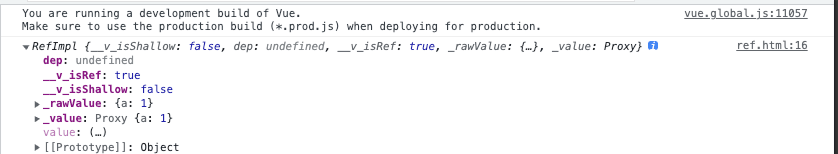

# ref实现

## 前言

在vue3中，将基本数据类型(数值、字符串、布尔)变为响应式数据用的是ref。

ref的形式共有两种：

- ref
- shallowRef（浅的ref， 如果shallowRef里面是对象， 则对象里的所有属性不具有响应式）

## 基本使用

同上文[reactive实现](https://www.yuque.com/u25152297/zqghcm/iy30nhwzo5dqkz2t)建立文件ref.html


```html
<!DOCTYPE html>
<html lang="en">
<head>
  <meta charset="UTF-8">
  <meta http-equiv="X-UA-Compatible" content="IE=edge">
  <meta name="viewport" content="width=device-width, initial-scale=1.0">
  <title>Document</title>
</head>
<body>
  <script src="../dist/vue.global.js"></script>
  <script>
    const { ref, shallowRef }  = Vue
    const name = ref('vvv')
    const obj = shallowRef({a: 1})
    console.log(name)
    console.log(obj)
  </script>
</body>
</html>
```


我们可以从浏览器的打印结果看到， shallowRef的实例上_value属性只是一个普通对象， 并不是proxy的代理对象了， 因为shallowRef对于对象处理， 其实是并没有去处理，下面我们看看ref去处理对象

```html
<!DOCTYPE html>
<html lang="en">
<head>
  <meta charset="UTF-8">
  <meta http-equiv="X-UA-Compatible" content="IE=edge">
  <meta name="viewport" content="width=device-width, initial-scale=1.0">
  <title>Document</title>
</head>
<body>
  <script src="../dist/vue.global.js"></script>
  <script>
    const { ref, shallowRef }  = Vue
    const obj = ref({a: 1})
    console.log(obj)
  </script>
</body>
</html>
```


我们可以从浏览器的打印结果看到， ref的实例上_value属性是一个proxy的代理对象了， 说明ref对于对象的处理是用reactive去处理的

### 小结

- **ref对于对象的处理是用reactive去处理的**

## 实现



从浏览器的返回结果我们可以看到， ref和shallowRef都返回的是一个**RefImpl实例**

```typescript
export function ref(value) {
  return createRef(value)
}
export function shallowRef(value) {
  return createRef(value, true)
}

/**
 * 创建ref实例（柯里化的思想）
 * @param rawValue 原始的值 
 * @param shallow 是否浅的
 */
function createRef(rawValue, shallow = false) {
  return new RefImpl(rawValue, shallow)
}


class RefImpl {
}
```

将核心代码交给类RefImpl去处理， 从浏览器上看， RefImpl有几个属性

- __v_isRef
- __v_isShallow
- _rawValue
- _value

参照vue3源码， 我们可以写出类RefImpl的相关代码

```typescript
// 转reactive
export const toReactive = <T extends unknown>(value: T): T => isObject(value) ? reactive(value) : value
// 判断是否是对象
export const isObject = (val: unknown): val is Record<any, any> => val !== null && typeof val === 'object'
// 比较值是否改变
export const hasChanged = (value: any, oldValue: any): boolean => !Object.is(value, oldValue)

class RefImpl {
  private _value // 私有的值
  private _rawValue // 私有的原始值
  public readonly __v_isRef = true
  constructor(value, public readonly __v_isShallow: boolean) {
    this._rawValue = value
    this._value = __v_isShallow ? value : toReactive(value)
  }

  // 代理_value
  get value() {
    // 收集依赖
    return this._value
  }
  set value(newVal) {
    if(hasChanged(newVal, this._rawValue)) {
       //触发依赖
       this._rawValue = newVal
       this._value =  this.__v_isShallow ? newVal : toReactive(newVal)
    }
  }
}
```

## ref全部实现代码

```typescript
// 转reactive
export const toReactive = <T extends unknown>(value: T): T => isObject(value) ? reactive(value) : value
// 判断是否是对象
export const isObject = (val: unknown): val is Record<any, any> => val !== null && typeof val === 'object'
// 比较值是否改变
export const hasChanged = (value: any, oldValue: any): boolean => !Object.is(value, oldValue)

export function isRef(r) {
  // 判断是否已经ref过了
  return !!(r && r.__v_isRef === true)
}


export function ref(value) {
  return createRef(value)
}
export function shallowRef(value) {
  return createRef(value, true)
}

/**
 * 创建ref实例
 * @param rawValue 原始的值 
 * @param shallow 是否浅的
 */
function createRef(rawValue, shallow = false) {
  if (isRef(rawValue)) {
    return rawValue
  }
  return new RefImpl(rawValue, shallow)
}

class RefImpl {
  private _value // 私有的值
  private _rawValue // 私有的原始值
  public readonly __v_isRef = true
  constructor(value, public readonly __v_isShallow: boolean) {
    this._rawValue = value
    this._value = __v_isShallow ? value : toReactive(value)
  }

  // 代理
  get value() {
    // 收集依赖
    return this._value
  }
  set value(newVal) {
    if(hasChanged(newVal, this._rawValue)) {
       //触发依赖
       this._rawValue = newVal
       this._value =  this.__v_isShallow ? newVal : toReactive(newVal)
    }
  }
}
```

## 总结

- **ref是处理基本数据的**
- **ref对于对象的处理是用reactive去处理的**
- **ref是通过class中get和set去进行拦截的（转化为es5是Object.defineProperty）**

## **问题**

- ref 和 reactive有什么区别?
  通过源码我们可以看到ref是通过Object.defineProperty实现的，而reactive是通过proxy实现的，这时候就有同学问？ 为什么ref不通过proxy实现呢, 主要是因为proxy只支持对象。

- ref中可以放对象作为参数吗? reactive可以放基础值作为参数吗?
  ref是可以传对象的, 如果传的是对象会给reactive去实现
  reactive放基础值是没什么作用的, 具体为什么可以看[reactive实现](https://www.yuque.com/u25152297/zqghcm/iy30nhwzo5dqkz2t)

## mini-vue3实现相关

[reactive实现](https://codevity.top/article/web/vue/vue3/source-code/1-reactive.html)

[ref实现](https://codevity.top/article/web/vue/vue3/source-code/3-ref.html)

[effect实现](https://codevity.top/article/web/vue/vue3/source-code/2-effect.html)

[computed实现](https://codevity.top/article/web/vue/vue3/source-code/5-computed.html)

<br/>
<hr />

⭐️⭐️⭐️好啦！！！本文章到这里就结束啦。⭐️⭐️⭐️

✿✿ヽ(°▽°)ノ✿

撒花 🌸🌸🌸🌸🌸🌸
