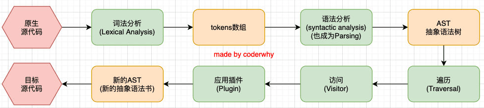
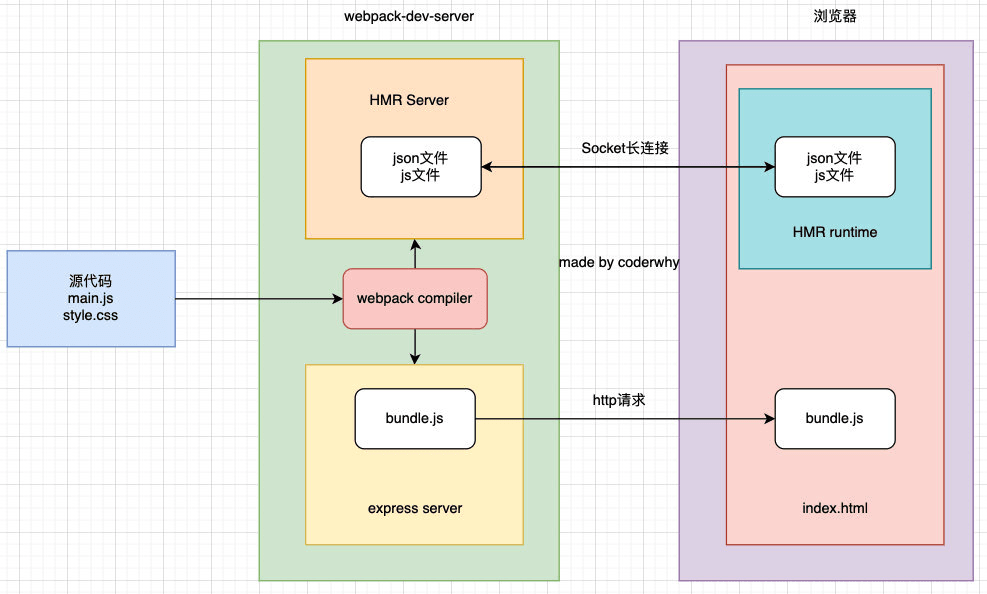

# webpack 相关知识

## 1.Webpack 底层的工作流程

Webpack 底层的工作流程大致可以总结为这么几个阶段：

1. 初始化阶段：
   - **初始化参数**：从配置文件、 配置对象、Shell 参数中读取，与默认配置结合得出最终的参数；
   - **创建编译器对象**：用上一步得到的参数创建 Compiler 对象；
   - **初始化编译环境**：包括注入内置插件、注册各种模块工厂、初始化 RuleSet 集合、加载配置的插件等；
   - **开始编译**：执行 compiler 对象的 run 方法，创建 Compilation 对象；
   - **确定入口**：根据配置中的 `entry` 找出所有的入口文件，调用 `compilation.addEntry` 将入口文件转换为 `dependence` 对象。
2. 构建阶段：
   - **编译模块(make)**：从 `entry` 文件开始，调用 `loader` 将模块转译为标准 JS 内容，调用 JS 解析器将内容转换为 AST 对象，从中找出该模块依赖的模块，再 **递归** 处理这些依赖模块，直到所有入口依赖的文件都经过了本步骤的处理；
   - **完成模块编译**：上一步递归处理所有能触达到的模块后，得到了每个模块被翻译后的内容以及它们之间的`依赖关系图`。
3. 封装阶段：
   - **合并(seal)**：根据入口和模块之间的依赖关系，组装成一个个包含多个模块的 `Chunk`；
   - **优化(optimization)**：对上述 `Chunk` 施加一系列优化操作，包括：tree-shaking、terser、scope-hoisting、压缩、Code Split 等；
   - **写入文件系统(emitAssets)**：在确定好输出内容后，根据配置确定输出的路径和文件名，把文件内容写入到文件系统。

在这个过程中有不少可能造成性能问题的地方：

- 构建阶段：
  - 首先需要将文件的相对引用路径转换为绝对路径，这个过程可能涉及多次 IO 操作，执行效率取决于**文件层次深度**；
  - 找到具体文件后，需要读入文件内容并调用 [loader-runner](https://link.juejin.cn/?target=https%3A%2F%2Fgithub1s.com%2Fwebpack%2Floader-runner%2Fblob%2FHEAD%2Flib%2FLoaderRunner.js) 遍历 Loader 数组完成内容转译，这个过程需要执行较密集的 CPU 操作，执行效率取决于 **Loader 的数量与复杂度**；
  - 需要将模块内容解析为 AST 结构，并遍历 AST 找出模块的依赖资源，这个过程同样需要较密集的 CPU 操作，执行效率取决于 **代码复杂度**；
  - 递归处理依赖资源，执行效率取决于 **模块数量**。
- 封装阶段：
  - 根据 `splitChunks` 配置、`entry` 配置、动态模块引用语句等，确定模块与 Chunk 的映射关系，其中 `splitChunks` 相关的分包算法非常复杂，涉及大量 CPU 计算；
  - 根据 `optimization` 配置执行一系列产物优化操作，特别是 [Terser](https://link.juejin.cn/?target=https%3A%2F%2Fgithub.com%2Fwebpack-contrib%2Fterser-webpack-plugin) 插件需要执行大量 AST 相关的运算，执行效率取决于 **产物代码量**；
- 等等。

可以看出，Webpack 需要执行非常密集的 IO 与 CPU 操作，计算成本高，再加上 Webpack 以及大多数组件都使用 JavaScript 编写，无法充分利用多核 CPU 能力，所以在中大型项性能通常表现较差。

不过，这些性能问题是可以被优化的！


## 2.babel原理

### 什么是babel?

是一个工具链，主要用于旧浏览器或者缓解中将ECMAScript 2015+代码转换为向后兼容版本的JavaScript

包括：语法转换、源代码转换、Polyfill实现目标缓解缺少的功能等

### babel原理

Babel也拥有编译器的工作流程：

- 解析阶段（Parsing）
- 转换阶段（Transformation）
- 生成阶段（Code Generation）




## 3.HMR原理

### 什么是HMR

HMR的全称是Hot Module Replacement，翻译为模块热替换；
模块热替换是指在 应用程序运行过程中，替换、添加、删除模块，`而无需重新刷新整个页面`。

HMR通过如下几种方式，来提高开发的速度：
- 不重新加载整个页面，这样可以保留某些应用程序的状态不丢失
- 只更新需要变化的内容，节省开发的时间
- 修改了css、js源代码，会立即在浏览器更新，相当于直接在浏览器的devtools中直接修改样式

### HMR原理

webpack-dev-server会创建两个服务：`提供静态资源的服务（express）和Socket服务（net.Socket）`


express server负责直接提供静态资源的服务（打包后的资源直接被浏览器请求和解析）。

HMR Socket Server，是一个socket的长连接：

- 长连接有一个最好的好处是建立连接后双方可以通信（服务器可以直接发送文件到客户端）

- 当服务器监听到对应的模块发生变化时，会生成两个文件.json（manifest文件）和.js文件（update chunk）

- 通过长连接，可以直接将这两个文件主动发送给客户端（浏览器）

- 浏览器拿到两个新的文件后，通过HMR runtime机制，加载这两个文件，并且针对修改的模块进行更新




## 4.自定义loader

### **什么是loader?**

 loader是用于对模块的源代码进行转换（处理），之前我们已经使用过很多Loader，比如css-loader、style-loader、babel-loader等


### **如何自定义loader?**

loader本质上是一个导出为函数的JavaScript模块；
**loader runner库**会调用这个函数，然后将上一个loader产生的结果或者资源文件传入进去


### **自定义的md-loader(解析md文档)**

```js
const marked = require('marked');
const hljs = require('highlight.js');

/*
* content：资源文件的内容
* map：sourcemap相关的数据
* meta：一些元数据
*/
module.exports = function(content, map, meta) {
  marked.setOptions({
    highlight: function(code, lang) {
      return hljs.highlight(lang, code).value;
    }
  })

  const htmlContent = marked(content);
  const innerContent = "`" + htmlContent + "`";
  const moduleCode = `var code=${innerContent}; export default code;`
  return moduleCode;
} 
```

### **使用**

```js
const path = require('path');

module.exports = {
  mode: "development",
  entry: "./src/main.js",
  output: {
    filename: "bundle.js",
    path: path.resolve(__dirname, "./build")
  },
  module: {
    rules: [
      {
        test: /\.md$/i,
        use: [
          "md-loader"
        ]
      },
      {
        test: /\.css$/i,
        use: [
          "style-loader",
          "css-loader"
        ]
      }
    ]
  },
  resolveLoader: {
    modules: ["node_modules", "./my-loader"]
  }
}

```


## 5.自定义Plugin

`webpack` 插件由以下组成：

- 一个 JavaScript 命名函数。
- 在插件函数的 prototype 上定义一个 `apply` 方法。
- 指定一个绑定到 webpack 自身的[事件钩子](https://www.webpackjs.com/api/compiler-hooks/)。
- 处理 webpack 内部实例的特定数据。
- 功能完成后调用 webpack 提供的回调

```js
// 一个 JavaScript 命名函数。
function MyExampleWebpackPlugin() {

};

// 在插件函数的 prototype 上定义一个 `apply` 方法。
MyExampleWebpackPlugin.prototype.apply = function(compiler) {
  // 指定一个挂载到 webpack 自身的事件钩子。
  compiler.plugin('webpacksEventHook', function(compilation /* 处理 webpack 内部实例的特定数据。*/, callback) {
    console.log("This is an example plugin!!!");

    // 功能完成后调用 webpack 提供的回调。
    callback();
  });
};
```

#### Compiler 和 Compilation

在插件开发中最重要的两个资源就是 `compiler` 和 `compilation` 对象。理解它们的角色是扩展 webpack 引擎重要的第一步。

- `compiler` 对象代表了完整的 webpack 环境配置。这个对象在启动 webpack 时被一次性建立，并配置好所有可操作的设置，包括 options，loader 和 plugin。当在 webpack 环境中应用一个插件时，插件将收到此 compiler 对象的引用。可以使用它来访问 webpack 的主环境。
- `compilation` 对象代表了一次资源版本构建。当运行 webpack 开发环境中间件时，每当检测到一个文件变化，就会创建一个新的 compilation，从而生成一组新的编译资源。一个 compilation 对象表现了当前的模块资源、编译生成资源、变化的文件、以及被跟踪依赖的状态信息。compilation 对象也提供了很多关键时机的回调，以供插件做自定义处理时选择使用。

### 基本插件架构

插件是由「具有 `apply` 方法的 prototype 对象」所实例化出来的。这个 `apply` 方法在安装插件时，会被 webpack compiler 调用一次。`apply` 方法可以接收一个 webpack compiler 对象的引用，从而可以在回调函数中访问到 compiler 对象。一个简单的插件结构如下：

```javascript
function HelloWorldPlugin(options) {
  // 使用 options 设置插件实例……
}

HelloWorldPlugin.prototype.apply = function(compiler) {
  compiler.plugin('done', function() {
    console.log('Hello World!');
  });
};

module.exports = HelloWorldPlugin;
```

然后，要安装这个插件，只需要在你的 webpack 配置的 `plugin` 数组中添加一个实例：

```javascript
var HelloWorldPlugin = require('hello-world');

var webpackConfig = {
  // ... 这里是其他配置 ...
  plugins: [
    new HelloWorldPlugin({options: true})
  ]
};
```

### 访问 compilation 对象

使用 compiler 对象时，你可以绑定提供了编译 compilation 引用的回调函数，然后拿到每次新的 compilation 对象。这些 compilation 对象提供了一些钩子函数，来钩入到构建流程的很多步骤中。

```javascript
function HelloCompilationPlugin(options) {}

HelloCompilationPlugin.prototype.apply = function(compiler) {

  // 设置回调来访问 compilation 对象：
  compiler.plugin("compilation", function(compilation) {

    // 现在，设置回调来访问 compilation 中的步骤：
    compilation.plugin("optimize", function() {
      console.log("Assets are being optimized.");
    });
  });
};

module.exports = HelloCompilationPlugin;
```

关于 `compiler`, `compilation` 的可用回调，和其它重要的对象的更多信息，请查看 [插件](https://www.webpackjs.com/api/plugins/) 文档。

### 异步编译插件

有一些编译插件中的步骤是异步的，这样就需要额外传入一个 callback 回调函数，并且在插件运行结束时，_必须_调用这个回调函数。

```javascript
function HelloAsyncPlugin(options) {}

HelloAsyncPlugin.prototype.apply = function(compiler) {
  compiler.plugin("emit", function(compilation, callback) {

    // 做一些异步处理……
    setTimeout(function() {
      console.log("Done with async work...");
      callback();
    }, 1000);

  });
};

module.exports = HelloAsyncPlugin;
```

### 示例

一旦能我们深入理解 webpack compiler 和每个独立的 compilation，我们依赖 webpack 引擎将有无限多的事可以做。我们可以重新格式化已有的文件，创建衍生的文件，或者制作全新的生成文件。

让我们来写一个简单的示例插件，生成一个叫做 `filelist.md` 的新文件；文件内容是所有构建生成的文件的列表。这个插件大概像下面这样：

```javascript
function FileListPlugin(options) {}

FileListPlugin.prototype.apply = function(compiler) {
  compiler.plugin('emit', function(compilation, callback) {
    // 在生成文件中，创建一个头部字符串：
    var filelist = 'In this build:\n\n';

    // 遍历所有编译过的资源文件，
    // 对于每个文件名称，都添加一行内容。
    for (var filename in compilation.assets) {
      filelist += ('- '+ filename +'\n');
    }

    // 将这个列表作为一个新的文件资源，插入到 webpack 构建中：
    compilation.assets['filelist.md'] = {
      source: function() {
        return filelist;
      },
      size: function() {
        return filelist.length;
      }
    };

    callback();
  });
};

module.exports = FileListPlugin;
```

### 插件的不同类型

webpack 插件可以按照它所注册的事件分成不同的类型。每一个事件钩子决定了它该如何应用插件的注册。

- **同步(synchronous)** Tapable 实例应用插件时会使用：

```js
applyPlugins(name: string, args: any...)
applyPluginsBailResult(name: string, args: any...)
```

这意味着每个插件回调，都会被特定的 `args` 一个接一个地调用。 这是插件的最基本形式。许多有用的事件（例如 `"compile"`, `"this-compilation"`），预期插件会同步执行。

- **瀑布流(waterfall)** 插件应用时会使用：

```js
applyPluginsWaterfall(name: string, init: any, args: any...)
```

这种类型，每个插件都在其他插件依次调用之后调用，前一个插件调用的返回值，作为参数传入后一个插件。这类插件必须考虑其执行顺序。 必须等前一个插件执行后，才能接收参数。第一个插件的值是`初始值(init)`。这个模式用在与 `webpack` 模板相关的 Tapable 实例中（例如 `ModuleTemplate`, `ChunkTemplate` 等）。

- **异步(asynchronous)** When all the plugins are applied asynchronously using

```js
applyPluginsAsync(name: string, args: any..., callback: (err?: Error) -> void)
```

这种类型，插件处理函数在调用时，会传入所有的参数和一个签名为 `(err?: Error) -> void` 的回调函数。处理函数按注册时的顺序调用。在调用完所有处理程序后，才会调用 `callback`。 这也是 `"emit"`, `"run"` 等事件的常用模式。

- **异步瀑布流(async waterfall)** 插件将以瀑布方式异步应用。

```
applyPluginsAsyncWaterfall(name: string, init: any, callback: (err: Error, result: any) -> void)
```

这种类型，插件处理函数在调用时，会传入当前值(current value)和一个带有签名为 `(err: Error, nextValue: any) -> void.` 的回调函数。当调用的 `nextValue` 是下一个处理函数的当前值(current value)时，第一个处理程序的当前值是 `init`。在调用完所有处理函数之后，才会调用 callback，并将最后一个值传入。如果其中任何一个处理函数传入一个 `err` 值，则会调用此 callback 并将此 error 对象传入，并且不再调用其他处理函数。 这种插件模式适用于像 `"before-resolve"` 和 `"after-resolve"` 这样的事件。

- **异步串联(async series)** 它与异步(asynchronous)相同，但如果任何插件注册失败，则不再调用其他插件。

```js
applyPluginsAsyncSeries(name: string, args: any..., callback: (err: Error, result: any) -> void)
```

- **并行(parallel)** 

```js
applyPluginsParallel(name: string, args: any..., callback: (err?: Error) -> void)
applyPluginsParallelBailResult(name: string, args: any..., callback: (err: Error, result: any) -> void)
```

<br/>
<hr />

⭐️⭐️⭐️好啦！！！本文章到这里就结束啦。⭐️⭐️⭐️

✿✿ヽ(°▽°)ノ✿

撒花 🌸🌸🌸🌸🌸🌸
