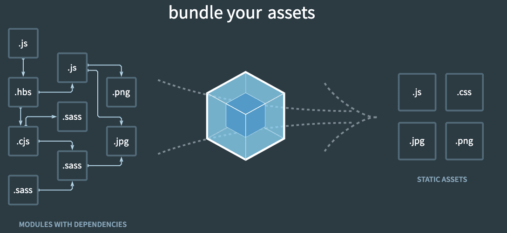
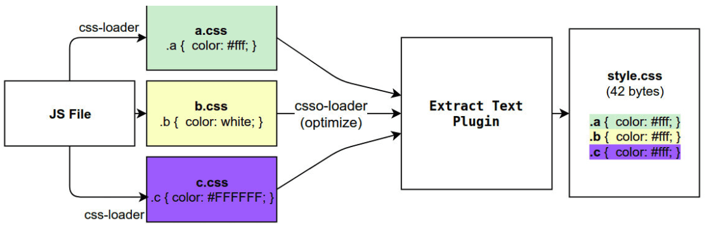

# webpack 学习一
## 1.Webpack是什么?

webpack是一个静态的模块化打包工具，为现代的JavaScript应用程序；

我们来对上面的解释进行拆解：
打包bundler：webpack可以将帮助我们进行打包，所以它是一个打包工具
静态的static：这样表述的原因是我们最终可以将代码打包成最终的静态资源（部署到静态服务器）
模块化module：webpack默认支持各种模块化开发，ES Module、CommonJS、AMD等
现代的modern：我们前端说过，正是因为现代前端开发面临各种各样的问题，才催生了webpack的出现和发展




### Webpack的依赖

Webpack的运行是依赖Node环境的，所以我们电脑上必须有Node环境


### Webpack的安装

webpack的安装目前分为两个：webpack、webpack-cli

那么它们是什么关系呢？

- 执行webpack命令，会执行node_modules下的.bin目录下的webpack；

- webpack在执行时是依赖webpack-cli的，如果没有安装就会报错；
- webpack-cli中代码执行时，才是真正利用webpack进行编译和打包的过程；
- 所以在安装webpack时，我们需要同时安装webpack-cli（第三方的脚手架事实上是没有使用webpack-cli的，而是类似于自己的vue-service-cli的东西）

### webpack默认打包

- 我们可以通过webpack进行打包，之后运行`打包之后`的代码
  在目录下直接执行 **`webpack`** 命令

```js
webpack
```

- 生成一个**dist**文件夹，里面存放一个main.js的文件，就是我们打包之后的文件：
  - 这个文件中的代码被压缩和丑化了；
  - 我们暂时不关心他是如何做到的，后续我讲webpack实现模块化原理时会再次讲到；
  - 另外我们发现代码中依然存在ES6的语法，比如箭头函数、const等，这是因为默认情况下webpack并不清楚
    我们打包后的文件是否需要转成ES5之前的语法，后续我们需要通过babel来进行转换和设置；

- 我们发现是可以正常进行打包的，但是有一个问题，webpack是如何确定我们的入口的呢？
  - 事实上，当我们运行webpack时，webpack会查找当前目录下的 **src/index.js**作为入口；
  - 所以，如果当前项目中没有存在src/index.js文件，那么会报错；


### Webpack配置文件

- 在通常情况下，webpack需要打包的项目是非常复杂的，并且我们需要一系列的配置来满足要求，默认配置必然
  是不可以的。
- 我们可以在根目录下创建一个***webpack.config.js***文件，来作为webpack的配置文件：

##### 入口(entry)

```js
const config = {
  entry: './path/to/my/entry/file.js'
};

module.exports = config;
```

`entry` 属性的单个入口语法，是下面的简写：

```js
const config = {
  entry: {
    main: './path/to/my/entry/file.js'
  }
};
```

##### 输出(output)

在 webpack 中配置 `output` 属性的最低要求是，将它的值设置为一个对象，包括以下两点：

- `filename` 用于输出文件的文件名。
- 目标输出目录 `path` 的绝对路径。

```javascript
const config = {
  output: {
    filename: 'bundle.js',
    path: '/home/proj/public/assets'
  }
};

module.exports = config;
```

此配置将一个单独的 `bundle.js` 文件输出到 `/home/proj/public/assets` 目录中。

##### loader和plugins

`loader` 和`plugins`单独分成模块去理解


### 指定配置文件

- 如果我们的配置文件并不是webpack.config.js的名字，而是其他的名字呢？
  - 比如我们将webpack.config.js修改成了 wk.config.js；
  
  - 这个时候我们可以通过 --config 来指定对应的配置文件；
  
    ```js
    webpack --config wk.config.js
    ```

- 但是每次这样执行命令来对源码进行编译，会非常繁琐，所以我们可以在package.json中增加一个新的脚本：

  ```js
  {
    "scripts": {
      "build": "webpack -- webpack --config wk.config.js"
    }
  }
  
  //执行
  yarn build || npm run build
  ```


## 2.loader

- webpack到底是如何对我们的项目进行打包的呢？
  - 事实上webpack在处理应用程序时，它会根据命令或者配置文件找到入口文件；
  - 从入口开始，会生成一个 **依赖关系图**，这个**依赖关系图**会包含应用程序中所需的所有模块（比如.js文件、css文件、图片、字体等）；
  - 然后遍历图结构，打包一个个模块（根据文件的不同使用不同的loader来解析）；


### loader的配置方式

- 配置方式表示的意思是在我们的webpack.config.js文件中写明配置信息：

  - module.rules中允许我们配置多个loader（因为我们也会继续使用其他的loader，来完成其他文件的加载）；

  - 这种方式可以更好的表示loader的配置，也方便后期的维护，同时也让你对各个Loader有一个全局的概览；

    

- **module.rules的配置如下：**

rules属性对应的值是一个数组：[Rule]

数组中存放的是一个个的Rule，Rule是一个对象，对象中可以设置多个属性：

   - **test属性**：用于对 resource（资源）进行匹配的，通常会设置成正则表达式；

   - **loader属性**： Rule.use: [ { loader } ] 的简写。

   - **use属性**：对应的值时一个数组：[UseEntry]

     - **UseEntry是一个对象**，可以通过对象的属性来设置一些其他属性
     - loader：必须有一个 loader属性，对应的值 是一个字符串
     
   - options：可选的属性，值是一个字符串或者对象，值会被传入到loader中；
  
- **传递字符串**（如：use: [ 'style-loader' ]）是 loader 属性的简写方式（如：use: [ { loader: 'style-loader'} ]）；
  
  ```js
  module.exports = {
    module: {
      rules: [
        {
          test: /\.css$/, // 正则表达式匹配相应的资源
          use: [
            // 注意顺序（从下往上，从左往右，从后往前）
            { loader: 'style-loader' },
            {
              loader: 'css-loader',
              options: {
                modules: true,
              },
            },
            { loader: 'sass-loader' },
          ],
        },
      ],
    },
  };
  ```

### PostCSS工具

- **什么是PostCSS呢？**
  - PostCSS是一个通过JavaScript来转换样式的**工具**；
  - 这个工具可以帮助我们进行一些**CSS的转换和适配**，比如**自动添加浏览器前缀、css样式的重置**；
  - 但是实现这些工具，我们需要**借助于PostCSS对应的插件**；

- **如何使用PostCSS呢？主要就是两个步骤：**

  - 第一步：查找PostCSS在构建工具中的扩展，比如webpack中的postcss-loader；

  - 第二步：选择可以添加你需要的PostCSS相关的插件；

    

### 命令行使用postcss

- **终端使用PostCSS**

  - 也是可以的，但是我们需要单独安装一个工具postcss-cli；

- **安装**：postcss、postcss-cli

  ```shell
  yarn add postcss postcss-cli -D
  ```

### postcss-loader的使用

- **借助于构建工具：**

  - 在webpack中使用postcss就是使用postcss-loader来处理的；

- **安装postcss-loader**：

  ```shell
  yarn add postcss-loader -D我们修改加载css的loader
  ```

- 修改加载css的loader
  
  - **注意：因为postcss需要有对应的插件才会起效果，所以我们需要配置它的plugin**

### 单独的postcss配置文件

- **在根目录下创建postcss.config.js，下入下面代码，将会自动加入css前缀**

```js
module.exports = {
  plugins: [
    require('autoprefixer')
  ]
}
```

- **postcss-preset-env(预设)** 
  - postcss-preset-env也是一个postcss的插件；
  - 它可以帮助我们将一些现代的CSS特性，转成大多数浏览器认识的CSS，并且会根据目标浏览器或者运行时环
    境添加所需的polyfill；
  - 包括会自动帮助我们添加autoprefixer（所以相当于已经内置了autoprefixer）

- **安装postcss-preset-env**

```shell
yarn add postcss-preset-env -D 
```

```js
module.exports = {
  plugins: [
    'postcss-preset-env'
  ]
}
```

### file-loader

- **要处理jpg、png等格式的图片，我们也需要有对应的loader：file-loader**

  - file-loader的作用就是帮助我们处理import/require()方式引入的一个文件资源，并且会将它放到我们输出的
    文件夹中；

- **安装file-loader**

  ```shell
  yarn add file-loader -D
  ```

- **配置处理图片的Rule**

  ```js
  {
    test: /\.(png|jpe?g|gif|svg)$/,
      use: {
        loader: "file-loader"
      }
  }
  ```

- **有时候我们处理后的文件名称按照一定的规则进行显示：**

  比如保留原来的**文件名、扩展名**，同时为了**防止重复**，包含一个**hash值**等

- **[PlaceHolders](https://webpack.js.org/loaders/file-loader/##placeholders)**

- **最常用的placeholder**

  - **[ext]**： 处理文件的扩展名；
  - **[name]**：处理文件的名称；
  - **[hash]**：文件的内容，使用MD4的散列函数处理，生成的一个128位的hash值（32个十六进制）；
  - **[contentHash]**：在file-loader中和[hash]结果是一致的（在webpack的一些其他地方不一样，后面会讲到）；
  - **[hash:length]**：截图hash的长度，默认32个字符太长了；
  - **[path]**：文件相对于webpack配置文件的路径；

- **设置文件名称和存放路径**

  - name设置名称
  
  - outputPath设置存放路径
  
    ```js
    {
      test: /\.(png|jpe?g|gif|svg)$/,
        use: {
          loader: "file-loader",
            options: {
              name: "[name].[hash:8].ext",
              outputPath: "img"
            }
        }
    }
    ```
  
    
  

### url-loader

- **url-loader和file-loader的工作方式是相似的，但是可以将较小的文件，转成base64的URI。**

- **安装url-loader**

  ```shell
  yarn add url-loader -D
  ```

  ```js
  {
    test: /\.(png|jpe?g|gif|svg)$/,
      use: [
        {
          loader: 'url-loader',
          options: {
            name: "img/[name].[hash:6].[ext]",
            outputPath: "img"
          }
        }
      ]
  }
  ```

  

- **url-loader的limit**

  - 开发中我们往往是**小的图片需要转换**，**大的图片直接使用图片**即可

    - **小的图片转换base64**之后可以和页面一起被请求，**减少不必要的请求**过程
    - 大的图片也进行转换，反而会影响页面的请求速度

  - 限制哪些大小的图片转换和不转换

    - url-loader有一个options属性limit，可以用于设置转换的限制

      ```js
      {
        test: /\.(png|jpe?g|gif|svg)$/,
          use: [
            {
              loader: 'url-loader',
              options: {
                name: "img/[name].[hash:6].[ext]",
                limit: 100 * 1024
              }
            }
          ]
      }
      ```
      
      

### asset module type的介绍

- **我们当前使用的webpack版本是webpack5**

  - 在webpack5之前，加载这些资源我们需要使用一些**loader**，比如raw-loader 、url-loader、file-loader
  - 在webpack5之后，我们可以直接使用**资源模块类型（asset module type）**，来替代上面的这些loader

- **资源模块类型(asset module type)，通过添加 4 种新的模块类型，来替换所有这些 loader**

  - **asset/resource** 发送一个单独的文件并导出 URL。之前通过使用 file-loader 实现；

  - **asset/inline** 导出一个资源的 data URI。之前通过使用 url-loader 实现；

  - **asset/source** 导出资源的源代码。之前通过使用 raw-loader 实现；

  - **asset** 在导出一个 data URI 和发送一个单独的文件之间自动选择。之前通过使用 url-loader，并且配置资源
    体积限制实现

    ```js
    {
      test: /\.(png|jpe?g|gif|svg)$/,
      type: "asset/resource", // file-loader的效果
    
    }
    ```
    
    

- **自定义文件的输出路径和文件名**

  - 方式一：修改**output**，添加**assetModuleFilename**属性；
  
    ```js
    output: {
      filename: "bundle.js",
        // 必须是一个绝对路径
        path: path.resolve(__dirname, "./build"),
        assetModuleFilename: "img/[name].[hash:6][ext]"
    }
    ```
  
  - 方式二：在**Rule**中，添加一个**generator**属性，并且设置**filename**
  
    ```js
    {
      test: /\.(png|jpe?g|gif|svg)$/,
      type: "asset/resource", // file-loader的效果
      generator: {
         filename: "img/[name].[hash:6][ext]"
      }
    }
    ```

- **url-loader的limit的效果**
  
  - 步骤一：将type修改为asset
  
  - 步骤二：添加一个parser属性，并且制定dataUrl的条件，添加maxSize属性
  
    ```js
    {
      test: /\.(png|jpe?g|gif|svg)$/,
      type: "asset",
      generator: {
         filename: "img/[name].[hash:6][ext]"
       },
      parser: {
         dataUrlCondition: {
               maxSize: 100 * 1024
            }
        }
    }
    ```
  
    

### 加载字体文件

- **可以选择使用file-loader来处理，也可以选择直接使用webpack5的资源模块类型来处理**

  ```js
  {
    test: /\.ttf|eot|woff2?$/i,
    type: "asset/resource",
      generator: {
        filename: "font/[name].[hash:6][ext]"
      }
  }
  ```


## 3.Plugin

- Webpack的另一个核心是Plugin
  - Loader是用于特定的模**块类型进行转换**
  - Plugin可以用于执行更加广泛的任务，比如**打包优化、资源管理、环境变量注入**等




### CleanWebpackPlugin

- **每次修改了一些配置，重新打包时，都需要手动删除dist文件夹**
  
- 借助于一个插件来帮助我们完成，这个插件就是**CleanWebpackPlugin**
  
- **安装插件**

  ```shell
  yarn add clean-webpack-plugin -D
  ```

- **配置**

  ```js
  const { CleanWebpackPlugin } = require('clean-webpack-plugin');
  module.exports = {
    plugins: [
      new CleanWebpackPlugin()
    ]
  }
  ```

### HtmlWebpackPlugin

- **生成对应的入口文件index.html**
  - 我们的HTML文件是编写在根目录下的，而**最终打包的dist文件夹中是没有index.html文件**的。
  - 在进行项目部署的时，**必然也是需要有对应的入口文件index.html**；
  - 所以需要对index.html进行打包处理
- **安装插件**

```shell
yanr add html-webpack-plugin -D
```

- 配置

  ```js
  const HtmlWebpackPlugin = require('html-webpack-plugin');
  module.exports = {
    plugins: [
      new HtmlWebpackPlugin({
        title: "title 测试"
      })
    ]
  }
  ```

- **生成的index.html分析**

  - 该文件中也自动添加了我们打包的bundle.js文件

    ```html
    <!DOCTYPE html>
    <html lang="">
      <head>
        <meta charset="utf-8" />
        <meta http-equiv="X-UA-Compatible" content="IE=edge" />
        <meta name="viewport" content="width=device-width,initial-scale=1" />
        <link rel="icon" href="./favicon.ico" />
        <title>title 测试</title>
      </head>
      <body>
        <script src="js/bundle.js"></script>
      </body>
    </html>
    ```
    
    **这个文件是如何生成的呢？**

  - 默认情况下是根据ejs的一个模板来生成的
  - 在html-webpack-plugin的源码中，有一个default_index.ejs模块

- **自定义HTML模板**

  - 比如添加一个noscript标签，在用户的JavaScript被关闭时，给予响应的提示；

  - 比如在开发vue或者react项目时，我们需要一个可以挂载后续组件的根标签;
    
  -  这个我们需要一个属于自己的index.html模块

    ```html
    <!DOCTYPE html>
    <html lang="">
      <head>
        <meta charset="utf-8">
        <meta http-equiv="X-UA-Compatible" content="IE=edge">
        <meta name="viewport" content="width=device-width,initial-scale=1.0">
        <link rel="icon" href="<%= BASE_URL %>favicon.ico">
        <title><%= htmlWebpackPlugin.options.title %></title>
      </head>
      <body>
        <noscript>
          <strong>We're sorry but <%= htmlWebpackPlugin.options.title %> doesn't work properly without JavaScript enabled. Please enable it to continue.</strong>
        </noscript>
          
         <div id="app"></div>
      </body>
    </html>
    ```
    
    

- **自定义模板数据填充**
  - 上面的代码中，会有一些类似这样的语法**`<% 变量 %>`**，这个是**EJS模块填充数据的方式**
  
  - 在配置HtmlWebpackPlugin时，我们可以添加如下配置
    - **template**：指定我们要使用的模块所在的路径
    
    - **title**：在进行htmlWebpackPlugin.options.title读取时，就会读到该信息
    
      ```js
      const HtmlWebpackPlugin = require('html-webpack-plugin');
      module.exports = {
        plugins: [
          new HtmlWebpackPlugin({
            title: "title 测试",
            template: "./public/index.html"
          })
        ]
      }
      ```

### DefinePlugin

- **模块中使用到一个BASE_URL的常量**

  ```html
  <link rel="icon" href="<%= BASE_URL %>favicon.ico">
  ```

  - 并没有设置过这个常量值，所以会出现没有定义的错误, 这个时候我们可以使用DefinePlugin插件

- **DefinePlugin允许在编译时创建配置的全局常量，是一个webpack内置的插件（不需要单独安装）**

  ```js
  const { DefinePlugin } = require('webpack');
  module.exports = {
    plugins: [
     new DefinePlugin({
        BASE_URL: '"./"'
      })
    ]
  }
  ```

### CopyWebpackPlugin

- **在vue的打包过程中，如果我们将一些文件放到public的目录下，那么这个目录会被复制到dist文件夹中**

  - 这个复制的功能，可以使用CopyWebpackPlugin来完成

- **安装CopyWebpackPlugin插件**

  ```shell
  yarn add copy-webpack-plugin -D
  ```

- **配置CopyWebpackPlugin**
  - 规则在**patterns**中设置；
  
  - **from**：设置从哪一个源中开始复制；
  
  - **to**：复制到的位置，可以省略，会默认复制到打包的目录下；
  
  - **globOptions**：设置一些额外的选项，其中可以编写需要忽略的文件：
    - .DS_Store：mac目录下回自动生成的一个文件；
    -  index.html：也不需要复制，因为我们已经通过HtmlWebpackPlugin完成了index.html的生成
    -  其他...
    
    ```js
    const CopyWebpackPlugin = require('copy-webpack-plugin');
    module.exports = {
      plugins: [
        new CopyWebpackPlugin({
          patterns: [
            {
              from: "public",
              globOptions: {
                ignore: [
                  "**/index.html",
                  "**/.DS_Store",
                  "**/其他..."
                ]
              }
            }
          ]
        })
      ]
    }
    ```

## 总结

- webpack基本配置（一）

  ```js
  module.exports = {
    entry: '', // 入口，也可以配置成对象形式
    output: {
      filename: 'bundle.js', // 文件名
      path: path.resolve(__dirname, "./dist"), // 打包后的路径, 必须是绝对路径
    },
    module: {
      rules: [] // loader
    },
    plugins: [] // 插件
  }
  // 待补充...
  ```

- 常用的loader（**注意顺序（从下往上，从左往右，从后往前）**）
  - css-loader、less-loader（sass-loader）、style-loader（会直接引入到style中）、MiniCssExtractPlugin.loader (生成独立文件引入)
  - file-loader **处理jpg、png等格式的图片**
  - url-loader **url-loader和file-loader的工作方式是相似的，`但是可以将较小的文件`，转成base64的URI**
  - 待补充...
- 常用的plugins
  - CleanWebpackPlugin **重新打包， 自动删除dist文件夹**
  - HtmlWebpackPlugin **配置生成的index.html**
  - DefinePlugin  **模块中使用到一个BASE_URL的常量, 我们可以用这个插件配置这些常量**
  - 待补充...

