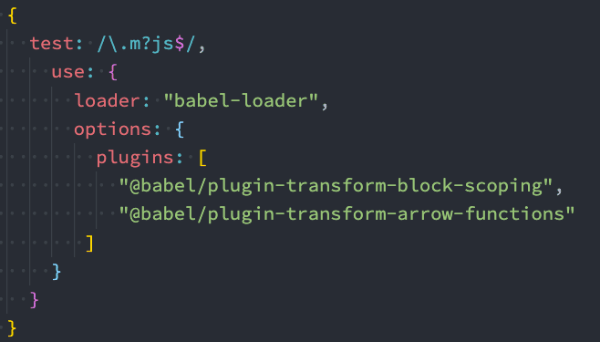
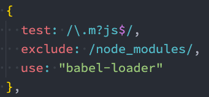
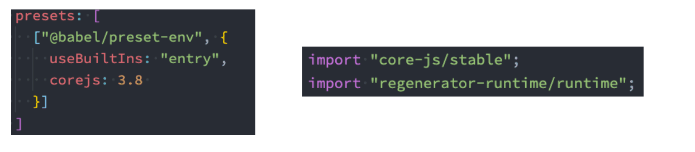
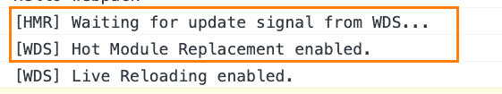

# webpack 学习二

## 1.模块

### Mode配置

[官方文档](https://webpack.docschina.org/configuration/mode/)

- **Mode配置选项，可以告知webpack使用响应模式的内置优化**
  
  - 默认值是**production**（什么都不设置的情况下）
  - 可选值有：**none** | **development** | **production**
  
- **这几个选项有什么样的区别呢?**

  | 选项        | 描述                                                         |
  | ----------- | ------------------------------------------------------------ |
  | development | 会将 `DefinePlugin` 中 `process.env.NODE_ENV` 的值设置为 `development`. 为模块和 chunk 启用有效的名。 |
  | production  | 会将 `DefinePlugin` 中 `process.env.NODE_ENV` 的值设置为 `production`。为模块和 chunk 启用确定性的混淆名称，`FlagDependencyUsagePlugin`，`FlagIncludedChunksPlugin`，`ModuleConcatenationPlugin`，`NoEmitOnErrorsPlugin` 和 `TerserPlugin` 。 |
  | none        | 不使用任何默认优化选项                                       |


### source-map

[官方文档](https://webpack.docschina.org/configuration/devtool/#root)

代码报错需要调试时（debug），调试转换后的代码是很困难的, 能保证代码不出错吗？不可能

- **代码通常运行在浏览器上时，是通过打包压缩的**

  - 也就是真实跑在浏览器上的代码，和我们编写的代码其实是有**差异**的
  - 比如**ES6的代码可能被转换成ES5**
  - 比如**对应的代码行号、列号在经过编译后肯定会不一致**
  - 比如**代码进行丑化压缩时，会将编码名称等修改**
  - 比如我们**使用了TypeScript等方式编写的代码，最终转换成JavaScrip**t

- **如何可以调试这种转换后不一致的代码呢？答案就是source-map**

  - **source-map是从已转换的代码，映射到原始的源文件**
  - 使浏览器可以重构原始源并在调试器中显示重建的原始源

- **如何使用source-map**

  - 第一步：根据源文件，生成source-map文件，webpack在打包时，可以通过**配置生成source-map**

  - 第二步：在转换后的代码，**最后添加一个注释**，它指向sourcemap

    ```shell
    //## sourceMappingURL=common.bundle.js.map
    ```

  - 浏览器会**根据我们的注释**，查找响应的source-map，并且根据source-map还原我们的代码，方便进行调试

  - 在Chrome中，我们可以按照如下的方式打开source-map

    

- **分析source-map**

  - 最初source-map生成的文件带下是**原始文件的10倍**，**第二版减少了约50%**，**第三版又减少了50%**，所以目前一个
    133kb的文件，最终的source-map的大小大概在300kb
  - 目前的source-map长什么样子呢？
    - **version**：当前使用的版本，也就是最新的第三版
    - **sources**：从哪些文件转换过来的source-map和打包的代码（最初始的文件）
    - **names**：转换前的变量和属性名称（因为我目前使用的是development模式，所以不需要保留转换前的名
      称）
    - **mappings**：source-map用来和源文件映射的信息（比如位置信息等），一串base64 VLQ（veriable-
      length quantity可变长度值）编码
    - **file**：打包后的文件（浏览器加载的文件）
    - **sourceContent**：转换前的具体代码信息（和sources是对应的关系）
    - **sourceRoot**：所有的sources相对的根目录


- **生成source-map**
  - webpack为我们提供了非常多的选项（目前是26个），来处理source-map；
  - https://webpack.docschina.org/configuration/devtool/
  - 选择不同的值，生成的source-map会稍微有差异，打包的过程也会有性能的差异，可以根据不同的情况进行
    选择


## 2.Babel的深入解析

- **为什么需要Babel？**

  - 开发中，我们想要使用E**S6+的语法**，想要使用TypeScript，**开发**React项目，它们都是离不开Babel的

- **Babel是什么呢？**

  - Babel是一个**工具链**，主要用于旧浏览器或者缓解中将ECMAScript 2015+代码转换为**向后兼容版本**的JavaScript
  - 包括：**语法转换、源代码转换、Polyfill实现目标缓解缺少**的功能等

- **Babel命令行使用**

  - babel本身可以作为一个独立的工具（和postcss一样），不和webpack等构建工具配置来单独使用

  - 如果希望在命令行尝试使用babel，需要安装如下库

    - @babel/core：babel的核心代码，必须安装
    - @babel/cli：可以让我们在命令行使用babel

    ```shell
    yarn add @babel/cli @babel/core
    ```

  - babel来处理我们的源代码

    - src：是源文件的目录

    - --out-dir：指定要输出的文件夹dist

      ```shell
      npx babel src --out-dir dist
      ```

  - 插件的使用

    - 比如我们需要转换箭头函数，那么我们就可以使用箭头函数转换相关的插件

      ```shell
      @babel/plugin-transform-arrow-functions -D
      
      npx babel src --out-dir dist --plugins=@babel/plugin-transform-arrow-functions
      ```

  - Babel的预设preset

    - 如果要转换的内容过多，一个个设置是比较麻烦的，我们可以使用预设（preset）

    - 安装@babel/preset-env预设

      ```shell
      yarn add @babel/preset-env -D
      ```

    - 执行如下命令

      ```shell
      npx babel src --out-dir dist --presets=@babel/preset-env
      ```

- **Babel的底层原理**

  - babel是**如何做到**将我们的一段代码（ES6、TypeScript、React）转成另外一段代码（ES5）的呢？

    - 从一种源代码（原生语言）转换成另一种源代码（目标语言），这是什么的工作呢？
    - 就是**编译器**，事实上我们可以将babel看成就是一个编译器。
    - Babel编译器的作用就是将我们的源代码，转换成浏览器可以直接识别的另外一段源代码

  - Babel也拥有编译器的**工作流程**(三个阶段)

    - **解析阶段**（Parsing）
    - **转换阶段**（Transformation）
    - **生成阶段**（Code Generation）

  - babel编译器执行原理

    - Babel的执行阶段

      

    - 具体

      

- **babel-loader**

  - 实际开发中，我们通常会在构建工具中通过配置babel来对其进行使用的，比如在webpack中

  - 安装相关的依赖

    ```shell
    yarn add babel-loader @babel/core
    ```

  - 设置一个规则，在加载js文件时，使用babel

    

  - 指定使用的插件

    - 必须指定使用的插件才会生效

      

  - babel-preset(预设)

    - 如果我们一个个去安装使用插件，那么需要手动来管理大量的babel插件，我们可以直接给webpack提供一个
      preset，**webpack会根据我们的预设来加载对应的插件列表**，并且将其传递给babel

    - 常见的预设有三个

      - env
      - react
      - TypeScript

    - 安装preset-env

      ```js
      yarn add @babel/preset-env
      ```

      

  - 设置目标浏览器 browserslist

    - 最终打包的JavaScript代码，是需要跑在目标浏览器上的，那么如何告知babel我们的目标浏览器呢？

      - browserslist工具

      - target属性

        

  - Babel的配置文件(独立文件)

    - babel给我们提供了两种配置文件的编写
      - babel.config.json（或者.js，.cjs，.mjs）文件
      - .babelrc.json（或者.babelrc，.js，.cjs，.mjs）文件


### 认识polyfill

- **Polyfill是什么呢？**

  - **翻译**：一种用于衣物、床具等的聚酯填充材料, 使这些物品更加温暖舒适
  - **理解**：更像是应该填充物（垫片），一个**补丁**，可以帮助我们更好的使用JavaScript

- **为什么时候会用到polyfill呢？**

  - 比如我们使用了一些语法特性（例如：Promise, Generator, Symbol等以及实例方法例如Array.prototype.includes等）
  - 但是某些浏览器压根不认识这些特性，必然会报错
  - 我们可以使用polyfill来填充或者说打一个补丁，那么就会包含该特性了

- **如何使用polyfill？**

  - babel7.4.0之前，可以使用 @babel/polyfill的包，但是该包现在已经不推荐使用了

    

  - babel7.4.0之后，可以通过单独引入core-js和regenerator-runtime来完成polyfill的使用

    ```shell
    yarn add core-js regenerator-runtime --save
    ```

    


### 配置babel.config.js

- **preset-env配置一些属性**
  - **useBuiltIns**：**设置以什么样的方式来使用polyfill**
  -  **corejs**：**设置corejs的版本**，目前使用较多的是3.x的版本，比如我使用的是3.8.x的版本
    - 另外corejs可以设置是否对提议阶段的特性进行支持
    - 设置 proposals属性为true即可
- **useBuiltIns属性设置**
  - useBuiltIns属性有三个常见的值
  - 第一个值：**false**
    -  打包后的文件不使用polyfill来进行适配
    - 并且这个时候是不需要设置corejs属性的
  - 第二个值：**usage**
    - 会根据源代码中出现的语言特性，自动检测所需要的polyfill
    - 这样可以确保最终包里的polyfill数量的最小化，打包的包相对会小一些
    - 可以设置corejs属性来确定使用的corejs的版本
  - 第三个值：**entry**
    - 如果我们依赖的某一个库本身使用了某些polyfill的特性，但是因为我们使用的是usage，所以之后用户浏览器
      可能会报错, 所以，如果你担心出现这种情况，可以使用 entry
    - 并且需要在入口文件中添加 `import 'core-js/stable'; import 'regenerator-runtime/runtime'
    - 这样做会根据 browserslist 目标导入所有的polyfill，但是对应的包也会变大




## 3.创建vue3项目

[创建vue3项目](https://codevity.top/article/web/engineered/relevant/1-%E5%88%9B%E5%BB%BAvue3%E9%A1%B9%E7%9B%AE.html#webpack)


## 4.搭建本地服务器

- **目前我们开发的代码，为了运行需要有两个操作**

  - 操作一：npm run build，编译相关的代码
  - 操作二：通过live server或者直接通过浏览器，打开index.html代码，查看效果

- **希望可以做到，当文件发生变化时，可以自动的完成编译和展示**

- **为了完成自动编译，webpack提供了几种可选的方式**

  - webpack watch mode
  - webpack-dev-server
  - webpack-dev-middleware

- **Webpack watch**

  - webpack给我们提供了watch模式

    - 在该模式下，webpack依赖图中的所有文件，只要有一个发生了更新，那么代码将被重新编译
    - 我们不需要手动去运行 npm run build指令了

  - 如何开启watch呢？两种方式

    - 方式一：在导出的配置中，添加 watch: true；
    - 方式二：在启动webpack的命令中，添加 --watch的标识

    

- **webpack-dev-server**

- **webpack-dev-middleware**

## 5.模块热替换（HMR）

- **什么是HMR呢？**

  - HMR的全称是Hot Module Replacement，翻译为模块热替换
  - 模块热替换是指在 应用程序运行过程中，替换、添加、删除模块，而**无需重新刷新**整个页面

- **HMR通过如下几种方式，来提高开发的速度**

  - **不重新加载整个页面**，这样可以保留某些应用程序的状态不丢失
  - **只更新需要变化的内容**，节省开发的时间
  - **修改了css、js源代码，会立即在浏览器更新**，相当于直接在浏览器的devtools中直接修改样式

-  **如何使用HMR呢？**

  - 默认情况下，webpack-dev-server已经支持HMR，我们只需要开启即可
  - 在不开启HMR的情况下，当我们修改了源代码之后，整个页面会自动刷新，使用的是live reloading

- **开启HMR**

  - 修改webpack的配置：

    ```js
    module.exports = {
      devServer: {
        hot: true
      }
    }
    ```

  - 浏览器可以看到如下效果

    

  - 但是会发现，当我们修改了某一个模块的代码时，依然是刷新的整个页面

    - 这是因为我们需要去指定哪些模块发生更新时，进行HMR

    

- **HMR的原理**

  - 那么HMR的原理是什么呢？如何可以做到只更新一个模块中的内容呢？
    - webpack-dev-server会创建两个服务：**提供静态资源的服务（express）和Socket服务（net.Socket）**
    - express server负责直接提供静态资源的服务（打包后的资源直接被浏览器请求和解析）

  - HMR Socket Server，是一个socket的长连接
    - 长连接有一个最好的好处是建立连接后**双方可以通信**（服务器可以直接发送文件到客户端）
    - **当服务器监听到对应的模块发生变化时，会生成两个文件.json（manifest文件）和.js文件（update chunk）**
    - 通过长连接，可以直接**将这两个文件主动发送给客户端**（浏览器）
    - **浏览器拿到两个新的文件后，通过HMR runtime机制，加载这两个文件，并且针对修改的模块进行更新**

- **HMR的原理图**


## 6.devServer

[官方文档](https://webpack.docschina.org/configuration/dev-server/)

### publicPath属性

-  devServer中有一个publicPath的属性，该属性是指定本地服务所在的文件夹
  - 它的**默认值是 /**，也就是我们直接访问端口即可访问其中的资源 `http://localhost:8080`；
  - 如果我们将其设置为了 **/abc**，那么我们需要通过 `http://localhost:8080/abc`才能访问到对应的打包后的资源
  - 并且这个时候，我们其中的bundle.js通过 `http://localhost:8080/bundle.js`也是无法访问的
    - 所以必须将output.publicPath也设置为 /abc；
    - 官方其实有提到，建议 devServer.publicPath 与 output.publicPath相同

### contentBase属性

- devServer中contentBase对于我们直接访问打包后的资源其实并没有太大的作用，它的主要作用是**如果我们打包**
  **后的资源，又依赖于其他的一些资源**，那么就需要**指定从哪里来查找这个内容**
  - 比如在index.html中，我们需要依赖一个 abc.js 文件，这个文件我们存放在 public文件 中
  - 在index.html中，我们应该如何去引入这个文件呢？
    - 比如代码是这样的：`<script src="./public/abc.js"></script>`；
    - 但是这样打包后浏览器是无法通过相对路径去找到这个文件夹的
    -  所以代码是这样的：`<script src="/abc.js"></script>`;
    -  但是我们如何让它去查找到这个文件的存在呢？ 设置contentBase即可

-  当然在devServer中还有一个可以监听contentBase发生变化后重新编译的一个属性： watchContentBase 

```js
module.exports = {
   devServer: {
      contentBase: path.resolve(__dirname, "./abc"),
      watchContentBase: true,
 		}
}
```

### hotOnly、host配置

- **hotOnly是当代码编译失败时，是否刷新整个页面**
  -  默认情况下当代码编译失败修复后，我们会重新刷新整个页面
  -  如果不希望重新刷新整个页面，可以设置hotOnly为true
- **host设置主机地址**
  -  默认值是localhost；
  -  如果希望其他地方也可以访问，可以设置为 0.0.0.0

```js
module.exports = {
  devServer: {
    hotOnly: true,
    host: '0.0.0.0'
  }
}
```

### port、open、compress

- **port设置监听的端口，默认情况下是8080**

- **open是否打开浏览器**

  - **默认值是false**，设置为true会打开浏览器
  - 也可以设置为类似于 Google Chrome等值

- **compress是否为静态文件开启gzip compression**

  - **默认值是false**，可以设置为true

    

```js
module.exports = {
  devServer: {
    port: 8081,
    open: true,
    compress: true // 为静态文件开启gzip 
  }
}
```

### Proxy代理

- **proxy是我们开发中非常常用的一个配置选项，它的目的设置代理来解决跨域访问的问题**
  - 比如我们的一个api请求是 `http://localhost:8888`，但是本地启动服务器的域名是`http://localhost:8000`，这
    个时候发送网络请求就会出现跨域的问题
  - 那么我们可以将请求先发送到一个代理服务器，代理服务器和API服务器没有跨域的问题，就可以解决我们的
    跨域问题了

- **配置**
  - **target**：表示的是**代理到的目标地址**，比如 /api-hy/moment会被代理到 `http://localhost:8888/api/moment`；
  - **pathRewrite**：默认情况下，我们的 /api-hy 也会被写入到URL中，如果希望删除，可以使用pathRewrite；
  - **secure**：默认情况下不接收转发到https的服务器上，如果希望支持，可以设置为false；
  - **changeOrigin**：它表示是否更新代理后请求的headers中host地址

- **changeOrigin的解析**
  - 通过查看源码我发现其实是要**修改代理请求中的headers中的host属性**
  - 因为我们真实的请求，其实是需要通过 `http://localhost:8888`来请求的
  - 但是因为使用了代码，默认情况下它的值时 `http://localhost:8000`；
  - 如果我们需要修改，那么可以将changeOrigin设置为true即可

```js
module.export = {
  devServer: {
    // 代理单一目标 /api
    proxy: {
      "/api": {
        target: "http://localhost:8888",
        pathRewrite: {
          "^/api": ""  // 不希望传递/api，则需要重写路径
        },
        secure: false,
        changeOrigin: true
      }
    }
  }
```

```js
module.export = {
  devServer: {
    // 代理多个目标 /api + /auth 
    proxy: [
      {
        context: ['/auth', '/api'],
        target: 'http://localhost:3000',
        secure: false,
        changeOrigin: true
      }
    ]
  }
}
```


### historyApiFallback

- **historyApiFallback是开发中一个非常常见的属性，它主要的作用是解决SPA页面在路由跳转之后，进行页面刷新时，返回404的错误**
-  **boolean值：默认是false**
  - 如果**设置为true**，那么在刷新时，返回404错误时，会自动返回 index.html 的内容
- **object类型的值，可以配置rewrites属性**
  - 以配置from来匹配路径，决定要跳转到哪一个页面

```js
module.exports = {
  devServer: {
   //  historyApiFallback: true, // boolean形式
    historyApiFallback: {
      rewrites: [
        { from: /^\/$/, to: '/views/landing.html' },
        { from: /^\/subpage/, to: '/views/subpage.html' },
        { from: /./, to: '/views/404.html' }
      ]
    }
  }
}
```


## 7.resolve模块解析

[官方文档](https://webpack.docschina.org/configuration/resolve/)

- **resolve用于设置模块如何被解析**

  - 在开发中我们会有各种各样的模块依赖，这些模块可能来自于自己编写的代码，也可能来自第三方库
  - **resolve可以帮助webpack从每个 require/import 语句中，找到需要引入到合适的模块代码**
  -  webpack 使用 enhanced-resolve 来解析文件路径
- **webpack能解析三种文件路径**
  - 绝对路径
    -  由于已经获得文件的绝对路径，因此不需要再做进一步解析
  - 相对路径
    - 在这种情况下，**使用 import 或 require 的资源文件所处的目录**，被认为是上下文目录
    - **在 import/require 中给定的相对路径，会拼接此上下文路径，来生成模块的绝对路径**
  - 模块路径
    - 在 resolve.modules中指定的所有目录检索模块
      -  默认值是 ['node_modules']，所以默认会从node_modules中查找文件
    - 我们可以通过设置别名的方式来替换初识模块路径，后面解释alias的配置
- **extensions和alias配置**

  - extensions是解析到文件时**自动添加扩展名**

    - 默认值是 ['.wasm', '.mjs', '.js', '.json']
    - 所以如果我们代码中想要添加加载 .vue 或者 jsx 或者 ts 等文件时，我们必须自己写上扩展名
  - 配置别名alias
  
    - 特别是当我们项目的目录结构比较深的时候，或者一个文件的路径可能需要 ../../../这种路径片段
  - 我们可以给某些常见的路径起一个别名

```js
module.export = {
  resolve: {
    extensions: ['.wasm', '.mjs', '.js', '.json', '.jsx', '.ts', '.vue'],
    alias: {
      "@": path.resolve(__dirname, "./src"),
      "pages": path.resolve(__dirname, "./src/pages")
    }
  }
}
```


## 8.入口文件解析

- 我们之前编写入口文件的规则是这样的：./src/index.js，但是如果我们的**配置文件所在的位置变成了 config 目录**，
  我们是否应该变成 ../src/index.js呢？

  - 如果我们这样编写，会发现是报错的，依然要写成 ./src/index.js；
  - 这是因为入口文件其实是和另一个属性时有关的 **context**

-  **context的作用是用于解析入口（entry point）和加载器（loader）**

  - 官方说法：默认是当前路径（但是经过我测试，**默认应该是webpack的启动目录**）
  - 另外推荐在配置中传入一个值
  
  ```js
  module.exports = {
    // context是配置文件所在目录
    context: path.resolve(__dirname, './'),
    entry: './src/index.js'
  }
  ```
  
  ```js
  module.export = {
    // context是上一个目录
    context: path.resolve(__dirname, '../'),
    entry: './src/index.js'
  }
  ```

## 总结

- webpack基本配置（二）

  ```js
  module.exports = {
    mode: 'development', // development | production | none
    entry: '', // 入口，也可以配置成对象形式
    devtool: 'source-map', // 控制是否生成，以及如何生成 source map
    output: {
      filename: 'bundle.js', // 文件名
      path: path.resolve(__dirname, './dist') // 打包后的路径, 必须是绝对路径
    },
    resolve: {
      extensions: ['.wasm', '.mjs', '.js', '.json', '.jsx', '.ts', '.vue'],
      alias: {
        '@': path.resolve(__dirname, './src'),
        pages: path.resolve(__dirname, './src/pages')
      }
    },
    devServer: {
      hot: true, // 开启热更新
      host: '0.0.0.0', // 设置主机地址
      port: 8081, // 设置端口
      open: true, // 自动打开浏览器
      compress: true, // 为静态文件开启gzip
      // 代理单一目标 /api
      proxy: {
        '/api': {
          target: 'http://localhost:8888',
          pathRewrite: {
            '^/api': '' // 不希望传递/api，则需要重写路径
          },
          secure: false,
          changeOrigin: true
        }
      }
    },
    module: {
      rules: [] // loader
    },
    plugins: [] // 插件
  }
  // 待补充...
  ```
  
  